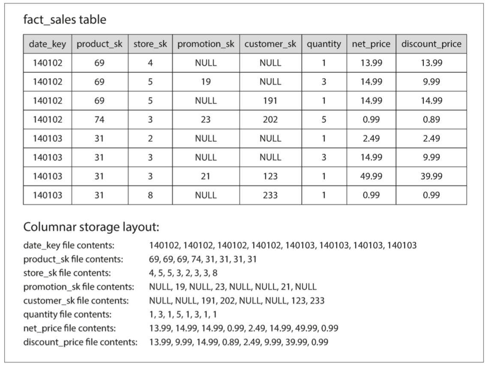
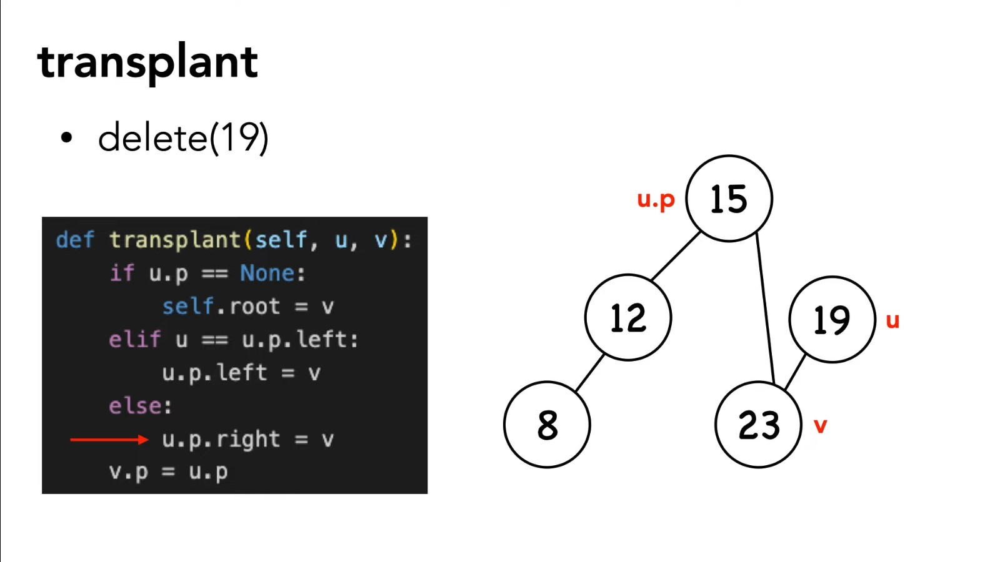
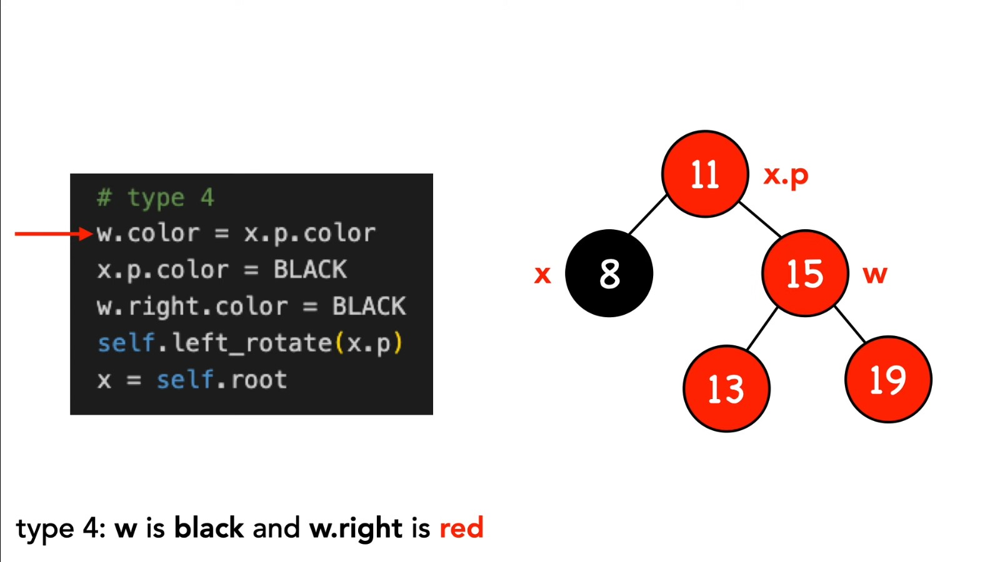
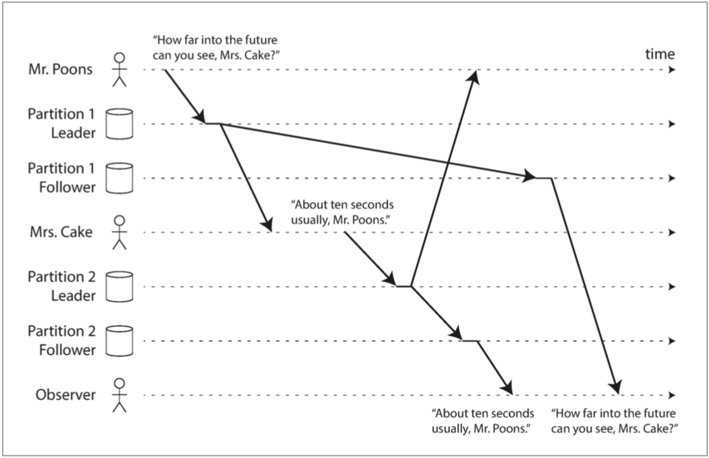
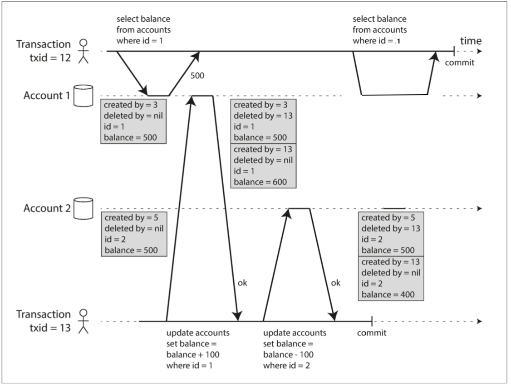

# Designing Data-Intensive Application

Reference: [Designing Data-Intensive Applications 心得筆記](https://www.jyt0532.com/toc/designing_data_intensive-application/)

# Part 1 Intro: Foundations of Data Systems
前四章介紹數據系統底層的概念，適用於單點的數據系統以及分布式系統。

# Chap 1 – Reliable, Scalable, and Maintainable

目前大部分的應用程式屬於數據密集型，而不是計算密集型。也就是說目前不像以前會被CPU的性能給侷限，而是被數據量、數據複雜度及存取速度限制。

數據密集的應用通常需要提供以下功能:

1. Database:
2. Caches:
3. Search indexes:
4. Stream processing:
5. Batch processing: 週期性的整理分析海量的資訊。

本章探討幾個數據系統最主要的需求 – reliable, scalable, and maintainable.

## Data System


現今的社會通常會單獨將:

1\. 緩存(比如用Memcache)

2\. 全文搜索(比如用ElasticSearch或Solr)

3\. 消息隊列(比如用kafka)

分離出來**不會把所有的功能都丟給同一個數據庫支持**。

既然如此，我們的工作就是寫好你的應用程式代碼，讓這些工具可以無縫接軌 然後再把複雜的實作封裝在你的API底下。

這本書的目的就是能讓你自由的運用我們手上有的工具，提供所有必需的功能之外，並在設計的時候思考:

1.當系統出問題時 如何確保數據的正確性和完整性

2.當部分系統退化降級時 如何維持良好性能

3.當負載增加時 如何擴容應對

4.何謂好的API

有非常多的事要考慮，本章節注重於三點最重要的項目: Reliability, Scalability, and Maintainability。

## 1. Reliability 可靠性

Reliability可靠性 : 即使出現錯誤，也能續正常工作。

正常工作定義:

1. 表現出用戶所期望的功能
2. 允許用戶犯錯或是以出乎意料的方式使用應用
3. 在預期的負載和數據量下 性能仍然滿足要求
4. 系統能防止未經授權的訪問和濫用

造成錯誤的原因是故障(fault) 能預料且應對故障的系統稱為容錯(fault-tolerant)或韌性(resilient)

失效(failure) 失效跟故障不一樣 故障通常定義為系統的一部分狀態偏離其標準 失效則是系統作為一個整體系統停止向用戶提供服務

我們不可能讓故障的機率降到零 但我們能有防錯機制防止**故障導致失效**

所以我們的目標並不是阻止錯誤(prevent fault) 而是容忍錯誤(tolerate fault)

1. 硬件故障(hardware failure)
2. 軟件錯誤 Software Error
3. 人為錯誤 Human Errors

## 2. Scalability 可伸展性

可伸展性(Scalability)指的是我們面對**負載增加**的能力。

當負載參數增加時，如何保持良好的性能? - 通常適合用於某個級別的系統架構 不會同樣適用於10倍的負載級別。如果你的服務正在快速的增長，那每次數量及變化時，都要重新考慮架構。

1. 垂直擴展 vs 橫向擴展

垂直擴展 也就是把你的機器變成更強的機器

橫向擴展 也就是用更多台沒那麼強的小機器

1. 彈性擴展系統 vs 手動擴展系統

彈性(elastic)的 代表說可以在檢測到負載增加時自動增加計算資源

手動的則是人工分析容量並決定向系統添加更多的機器

### 負載

在討論負載增長問題之前 我們要有一個方式來描述當前的負載 我們稱為**負載參數(load parameter)** 你要選擇哪個參數則是取決於你的系統 你可以選擇web server的QPS 或是 資料庫讀或寫的比率 或是聊天室裡的觀眾數量 或是你的cache的hit rate

### 性能

負載增加時的影響 有兩個層面

1. 增加負載參數並保持系統資源(CPU 內存 網絡帶寬等)不變時 系統性能將受到什麼影響
2. 增加負載參數並希望保持性能不變時 需要增加多少系統資源

#### 延遲vs響應時間

latency和response time並非同義詞

響應時間是客戶所看到的 除了實際處理請求的時間 還包括網路延遲和排隊延遲

延遲是某個請求**等待處理**的持續時間 在此期間它處於休眠狀態 並等待服務

#### 排隊延遲 queueing delay

只要有一兩個很龐大複雜的請求 就會塞住後面排隊的人 這種效應稱為頭部阻塞(head-of-line blocking) 即使在排隊的人都是很快的請求 但還是總體響應時間會上升

## Maintainability 可維護性

在設計之初，就需要要求三個設計原則，以保持可維護性；

1. 可操作性(Operability): 便於運維團隊保持系統平順的運行
2. 簡單性(Simplicity): 盡量減少系統的複雜度 使新工程師也能輕鬆理解系統
3. 可演化性(evolability): 使工程師在未來能輕鬆地對系統進行更改 當需求變化時能做出相對應的改動 也稱為可擴展性(extensibility) 可修改性(modifiability)或可塑性(plasticity)

# Chap 2 - Data Models and Query Languages

本章節會講解一系列用於數據存儲和查詢的通用數據模型(第二層) 特別是比較relational model vs document model vs graph based model

大多數的應用 使用層層疊加的數據模型來構建 舉例來說

第一層:身為應用開發人員 你對於你的應用選擇了適當的對象或是資料結構來存儲 並定義了適當的API來操作(CRUD)這些資料結構

第二層:存儲資料結構時 你用更廣義的data-model 像是JSON或是XML文件 關聯數據庫中的table等等

第三層:Database的工程師可以決定要如何以內存,硬碟或網路上的bytes來表示這些Json/Xml/relational/graph數據 選擇正確的表達形式可以讓數據能被查詢 搜索 處理

第四層:硬件工程師可以使用電流 光脈衝 磁場或是其他東西來表示bytes

## hierarchical model (層次模型)

1970年時最受歡迎的數據處理數據庫是IBM的Information Management System 他只使用了一個簡單的模型 稱為層次模型(hierarchical model)

在層次模型的樹結構中 每條記錄只有一個父節點

## Network model (網路模型)

在層次模型的樹結構中 每條記錄只有一個父節點 但在CODASYL模型中 每條記錄可能有多個父節點 比如說”Greater Seattle Area”是一條紀錄 每個居住在該地區的用戶都可以和其關聯 這也允許了多對一和多對多的關係建模

在網路模型中 記錄和記錄之間不是以foreign key連結 而是像是pointer的概念 要訪問一個記錄唯一的方法是從根記錄開始沿著pointer一路找到你要的記錄 這路徑稱為訪問路徑(access path)

基本上 一個訪問路徑就像是遍歷一個linked list 從根記錄開始一路遍歷到你要的記錄 但在多對多的關係中 一條紀錄可以有不同種訪問路徑去訪問 而網路模型的程序員還必須紀錄追蹤這些訪問路徑

所以網路模型的搜尋功能 是透過遍歷紀錄列在數據庫中不斷移動游標來進行 如果紀錄有多個父節點 還必須追蹤所有路徑 CODASYL委員會成員也承認 這就像在n維數據空間中進行導航

## Relational model (關聯模型)

一個relation就是一個表(table) 也就是一堆tuples所組成 沒有像迷宮的嵌套結構 也沒有多重複雜的訪問路徑

當你要Query你的數據庫 Query優化器會自動決定查詢的順序或是使用哪些索引 程序員幾乎不需要考慮 但如果你想要用新的方式搜索數據 你就需要建立一個新的索引 建立完後 你的Query也不用變 數據庫內部會自行利用你的新索引

## document model (文檔模型)

### Document module與多對一的關係

仔細看JSON的例子，會發現region_id和industry_id是以ID形式被記錄，而不是純字串”Greater Seattle Area”和”Philanthropy”，為什麼呢?

既然都是document了，輸入即使是個自由文本感覺也挺合理，但是使用標準化的列表，比如下拉選單給使用者選擇，或是auto-complete有其優勢，優勢如下；

1. 各個簡介之間樣式和拼寫統一
2. 避免歧義 比如說同樣地區的不同寫法
3. 可以輕易改名 比如說政治事件 一個地名要改 不需要改所有文件
4. 本地化(Localization) 網站翻譯成其他語言時 標準化的列表可以輕鬆的根據使用者的設定客製化
5. 便於搜索 你搜索華盛頓州的慈善家也可以找得到這個document 而不是一定要找西雅圖的慈善家
6. 對人類有意義的訊息(比如Philanthropy) 只會存在一處 並在所有引用他的地方使用ID 若是直接使用文本 那麼對人類有意義的訊息會存在所有記錄中
7. ID對人類沒有意義 所以永遠不需要改變 即使他代表的東西發生了改變(比如說改名稱之類的) 不需要改變所有的紀錄 當你需要改變所有紀錄 你就必須承擔不一致(inconsistency)的風險 去除這個duplication就是**規範化(Normalization)**的關鍵思想

要支持多對一的關係(很多人在西雅圖工作 很多人是工程師等等) 這對於document模型是比較不利的 在關聯模型中就直接用id 因為join很簡單 但是在document模型中 join通常不太支持

### Object-Relational Mismatch & Document Model


使用relational model可能遇到一對多的關係的問題，以下是對於一對多關係的三種解法:

- 1. 以前的SQL(before 1999) 就是全部normalize 職缺一個表 教育程度一個表 聯絡資訊一個表 每個表上的row都有user_id 你需要的時候再join
  2. 比較新的SQL可以支援**結構化數據類型，**或XML，或Json，讓一個row裡面可以有很多data。支持XML的有Oracle, IBM DB2, MS SQL Server, PostgreSQL 支持JSON的有IBM DB2, MySQL, PostgreSQL。
  3. 把所有資訊存在一個JSON或XML document 然後存在數據庫中，讓應用去自行解讀Json的結構跟內容，只是這個做法通常不能search document裡面的值。對於一個像簡歷這種本身就是文檔的數據結構而言 JSON表示是非常合適的 (支援Document的數據庫有MongoDB, RethinkDB, CouchDB, Espresso等等)

```json
{
"user_id": 251,
"first_name": "Bill",
"last_name": "Gates",
"summary": "Co-chair of the Bill & Melinda Gates... Active blogger.",
"region_id": "us:91",
"industry_id": 131,
"photo_url": "/p/7/000/253/05b/308dd6e.jpg",
"positions": \[
 {
 "job_title": "Co-chair",
 "organization": "Bill & Melinda Gates Foundation"
 },
 {
 "job_title": "Co-founder, Chairman",
 "organization": "Microsoft"
 }
 \],
 "education": \[
 {
 "school_name": "Harvard University",
 "start": 1973,
 "end": 1975
 },
 {
 "school_name": "Lakeside School, Seattle",
 "start": null,
 "end": null
 }
 \],
 "contact_info": {
 "blog": "<http://thegatesnotes.com>",
 "twitter": "<http://twitter.com/BillGates>"
 }
 }
```


## Graph Model (圖數據模型)

文檔模型比較大的問題是在處理多對多的關係 雖然關聯模型可以很好處理多對多的關係 但隨著數據之間的連接變得更加複雜 將數據建模為**圖形**顯得更加自然

一個圖有兩個物件組成

1.點(vertices): 又稱節點(node) 實體(entity)

2.邊(edges): 又稱關係(relationships)或弧(arcs)

有很多常見的數據都可以被建構成圖形 比如說

1.社交圖: 點是人 邊是好友關係

2.網路圖: 點是網頁 邊是彼此的連結link

3.公路或鐵路: 點是車站或交叉路口 邊是路

圖數據並不是只能表示這樣的同類(homogeneous)數據 一個點除了是人之外 還可能是地點 事件 簽到 或是用戶的評論 邊除了表示兩人的朋友關係 還可以表示誰發了某個評論 誰參與了某個事件

看個例子 來自愛達荷州的Lucy和來自法國Beaune的Alain 目前已婚住在倫敦


### property graph (屬性圖)

在屬性圖模型中 每個**頂點**包括了

1. 唯一的標識符(unique identifier)
2. 一組出邊(outgoing edges)
3. 一組入邊(ingoing edges)
4. 一組屬性(key-value pair)

每個**邊**包括了

1. 唯一的標識符(unique identifier)
2. 邊的起點
3. 邊的終點
4. 描述兩個頂點之間關係類型的標籤
5. 一組屬性(key-value pair)

一個屬性圖就可以當成是兩個relational table 一個存點 一個存邊 每個entity都用一個json來存所有其他屬性

```sql
CREATE TABLE vertices (
vertex_id INTEGER PRIMARY KEY,
properties JSON
);
 
CREATE TABLE edges (
edge_id INTEGER PRIMARY KEY,
tail_vertex INTEGER REFERENCES vertices (vertex_id),
head_vertex INTEGER REFERENCES vertices (vertex_id),
label TEXT,
properties JSON
);
 
CREATE INDEX edges_tails ON edges (tail_vertex);
CREATE INDEX edges_heads ON edges (head_vertex);
```

1. 沒有限制哪些事物可不可以關聯 也就是任何點對點都可以產生邊
2. 給定任一點 可以很簡單的找到所有出邊跟入邊 然後就可遍歷圖
3. 你可以給不同類型的點和邊不同的label(如同剛剛說的這不是只能支持homogeneous) 可是卻還是可以在同一個圖上建模型!
4. 非常容易可以延伸圖! 假設今天你想在社交圖上標註哪些人對哪些食物過敏 你就只要加上食物的點(標上label) 然後把人跟食物加上一個邊 就搞定了! 想加什麼就加什麼 這樣關聯式數據庫是要改schema甚至需要migration的

### Cypher查詢語言 - 屬性圖的聲明式查詢語言

Cypher是屬性圖的聲明式查詢語言 由Neo4j圖形數據庫而發明


```sql
Insert:
CREATE
(NAmerica:Location {name:'North America',type:'continent'}),
(USA:Location {name:'United States',type:'country' }),
(Idaho:Location {name:'Idaho', type:'state' }),
(Lucy:Person {name:'Lucy' }),
(Idaho) -\[:WITHIN\]-> (USA) -\[:WITHIN\]-> (NAmerica),
(Lucy) -\[:BORN_IN\]-> (Idaho)
```

search:

找所有從美國移民到歐洲的人的名字，並返回符合的vertex的name，我們要找的頂點需要符合兩個條件:

1. 擁有一條連到美國任一位置的BORN_IN邊
2. 一條連到歐洲的任一位置的LIVING_IN邊
```sql
MATCH
(person) -\[:BORN_IN\]-> () -\[:WITHIN\*0..\]-> (us:Location {name:'United States'}),
(person) -\[:LIVES_IN\]-> () -\[:WITHIN\*0..\]-> (eu:Location {name:'Europe'})
RETURN person.name
```

Note:

可以想到兩種做法:

1. 是從人頂點出發，每個頂點都確認看看符不符合條件。

2. 一種是從位置頂點出發，看看能不能找到符合條件的人。

但是因為是聲明式語言，不用擔心數據庫實作的細節，查詢優化程序會自動選擇預測效率最高的策略。

### Triple-Stores (三元組存儲)

除了屬性圖之外，還有Triple-Stores可以儲存圖結構。

在Triple-Stores中，所有信息都以非常簡單的三部分表示形式存儲 - 主詞, 動詞, 受詞

比如說(Jim, likes, banana)

主詞:就是圖上的一個頂點

受詞:就是圖上的一個頂點 或是一個字串或數字 像是(lucy, age, 33)

動詞:如果受詞是圖上的一個頂點 動詞就是連結兩者的邊


- Insert:
```sql
@prefix : &lt;urn:example:&gt;.
\_:lucy a :Person.
\_:lucy :name "Lucy".
\_:lucy :bornIn \_:idaho.
\_:idaho a :Location.
\_:idaho :name "Idaho".
\_:idaho :type "state".
\_:idaho :within \_:usa.
\_:usa a :Location
\_:usa :name "United States"
\_:usa :type "country".
\_:usa :within \_:namerica.
\_:namerica a :Location
\_:namerica :name "North America"
\_:namerica :type :"continent"
\_：someName就是頂點的名字
```

也可以寫成這樣
```sql
@prefix : &lt;urn:example:&gt;.
\_:lucy a :Person; :name "Lucy"; :bornIn \_:idaho.
\_:idaho a :Location; :name "Idaho"; :type "state"; :within \_:usa
\_:usa a :Loaction; :name "United States"; :type "country"; :within \_:namerica.
\_:namerica a :Location; :name "North America"; :type "continent".
```

### SPARQL查詢語言 - 用來查詢Triple-Stores

今天一樣來查找從美國轉移到歐洲的人
```sql
PREFIX : &lt;urn:example:&gt;
SELECT ?personName WHERE {
?person :name ?personName.
?person :bornIn / :within\* / :name "United States".
?person :livesIn / :within\* / :name "Europe".
}
```

## Relational Model vs Document Model

關聯性數據庫: 支持多對一和多對多的關係

文檔數據庫: 架構靈活性 局部性而擁有的更好的性能 和較少的阻抗不匹配

### 架構靈活性

文檔數據庫是**讀時模式**(schema-on-read) 也就是隱藏的數據結構只有在讀取時才知道

聯數據庫是**寫時模式**(schema-on-write) 因為傳統的關係數據庫方法中 模式明確 且數據庫確保所有的數據都符合其模式 才能寫入

今天如果應用程式要改變數據格式 - 原本使用者只有儲存名字 現在要姓跟名分開存:

文檔數據庫

1\. if (user && user.name && !user.first_name) {

2\. // Documents written before Dec 8, 2013 don't have first_name

3\. user.first_name = user.name.split(" ")\[0\];

4\. }

關聯數據庫 - 需要改變schema 在改變的過程中 數據庫必須停止運作 而且這通常很慢 因為他會生出一個新的table 再把每一個row都重新寫一次

1\. ALTER TABLE users ADD COLUMN first_name text;

2\. UPDATE users SET first_name = split_part(name, ' ', 1); -- PostgreSQL

3\. UPDATE users SET first_name = substring_index(name, ' ', 1); -- MySQL

所以如果一個集合中的每個元素不是擁有同樣結構時 讀時模式更具優勢

### 查詢的數據局部性

文檔通常是以一個很長的字串存成JSON或XML 所以如果應用程式需要經常訪問整個文檔(比如說render網頁) 那局部存儲就有很大的優勢 因為你不需要一直query數據庫去decorate你的id

但是天不從人願 大多數情況 你**只需要**一個文檔的其中一小部分而已 這對於每次都讀取整個文檔是很浪費的 而且在更新文檔時 通常需要整個重新寫入(除非你不改變文檔的大小 那還有可能容易一些) 這些性能限制大大減少了文檔數據庫的實用場景

值得一提的是 **為了局部性而把相關的資訊集合起來** 不是只有文檔模型有

1.Google的Spanner就在關聯模型中支持局部性 藉由允許一個table的row被嵌套在父表內

2.Oracle允許**多表索引集群表(multi-table index cluster tables)**

3.BigTable數據模型(用於Cassandra和HBase)的**列族(column family)**概念和管理局部性的概念類似

### 文檔和關係數據庫的融合

2000年以後 大多數關聯數據庫都已經支援XML(代表著可以使用XML文檔進行本地修改 以及索引和查詢) 這允許應用程序使用和文檔數據相當類似的模型

9.3版本之後的PostgreSQL 5.7版本之後的MySQL 以及10.5之後的IBM DB2 也對JSON文件提供類似的支持 根據JSON在網際網路的使用情況 不難想像其他關聯數據庫也很快會陸續跟進

另一方面 文檔數據的RethinkDB 在查詢時也支援了類似關係的連接 文檔數據的MongoDB也可以自動resolve文檔中的引用(其實也就是多了一層處理client-side join)

隨著時間的推移 關聯數據庫和文檔數據庫似乎變得越來越相似 數據模型互相補充是一件好事 如果可以處理類似文檔的數據 又可以進行關聯查詢 那簡直天下太平

## Imperative vs. declarative (命令式語言vs. 聲明式查詢語言)

關聯模型使用的是聲明式查詢語言

IMS和CODASYL則是使用命令式代碼來查詢數據庫

命令式語言(imperative)告訴計算機以特定順序執行某些操作 逐行執行 判斷條件 是否再循環等等

聲明式查詢語言(declarative) 你指定所需紀錄要符合什麼條件 還有如何轉換數據(排序 分組和集合等等) 怎麼實現你不管 底層會幫你做到好

## SQL

SQL databases use the relational model

## NoSQL

**NoSQL** (Not only SQL) **is not a single model**—it includes multiple database models, including:

- **Document Model** (MongoDB, CouchDB)
- **Key-Value Model** (Redis, DynamoDB)
- **Column-Family Model** (Cassandra, HBase)
- **Graph Model** (Neo4j, ArangoDB)

1. 比關係數據庫更好的可擴展性 應付大數據以及高吞吐量
2. 免費和開源軟件更受偏愛
3. 關係模型不能很好地支持一些特殊的查詢操作
4. 更具動態性(dynamic)與表現力(expressive)的數據模型

## MongoDB – Using Document Data Model

# Chap 3 - Storage and Retrieval

這一章從數據庫的視角，聊聊數據庫是如何存儲我們的數據，以及如何在需要時提供數據。

存儲引擎分成兩大類，transactional workload (事務性負載)，和analytics workload (分析性負載)。

兩大類的存儲引擎 - log-structured(日誌結構)的存儲引擎，以及page-oriented(面向頁面)的存儲引擎。

## 世上最簡單的數據庫

跟所有系統設計一樣，從最簡單的開始優化，世上最簡單的數據庫，可以用兩個Bash函數實現:

```bash
#!/bin/bash
db_set () { echo "$1,$2" >> database }
db_get () { grep "^$1," database | sed -e "s/^$1,//" | tail -n 1 }
```

執行 – 把key value存進database:
```bash
> db_set key value
```

獲取value:
```bash
> db_get key
```

key跟value可以是任意的Json:
```bash
> db_set 123456 '{"name":"London","attractions":\["Big Be n","London Eye"\]}'
> db_set 42 '{"name":"San Francisco","attractions":\["Golde n Gate Bridge"\]}'
> db_get 42 {"name":"San Francisco","attractions":\["Golden Gate Bridg e"\]}
```

存進一個檔案裡，每行是用逗號分隔的key-value pair。每次呼叫db_set都往檔案的最後加新行，所以我們找的時候找最後一個`tail -n 1`。

```bash
> db_set
42 '{"name":"San Francisco","attractions":\["Explo ratorium"\]}'

> db_get
42 {"name":"San Francisco","attractions":\["Exploratorium"\]}

> cat database
123456,{"name":"London","attractions":\["Big Ben","London E ye"\]} 42,{"name":"San Francisco","attractions":\["Golden Gate Bri dge"\]} 42,{"name":"San Francisco","attractions":\["Exploratoriu m"\]}
```

以上是描述了日誌結構的精神，許多數據庫內部都是使用日誌(log)，也就是一個append-only的文件。

當然真的數據庫有很多問題需要處理(如並發控制, 回收Disk空間以避免日誌無限增長, 處理錯誤與部分寫入等等)，但基本原理一樣。

Log: An append-only sequence of records – log 在廣義情況下用的詞，不一定要是人類讀得懂的，可以是二進制格式

### 如何優化?

一段時間以後，文件會越來越大，性能會越來越差。因為每次的 db_get 會從頭到尾掃過整個文件，複雜度O(n)。

因此，需要使用index 當作路標，幫助找到想找的數據。

相反的，使用index是為了讓索引使更快，寫入時就要花更多的時間。如何取捨讀寫性能，就變成一個重要的問題。

## Hash index

用一個hash map把每個key的位置記下來。


現實生活中，Riak的搜尋引擎Bitcask就是使用這個方式。

使用時機是什麼呢? 就是擁有的key數目不多，但每個value很常被更新的情況。

比如說你是一個小youtube，你的key是存影片的網址，value是觀看次數。這種類型的數據，更新舊數據的需求遠遠大於增加新數據，而且key不多的話，只要放得進內存，這個簡單的實作會意外的適合。

### 優化

目前為止我們都是寫入同一個文件。我們要怎麼避免Disk被用光呢? 一個常見方法是設一個檔案的最大size，當你的log成長到這個大小，就開一個新的檔案寫，舊的檔案就可以壓縮(compaction)，壓縮就是把不要的東西拿掉，這裡就是只留每個key最新的value: 


當我有很多個檔案，就代表我有很多個Hash map。所以查詢的時候，要從最新的map開始找，再一路往回找。

### 難點

- 1. 文件格式: CSV不是儲存log最好的方式，最好的方式是二進制格式，更快更簡單。
  2. 刪除記錄: 如果要刪除一個key-value pair，必須在檔案中加入一個特殊的刪除記號(tombstone)。當檔案合併時，這個特殊記號會告訴process放棄所有相同key的記錄。
  3. 崩潰恢復: 如果數據庫重新啟動，Hash-map直接不見(因為被保存在內存)。你會需要把文件全部遍歷一遍來recover你的hash map，這讓數據庫重啟變得十分痛苦。Bitcask的解法是把每個檔案的snapshot不定期存起來，讓重啟變快。
  4. 部分寫入記錄: 數據庫隨時可能崩潰，如果正在寫log的時候數據庫崩潰了，就需要用一些checksum等等的機制去修復/刪除部分寫入的記錄。
  5. 並發控制: 寫的thread只能有一個，但是讀的thread可以有很多個。

### 問題

為什麼一定要append-only? 我有hash-map可以快速找到舊key的位置，overwrite不行嗎?

1. 速度: Sequential Write » Random Write。在磁盤旋轉硬盤上差異就很大，在SSD上差距小一點，我們會在比較B樹和LSM樹裡討論。
2. 並行比較容易做，要是可以Random Write，幾乎不可能併行化。
3. 崩潰回復(Crash recovery)比較簡單，Random Write到一半回覆的話基本沒救，沒什麼機制能挽回。
4. merge舊的檔案的時候，不用擔心數據隨著時間跑來跑去的問題。

### 侷限

1. Hash map必須要能放的進內存。
2. 範圍查詢效率差 : 你無法查詢kitty0000 - kitty9999之間的所有key 你必須在 hash-map中單獨找每個key

## SSTables & LSM Tree (Sorted String Table & Log-Structured Merge Tree)

剛剛的Hash索引，每個紀錄都照順序被寫入檔案，越晚寫的同樣key的記錄比早寫的優先。除此之外，文件中的記錄順序不重要。

現在來做一點小變化，我們現在要求文件的順序按照key排序，這就是Sorted String Table(SST)，除了保證順序的同時，還不讓key重複。

### SSTable 優缺點

缺點: 寫入速度較慢

優點:

1. 合併檔案簡單高效 – 用merge sort合併，若有key重複，拿比較晚生成的segment。
  


2. 索引上不需要所有的key，key可以sparse一點。比如說你要找 handiwork 這個字，而你的hash map裡有 handbag -> 102134 和 handsome - > 104667 你就可以直接從102134開始掃。
  

3. key跟key的offset之間的文件可以壓縮: 如同上圖的灰色區段，等到需要掃灰色區域的時候再拿出來，不用的時候可以壓縮後放在disk裡，省空間，省IO開銷。

### 構建和維護SSTables

在**Disk上**維護的方法，可以參照<mark>B樹</mark>。

在**內存**上維護的方法有很多，常聽到的就，是<mark>紅黑樹</mark>跟<mark>AVL樹</mark>，使用這些數據結構，你可以用任何順序插入key。

### LSM-tree(Log-Structured Merge Tree)
所以現在我們優化後的存儲引擎可以做以下的事:

1. 寫入key時，將其添加到內存的平衡樹結構，這個內存數也稱為內存表 (memtable)
2. 當內存表的size大於某個門檻(幾兆byte)，可以把它當作SSTable檔案寫進disk。在存的過程中發生的寫入就寫到另外一個新的內存表。
3. 怎麼處理讀request呢? 就先從memtable找，找不到在再最近的disk segment找，一路往回找。
4. 後台一直有個process在對文件segment進行壓縮。

這個方案的唯一問題就是如果系統突然crash，內存的東西會全部消失。所以每個寫需求除了寫進memtable，還要額外寫進一個log file，確保在崩潰後可以回復內存。當這次的memtable被寫進Disk時，這個log file就可以刪了。

### 性能優化 – 找不存在的key & 壓縮優化

1. 我們說一個讀需求，先在內存找，找不到再去硬碟裡最新的segment找，一路往回找，要是一個讀需求找一個不存在的key，那會找非常久。為了優化這一個use case，存儲引擎會再maintain一個Bloom lter(可以快速知道一個key在不在所有硬碟裡，不用真的一個一個找)
2. 壓縮的優化，主要分兩種: size-tiered跟leveled 壓縮
  1. size-tiered壓縮，就是比較新比較小的SSTable會被併進比較老比較大的SSTable 
  2. leveled壓縮，是按照資料的新舊程度分層處理(我們預期早期被輸入的資料比晚期被輸入的資料更少被查詢)，所以新的SSTable就劃分成比較細的檔案，舊的SSTable就往上層合併。

### 吞吐量
LSM樹的中心思想，就是可以保存一系列可以在後台合併的SSTables。即使之後資料量變大，數據量比內存大很多也沒關係，因為數據在硬碟裡是有序的，所以可以高效的進行範圍查詢。而且硬碟的寫入是sequential的(我們當內存通過一個門檻才會寫入硬碟，每次都是append)，所以LSM樹可以支持很高的吞吐量。

## B-tree
在幾乎所有的關係數據庫中，B-tree是標準的索引實現，許多非關聯數據庫也在用。就像SSTable，B-tree保持著照key排序的key-value pair，但是背後設計的理念很不一樣。

我們之前看到的日誌結構索引都將數據分解成可變大小的段，且按照順序寫進硬碟segment。但B-tree則是把數據庫分成很多大小一樣的segment(通常是4KB)，而且一次只能讀取或寫入一個page，這樣的設計更接近底層的硬碟(因為disk也被安排在固定大小的block中)。每個頁面都可以使用一個地址來標示，這讓一個頁面可以引用到另一個頁面，就像在硬碟裡的pointer而我們利用這些指針來建構一個樹。


每一個頁面都包含了幾個key和幾個對子頁面的指針，從一個根頁面(最上面那個)開始，假設要找`userId = 251`，那就會找200-300中間的指針，找到下一個頁面，一路找下去，就會找到251。你就可以再去看251的值是什麼(可能直接在那個entry裡，可能是指到value的指針)。一個頁面對子頁面引用的數量稱為branching factor，上圖的例子branching factor就是6實戰中branching factor通常是好幾百。

### 算法
1. 更新: 找到那個entry，把value改掉。
2. 加入新key: 找到屬於這個範圍的子page，加到子page裡，如果子page沒有空間容納新key就分成兩個。

這個算法必須保持樹的平衡，有N個key的樹高度應該是logN。而大多數的數據庫，都是3-4層就搞定(BF500，一頁4KB的數據四層，可以存256TB)。


### 優化
- 有崩潰的可能:
  - B-tree基本的底層操作，就是用新數據覆蓋Disk上的頁面，這和LSM樹形成強烈對比。後者只append到硬碟，而不修改硬碟。
  - 而要在磁性硬碟中修改硬碟的檔案，必須將磁頭移動到正確的位置，等待旋轉，盤上的正確位置出現，然後用新的數據覆蓋適當的扇區，在SSD上會更複雜。
  - 覆蓋硬盤檔案只是理想情況，某些情況我們還必須要平衡樹，這代表需要拆分兩個頁面，並在兩個頁面都要寫，還要改parent頁面的引用 ，這是一個危險的操作。如果在這一系列複雜的操作中途崩潰，那會導致一個損壞的索引(比如一個孤兒頁面沒有被父頁面連到)。
- 如何讓崩潰可被修復
  - 多維護一個數據結構，預寫式日誌(WAL write-ahead-log)，也是一個append-only的檔案，在實際修改B-tree時先在這WAL上寫下來，要是之後崩潰，以WAL為主來回覆內存。
  - 還有一個複雜的情況就是並行，如果多個線程要一起修改B-tree，需要仔細地處理並發問題，通常可以用個輕量級鎖(latches)來保護樹的結構。

## B tree vs. LSM tree

通常LSM樹的寫入速度更快，而B樹的讀取速度更快。

### LSM樹的優點

1. 寫入的速度  
    
    B樹的寫入，必須寫入至少兩個資料結構，先寫入WAL，再寫入樹頁面(也許還需要再分頁)。  
    
    而LSM樹通常能夠比B樹支持更高的寫入吞吐量，因為它是順序寫的，不需要重寫樹中的多個頁。這種特性在磁性硬盤上很重要sequential write比random write快得多。

2. 磁碟空間的應用

    因為LSM Tree可以被更好的壓縮，所以硬碟空間的使用通常比B樹索引更小一些。

    而因為LSM Tree不是頁面取向的實作，而且會時不時的做壓縮，因此磁盤消耗更低一些。相比而來，B樹的一個頁被切分或是一行裝不進一頁時，頁中的一些空間就沒有被利用到，常常會導致磁盤碎片。

### LSM樹的缺點

LSM很常壓縮來省空間，但如果壓縮到一半有讀請求，就會需要等很久。這種特殊情況不會影響到p50，但卻對p999有要命的延遲。相較而言B樹的性能就比較好預測。

如果寫的<mark>throughput</mark>很高，而且壓縮策略沒好好處理，可能會有壓縮趕不上新數據的情況，這樣讀的性能也會連帶影響。

## 其他索引結構
目前我們只討論了key-value索引，就像是關聯數據庫中的primary-key索引。primary-key代表的table唯一的一行，或document數據庫的一個的檔案，或圖形數據庫中的一個頂點。

### 二級索引(Secondary index)
<mark>二級索引</mark>(Secondary index)也很常見，可以在關聯數據庫中用 CREATE INDEX。在同一個表上創建多個二級索引，這些二級索引對於join的效率至關重要。

比如說熟悉的比爾蓋茲:


如果我們對每個表(regions table, positions table, education table)中都對user_id做了二級索引，我們很快就可以找到某個user_id在每個table的row。

二級索引跟key-value索引差別就是: 索引的值不是唯一的(比如說如果我想對last name作二級索引，那我每次搜尋James找到的數據不會只有一個)。

這有兩種方式可以解決 :
1. 讓索引的值是一個list of matching rows。
2. 把每個entry加上一個row number，讓他變成不是唯一。

不論哪種方式，B樹和日誌結構索引都可以用作二級索引。

### 將值存儲在索引中
我們知道索引的key是用來搜尋用的，但索引的值應該放什麼呢? 

有兩個可能:
1. 實際的文檔/頂點/記錄
2. 實際紀錄的引用 

後者情況的話，實際的row被存放的地方稱為堆元件(heap file)，而且紀錄沒有絕對的順序(可以都是append-only 也可以overwrite舊紀錄)。這個做法的好處是，如果有不同的二級索引指到同一個記錄，這個記錄不需要duplicate到各個二級索引中。

如果要update某一個key，分兩種情況:
1. 如果新value的size不比舊value大，那就直接覆蓋。
2. 如果新value的size更大的話，那可能這個heap-file要換地方存。那所有曾經指到舊heap-file的索引都修改，或是在舊heap-file的位置留下一個指針到新位址。

在某些情況下，從索引到堆文件的額外引用對讀取來說性能損失太大，所以你可以考慮把所有的row的data都存在索引裡，稱為clustered index。

在**Clustered index**(在索引中存儲所有row數據)和**Nonclustered index**(僅在索引中存儲對數據的引用)之間的折衷稱為**index with included columns**(包含列的索引)或**covering index**(覆蓋索引)。

你可以只把部分比較常被query的訊息存在索引內，而不是所有數據都存在索引內。當然，缺點就是增加額外的存儲空間開銷。

### multi-column indexes (多列索引)
目前的索引的是一個key對到一個value，如果我們需要同時**查詢一個表中的多個列**(或文檔中的多個字段)，這顯然不夠。

最常看到的多列索引被稱為連接索引(concatenated index)，它通過將一列的值追加到另一列後面，將多個字段組合成一個鍵。

比如說，你在一個電話簿中，加一個多列索引(lastName, firtName)。你可以用這個索引找出所有特定lastName的人(因為索引有sort)，你也可以用這個索引找特定lastName+firstName的人。但如果你想找某個特定firstName的人，抱歉做不到。

### multi-dimensional index (多維索引)
多維索引是一種**查詢多個列**的更一般的方法，這在地理空間的數據特別重要。

比如說，餐廳搜索網站有個數據庫，包含每個餐廳的經緯度，如果要支持一個sql空間查詢 :

```sql
SELECT * FROM restaurants
WHERE latitude > 51.4946 AND latitude < 51.5079
AND longitude > -0.1162 AND longitude < -0.1004;
```

B樹跟LSM樹都無法高效的查詢，因為我們有對經度跟緯度分別索引，所以它可以回傳一個經度範圍內的所有餐廳(但緯度可能是任意值)，也可以回傳一個緯度範圍內的所有餐廳(但經度可能是任意值)，無法同時滿足。

有兩個選擇 :
1. 用space-filling curve將二維位置轉換為單個數字，再用正常的索引。
2. 特殊化的空間索引，比如R-tree。

本書中沒有特別深入這兩個做法的算法，有興趣的再深入研究。我們只考慮usecase。

除了二維空間還能幹什麼呢，我們還可以搜尋顏色!把(R, G, B)作個多維索引，就可以找到你想找的相近顏色的東西!或者是任何二維的數據，比如說(時間 溫度)，你就可以找2013年五月氣溫在20-25度的日期。

### 全文搜索和模糊索引
目前為止的討論，都是在你有確切的數據，確切的key-value配對。那如果**想找的是拼錯的key**，這就需要不同的技術。

常看到搜尋引擎可以在你拼錯或是幫你找你輸入的同義詞，比如Lucene就可以幫你找`Edit Distance=1`的所有詞(加/減/改 一個字母)。

怎麼做到的呢? 他用了一種類似SSTable的數據結構來存儲它的字典，只是索引變成一個有限的狀態機(finite automate machine)。然後可以被轉成Levenshtein automaton，這個就支援了一個給定edit distance的搜尋。

### 在內存中存儲一切
目前討論的東西都是如何存取硬碟，硬碟有著很差的讀寫效率，那為什麼我們堅持如此呢? 因為兩點:
1. 硬碟耐用，電源關閉資料還在。
2. 成本低，便宜。

但隨著科技發展，內存變得便宜。把所有東西保存在內存逐漸變得可能(散布在多個機器中達到備份效果)，某些基於內存的key-value存儲(像是Memcached)僅用於緩存。如果重新啟動導致東西不見，也可以接受，但其他內存數據庫需要支持持久性的話，可以有如下方式 :
1. 電池供電的RAM
2. 將changes of log寫入Disk
3. 不定時把快照snapshot寫入Disk
4. 複製到其他機器的memory

當in-memory數據庫重啟時，它需要從disk或是網路重載狀態，雖然為了持久性必須寫log到disk，但讀需求完全由內存處理，而且這個append-only的寫很快。

當我們決定主要使用內存後，很多優化都可以做了，比如說Redis為各種資料結構(priority-queue, sets)提供了類似數據庫的接口，這些實作都很簡單。

## Online Transaction Processing & Online Analytics Processing (事務處理系統與分析系統)
在高層次上，我們看到存儲引擎分為兩大類。
1. Online Transaction Processing (優化事務處理): 訪問模式類似於處理業務事務，搜尋查找少量紀錄，並且需要時更新覆蓋紀錄。
2. Online Analytics Processing (優化分析): 需要掃描大量紀錄，每個記錄只讀取幾個column並統計匯總。Ex: 一月份我們每個商店的總收入是多少? 我們在最近的推廣活動中銷售多少香蕉?...

| 屬性 | 事務處理 OLTP | 分析系統 OLAP|
|---|---|---|
| 主要讀取模 | 查詢少量記錄 按key讀取 | 在大批量記錄上聚合 |
| 主要寫入模式 | 隨機訪問 要求低latency write | Bulk import 或是event stream | 
| 主要用戶 | 終端用戶 通過Web應用 | 內部數據分析師 |
| 處理的數據 | 數據的最新狀態 | 歷史事件 |
| 數據大小 | GB ~ TB | TB ~ PB |

剛開始，同一個數據庫可以同時提供這兩種用途。但最近的趨勢，則是不在OLTP的系統進行分析，而在一個單獨的數據倉庫(Data warehouse)進行分析。

## Data warehouse (數據倉庫)
為什麼需要把數據倉庫單獨分開呢? 因為OLTP的要求就是高度可用性，低延遲處理transaction，這些要求對於業務運作至關重要。

通常分析需要很多讀需求掃瞄數據庫，而分析的要求大多數情況是用來優化，沒有重要到需要使用許多昂貴的查詢來影響業務運作的性能。如果有個獨立的數據倉庫，你做分析的愛怎麼跑就怎麼跑，而不影響到OLTP的操作。

數據倉庫包含了OLTP系統的read-only的copy，使用定期的數據dump或是data stream從OLTP系統fetch數據。轉換成適合分析的模式後存進數據倉庫，此過程稱為Extract-Transform-Load(ETL)。


數據倉庫在大公司是非常常見的，一個大優勢，是可以針對分析模式進行優化。

本章目前為止提到的索引算法對於OLTP來說都工作的很好，但對於OLAP就沒那麼好。在剩下的章節，我們來看為了分析而優化的存儲引擎。

### 星型和雪花型
事務處理領域中，可以因為你應用程式的需要，使用不同的數據模型。但在分析領域中，數據模型的選擇就少了很多，許多數據倉庫都很制式化，稱為星型模式。

以下例子是食品零售商處的數據倉庫，中心是一個fact_table，fact_table每一行指的是一個事件。


fact_table的某些列是屬性，例如產品的銷售價格或成本。其他列則是對於其他表
的引用(foreign key)，其他表在此稱為維度表(dimensional table)。這樣可以在查詢fact_table的基礎中，當需要的時候再使用一些join來decorate的查詢。甚至連日期都可以建一個維度表，你可以多記錄一些資訊比如國定假日之類的。

星形模式名稱由此而來，當表關係可視化時，事實表在中間，由其他dimensional
table包圍。


可以再把dim_product table再細分下去，比如說把brand變成brand id成為
foreign key，再由更細微的dimensional table包圍，這就是雪花模式。


### 列存儲
可想而知的，維度表通常比較小(數百萬行)，但是fact_table通常有數萬億行數PB
的數據，如何高效的存儲和查詢很有挑戰性，本節主要針對事實表的存儲進行優化。

儘管事實表通常超過100個column，但用於分析的查詢，大多情況只需要其中的4-5個列 (你不會在分析查詢看到 SELECT * )。

以下的查詢，查詢了大量的row，但卻只拿了事實表中的3個column。

```sql
SELECT
 dim_date.weekday,
 dim_product.category,
 SUM(fact_sales.quantity) AS quantity_sold
FROM fact_sales
 JOIN dim_date ON fact_sales.date_key = dim_date.date_key
 JOIN dim_product ON fact_sales.product_sk = dim_product.
product_sk
WHERE
 dim_date.year = 2013 AND
 dim_product.category IN ('Fresh fruit', 'Candy')
GROUP BY
 dim_date.weekday, dim_product.category;
```

要如何有效的執行此查詢呢? 複習一下OLTP，存儲都是以row為方向進行佈局，表格一行中的所有值都存在一起。

要處理以上查詢，可能要在 fact_sales.date_key 跟 fact_sales.product_sk 上面建立索引。但即使這麼做，還是必須把所有符合 date_key 條件跟 product_sk 條件的row從硬碟移到內存，然後再開始filter，還是需要很久，因為資料量實在太大。

如果我們以column方向進行存儲佈局呢? 不是把所有同一行的東西存在一起
而是把同一列的東西存一起，如果每一個column都是一個分開的檔案，那其實只需要pasre那個檔案就可以。

下圖試著把每一個colume分開存到另一個檔案:



如果你需要組裝起真正的row，就把每個檔案的row number組合起來就可以。

### 列壓縮
除了只需要從硬碟讀出需要的列的檔案之外，我們還可以通過壓縮數據來進一步降低對磁盤吞吐量的需求。一樣的例子，有許多重複的值，這就很好利用<mark>bitmap encoding</mark>壓縮。


通常情況，distinct的值的數目會比總row的數目少很多(你可能有數十億的交易但卻只有十萬個商品)。我們對於每個出現過的value都建了一個bitmap 如上圖所示。而大多數情況下，每一個bitmap都會有大量個0(sparse)，這又讓我們可以再次使用Run-length encoding壓縮，而且這種存儲很適合這種操作。

```sql
WHERE product_sk IN(30,68,69)
```
只要讀出value=30, 68, 69的三個bitmap，把這三個bitmap OR 一下，就搞定。

```sql
WHERE product_sk = 31 AND store_sk = 3
```
你只要讀出value=31, 3的兩個bitmap，把這兩個bitmap AND 一下，就搞定。

### 列存儲中的排序順序
基本上在列存儲中，我們不介意row的順序，照insert順序就可以，我們就只要每次一有新的紀錄，就把每個列文件append一個值而已。

但是我們也可以強制排序，就像我們對SSTable做的那樣，並加上索引。

注意針對每個列文件單獨排序是沒有意義的，因為之後拼不起來，我們只能選擇一個我們認為最重要的列排序。比如說你發現很多分析都是用日期當作 WHERE的條件，你就可以把日期那個文件這日期排序，其他文件都跟著相同順序存。

再者，對於相同的日期，你可以再選第二的要比較的列文件(比如說
product_name) 再更精準的排序。

這樣子你的列存儲就可以很有效率的回應: 需要在特定日期範圍內按產品對銷售進行分組或過濾的查詢。

排序的另一個好處，是可以再幫助壓縮，如果主要排序列(比如日期)沒有那麼多不同的值，那同樣的值在排序完後會重複很多次。

## 總結
我們看到存儲引擎分為兩大類:優化事務處理(OLTP)和優化分析(OLAP)

- OLTP系統通常面向用戶，這意味著他們可能會看到大量的請求。應用程序給定key來請求記錄，存儲引擎使用索引來查找所請求的key的數據。 bottleneck往往是Disk Seek Time。

- OLAP系統主要由業務分析人員使用，它們處理比OLTP系統少得多的查詢量。但是每個查詢通常要求很高，需要在短時間內掃瞄數百萬條記錄，bottleneck往往是Disk Bandwidth。列存儲是這種工作負載越來越流行的解決方案。

OLTP方面，有兩個主要的流派: 
1. 日誌結構學派: 只允許附加到文件和刪除過時的文件，但不會更新已經寫入的文件，BitcaskSSTables, LSM樹, LevelDB, Cassandra, HBase, Lucene等都屬於這個組。
2. 直接更新學派: 將磁盤視為一組可以覆蓋的固定大小的頁面，最鼎鼎大名的就是B樹。日誌結構學派是比較最近的發展，他們主要把隨機寫入轉換成順序寫入，實現高寫吞吐量，而我們也介紹了一些索引結構來優化查詢。

OLAP方面，因為我們需要在大量的row之中掃描，索引的重要性就降低很多。反之，緊湊的編碼壓縮就變得重要，因為這影響了我們從Disk拉出多少資料。我們也討論了列存儲，來達到這個目標。

身為一個專業的程序開發員，如果您掌握了有關存儲引擎內部的知識，你就能更瞭解哪種工具最適合你的應用程序。當你需要調整參數，也知道怎麼樣最符合你的需求。

## Notes
### B-tree
- binary search tree:
  - 

- B-tree
  - 
  - **Rules**
    1. Keys in each node are stored in increasing order.
    2. If `n` is the order of the tree, each node can contain at most `n - 1` keys.
    3. Every internal node has between `⌈n/2⌉` and `n` children (i.e., Keys between `⌈n/2⌉ - 1` and `n - 1`).
    4. All leaf nodes are at the same depth.
    5. The root has at least 1 key and may have fewer than `⌈n/2⌉` children (unless it is also a leaf).

  - **Insertion**
    1. If the node is full, split it:
      1. push the middle key up to the parent
      2. Repeat if the parent is full (recursive split).

  - **Deletion**
    1. If deleting from a leaf and the result is still valid (enough keys), just delete.
    2. After deletion, the node have too few keys:
      1. Borrow a key from a sibling: The sibling's key becomes the new separator, and the separator key from the parent becomes the key in the node.
      2. Sibling also has minimum keys -> merge with the sibling and pull down the parent's separator to the merged node.
    3. Delete the key from an internal node:
      1. Choose a new separter from left or right subtree. (i.e., Replace the deleted key with the inorder predecessor (largest key from the left subtree) or inorder successor (smallest key from the right subtree).)
      2. Recursively delete the chosen key from its original position (which will be in a leaf).

  * **Order of a B-tree**: The maximum number of children that any node in the tree can have. 

- learning materials - links
  - [B-tree youtube video](https://youtu.be/K1a2Bk8NrYQ?si=Dd7fZzLIqgoxVbMa)
  - [B-tree intro](https://www.programiz.com/dsa/b-tree)

### AVL-tree
- **Height of a AVL-tree**
  - H(null) = -1
  - H(single node) = 0
  - H(n) = max(H(T-L), H(T-R)) + 1

- **Balance of a AVL-tree**
  - B(n) = H(T-L) - H(T-R)
    - B(n) > 0 -> left-heavy
    - B(n) < 0 -> right-heavy
  - AVL-tree = |B(n)| <= 1

- 

- **Rotations** - Rotations to fix imbalance
  - Left-Heavy: Do 1.Right, 2. Left-Right
  - Right-Heavt: Do 1. Left, 2. Right-Left
  1. Right/Left rotation: 
    - 
  2. Left-Right/Right-Left rotation: 
    - 

- Reference: [youtube video](https://www.youtube.com/watch?v=vRwi_UcZGjU)

### Red Black tree
**Rule** 
  1. A node is either red or black
  2. The root and leaves (NIL) are black.
  3. If a node is red, then its children are black.
  4. All Paths from a node to its NIL descendants contain the same number of blace nodes.
  - 

**extra notes**
  1. Nodes require one storage bit to keep track of color.
  2. The longest path (root to farthest NIL) is no more than twice the length of the shortest path (root to nearest NIL).
    - Shortest path: all black nodes
    - Longest path: alternation red and black.

**Operation - Search, Insert, Remove**
- Time complexity: O(log n) - (for Search, Insert, Remove)
- Space complexity: O(n)

**Rotation**
- Goal is to decrease the height of the tree 
  - red-black trees: maximum height of O(log n)
  - larger subtrees up, smaller subtrees down

- left-rotate/right-rotate
  - 
  - 
  - time complexity: O(1)

**Z's relationships**
  - parent, grandparent, uncle
  -  

**Insertions**
- Strategy
  1. Insert Z and color it **red**.
  2. Recolor and rotate nodes to fix violation.(4 Scenarios)
      1. Z = root -> color black
      2. Z.uncle = red -> recolor
      3. Z.uncle = black(triangle) -> rotate Z.parent
      4. Z.uncle = black(line) -> rotate Z.grandparent & recolor
  
  - Case 1:
    |step 1|step 2|
    |---|---|
    |||
  
  - Case 2:
    |step 1|step 2|
    |---|---|
    |||
  
  - Case 3:
    |triangle|step 1|step 2|
    |---|---|---|
    ||||

  - Case 4:
    |line|step 1|step 2|step 3|
    |---|---|---|---|
    |||||

**Deletion**
1. transplant - helps to move subtrees with the tree
    1. u is root:  
        |step 1|step 2|
        |---|---|
        |||

    2. u is left child:
        |step 1|step 2|step 3|
        |---|---|---|
        ||||

    3. u is right child:
        |step 1|step 2|step 3|
        |---|---|---|
        ||||
     
2. delete - deletes the node
    1. **left** child is NIL
        |step 1|step 2|step 3|
        |---|---|---|
        ||||
        
    2. **right** child is NIL
        |step 1|step 2|step 3|
        |---|---|---|
        ||||

    3. **neither** child is NIL
        |step 1|step 2|step 3|step 4|
        |---|---|---|---|
        |||||

        |step 5|step 6|step 7|
        |---|---|---|
        ||||

3. delete_fixup - fixes any red-black violations
    - Overview
        - 
    1. w is red
        |step 1|step 2|step 3|step 4|
        |---|---|---|---|
        |||||
    2. w is black, and w.left & w.right are black
        |step 1|step 2|step 3|
        |---|---|---|
        ||||

    3. w is black, and w.left is red and w.right is black
        |step 1|step 2|step 3|step 4|
        |---|---|---|---|
        |||||

    4. w is black, and w.right is red
        |step 1|step 2|step 3|step 4|
        |---|---|---|---|
        |||||

        |step 5|step 6|step 7|
        |---|---|---|
        ||||

- Reference: [youtube video](https://youtube.com/playlist?list=PL9xmBV_5YoZNqDI8qfOZgzbqahCUmUEin&si=E66VWaoW6F85jxOw)

### Bitmap encoding
TODO - bitmap encoding


### LSM-tree
TODO - lsm tree

# Chap 4 - Encoding and Evolution
## 編碼與演化
一個應用程序，無可避免的會隨著時間變化。不論是新產品的推出，對需求的深入了解，或是商業環境的變化，總是伴隨著功能的修改。功能的修改大多數情況也意味著要更改底層存儲的數據，可能是加一些新的field，或是用一個完全不同的表達方式。

相較於任何時間點都僅有一個schema的關係數據庫，讀時模式(schema-on-read,或是無模式schemaless)代表的是數據庫不會強制schema，所以數據庫可能同時有不同時期寫入的不同schema。

當數據格式(format)或模式(schema)發生變化時，通常應用程式的代碼也需要修改，但在大型的應用中，這些代碼修改不會一下馬上完成。

Server端: 通常需要進行rolling upgrade或是staged rollout，也就是將新版本部署到少數幾個節點，跑一些測試看有沒有問題，都沒問題再慢慢部署到其他的節點。這樣就不需要中斷服務，支持可演化性。

Client端: 除非你要求用戶強制升級(通常是不好的體驗)，不然客戶升不升級看客戶心情。

這代表，新舊版本的代碼或是新舊數據格式，可能會在系統中同時共處。想要系統正確的運作，就必須要保證**雙向兼容**。

**backward compatibility** (向後兼容): 新代碼可以讀舊數據。

**forward compatibility** (向前兼容): 舊代碼可以讀新數據。

向後兼容通常不難，因為新數據的作者知道舊數據的樣子，就可以直接處理。但向前兼容比較複雜，舊版的程式需要忽略新版的數據格式新增的地。

本章將介紹幾種編碼數據的方式，包括JSON XML Protocol Buffers Thrift Avro，關注重點如下:
1. 如何應對模式變化
2. 如何對新舊代碼數據需要共存的系統提供支持
3. 如何使用這些格式進行數據存儲和通信(REST, RPC, Messaging queues)

### Formats for encoding data (編碼數據的格式)
我們的程序使用兩種形式的數據:
1. 在內存中，數據被保存在object, struct, lists, arrays, hash tables, trees等等資料結構中。這些資料結構針對CPU的的訪問操作進行優化。
2. 數據寫入文件，或是需要在網路上傳輸的話，需要編碼(encode)成selfcontained的字節序列(比如JSON)，這個字節序列表示會與通常在內存中使用的數據結構完全不同。

所以，如果需要在兩個表達方式之間轉換，內存中表示到字節序列的轉換稱為編碼(Encoding)或是序列化(serialization)，或是編組(marshalling)。反之，稱為解碼(Decoding)，或是解析(Parsing)，或是反序列化(deserialization)，或是反編組(unmarshalling)。這是一個很常見的問題，所以有很多library和編碼格式可以選擇。

Note: 本書中第七章也會出現序列化這個詞，而且有完全不同的含義，為了避免術語重載，本書中堅持使用編碼(Encoding)來代表內存。

### 語言特定的格式
有許多語言都有支持將內存對象編碼為字節序列，比如Java的java.io.Serializable，Ruby的 Marshal，Python的pickle等等。
當你使用這些library時非常方便，可以用很少的程式實現內存的保存跟恢復，但也存在一些深層的問題: 
1. 通常跟語言綁定，其他語言很難讀取這種數據。如果用這個編碼傳輸，基本上就和這個語言綁在一起，接收端也要用相同語言。

2. 為了恢復數據，解碼過程需要<mark>實例化任意類</mark>的能力，這通常是安全問題的來源。

3. 在這些庫中常常忽略前向後向兼容性帶來的麻煩問題。

4. 效率也往往不佳(編碼或解碼所花費的CPU時間以及編碼結構的大小)

所以通常採用語言內建編碼通常是一個壞主意。

### JSON XML和二進制
如果要說哪個編碼可以被各種不同語言編寫跟讀取，絕對是先想到JSON和XML。但XML的冗長和不必要的複雜度常被詬病，JSON受歡迎是因為在Web瀏覽器中的支持，CSV則是功能弱了點。

JSON, XML和CSV都是文本格式，因此具有人類可讀性，但也有些問題:
1. 數字的編碼有些ambiguity，比如說XML和CSV不能區分數字和字符串(除非你知道schema)。JSON雖然可以區分字符串和數字，但不區分整數和浮點數，而且不能指定精度。這個問題在數字很大的時候更麻煩，比2^53還大的整數，分析會變得不準確。

2. JSON和XML對Unicode字符串有很好的支持，但不支持binary string。可是二進制字串是很實用的功能，所以解決方式就是用Base64來為二進制字串編碼成文本來繞開限制，但是這會讓傳輸的大小增加33%。

3. XML跟Json都有schema可以選，這些schema語言很強大但也很難學。

4. CSV沒有任何schema，所以應用程式可以自己決定每個row/column代表什麼。但CSV也是個相當模糊的格式，如果一個值裡面有著逗號或是換行，那就很麻煩了。

儘管存在這些缺陷，但JSON, XML和CSV已經足夠用於很多目的。特別是作為數據交換格式(將數據從一個組織發送到另一個組織)。這些格式用起來都不難，難的地方是讓不同的組織達成一致。

Note: XML example
  ```xml
  <note>
  <to>Tove</to>
  <from>Jani</from>
  <heading>Reminder</heading>
  <body>Don't forget me this weekend!</body>
  </note>
  ```
Reference: https://www.w3schools.com/xml/note.xml

### 二進制編碼 - MessagePack
JSON比XML簡潔，但是跟二進制比，還是太佔空間。所以有很多二進制編碼版本JSON(MessagePack, BSON, BJSON, UBJSON, BISON和Smile)，跟二進制編碼版本XML(WBXML和Fast Infoset)出現。

雖然這些格式已經被各種各樣的領域所採用，但是沒有一個像JSON和XML的文本版本那樣被廣泛採用，直接來看個例子，以下是JSON文檔:

```json
{
 "userName": "Martin",
 "favoriteNumber": 1337,
 "interests": ["daydreaming", "hacking"]
}
```


#### 🧠 什麼是 MessagePack？
MessagePack 是一種 **高效的二進位格式**，用來序列化資料，就像 JSON 一樣，但更小更快。  
它會把資料打包成緊湊的 byte 串，用來節省空間和加速傳輸。

#### 🧩 圖片解釋（以編碼的角度來看）

#### 👀 一開始的 byte：`83`

- `0x83` 表示：這是一個 **map**（也就是物件 / dictionary）
- `0x80` 是 map 的型別前綴（map fix format）
- `0x03` 是 key-value 對的數量：**3 個屬性**

也就是說，整體資料結構像這樣：

```json
{
  key1: value1,
  key2: value2,
  key3: value3
}
```

---

#### 🔤 第一個欄位：userName

- `a8`：代表是一個長度為 8 的字串（a0 是字串的前綴，低 4 bits 是長度）
- 接下來 8 bytes 是 ASCII 編碼的字串："userName"

接著是值的部分：

- `a6`：代表長度為 6 的字串
- 接下來的 6 bytes 是 ASCII 編碼的字串："Martin"

🔍 所以這一對是：
```json
"userName": "Martin"
```

---

#### 🔢 第二個欄位：favoriteNumber

- `ae`：長度為 14 的字串 → "favoriteNumber"
- `cd`：代表是 **uint16（無號整數，2 bytes）**
- `05 39`：十六進位轉十進位是 **1337**

🔍 所以這一對是：
```json
"favoriteNumber": 1337
```

---

#### 📚 第三個欄位：interests（陣列）

- `a9`：長度為 9 的字串 → "interests"
- `92`：代表這是陣列（array）長度為 2
- 第一個值：`ab` → 長度 11 的字串 → "daydreaming"
- 第二個值：`a7` → 長度 7 的字串 → "hacking"

🔍 所以這一對是：
```json
"interests": ["daydreaming", "hacking"]
```

總結: 二進制編碼長度為66個byte，比JSON純文本的88個byte少了一點。

### Thrift 與 Protocol Buffers 編碼
Apache Thrift 和 Protocol Buffers 是基於相同原理的二進制編碼庫。

Protocol Buffers 由 Google 開發，Thrift 由 Facebook 開發。這兩個都需要 schema 來 encode 數據。

如果要用Thrift對同樣數據編碼，需要定義Thrift的IDL(interface denition language)來描述schema:
```bash
struct Person {
 1: required string userName,
 2: optional i64 favoriteNumber,
 3: optional list<string> interests
}
```

Protocol Buffer的schema也很像:
```bash
message Person {
 required string user_name = 1;
 optional int64 favorite_number = 2;
 repeated string interests = 3;
}
```

其實Thrift有兩種不同的二進制編碼格式，BinaryProtocol和CompactProtocol， 基本上節省下來的bytes都在schema裡。

先來看BinaryProtocol，只需要使用59 bytes:


CompactProtocol編碼在語義上等同於BinaryProtocol，只需要33 bytes:


### Schema的演變
我們之前說過，schema 的變化在所難免。Thrift 和 Protocol Buffers如何處理 schema 更改呢?

我們在兩者的schema中都會看到field tag(1,2,3的那個)，還有數據類型(string,integer)。在解碼的時候，如果沒有說明field tag，就會跳過解碼那個field。

所以可以輕鬆地換Field的名字，但不能換field tag。如果想把1跟2調換，之前的舊資料都無法讀。但可以輕鬆地加入新field，舊的代碼就只是跳過新field而已，所以向前兼容有了。那要如何達到向後兼容呢? 那就是新加的field不能是required，必須要是optional，否則你的舊代碼無法解碼新數據。

那刪除field呢? 只能刪除一個optional的field，而且這個field tag不能再被任何未來的新field給使用。

### Avro
Apache Avro 是另一種二進制編碼格式，他原本是Hadoop的一個side project，有這個project的原印是Thrift不適合用在Hadoop。

Avro也有schema，而且還有兩種寫法:

1.Avro IDL(interface denition language)
```bash
record Person {
    string                userName;
    union { null, long }  favoriteNumber = null;
    array<string>         interests;
}
```
2.JSON
```json
{
 "type": "record",
 "name": "Person",
 "fields": [
 {"name": "userName", "type": "string"},
 {"name": "favoriteNumber", "type": ["null", "long"], "default": null},
 {"name": "interests", "type": {"type": "array", "items": "string"}
 ]
}
```

首先，注意schema中沒有field tag。如果我們用Avro編碼同樣的紀錄，只需要32bytes，這是目前最小的。

以下附上編碼方式:


要解析二進制數據，就是照著schema中定義的順序一一解析。可是因為沒有field tag，意味著**讀取數據的代碼**和**寫入數據的代碼**必須使用完全相同的模式。

那這樣怎麼支持schema的變化呢?

### 寫者模式與讀者模式
當應用程式想要編碼(不論是為了存在DB還是用網路傳輸)，他希望這個數據被以某個schema儲存，稱之為寫者schema。

當應用程式想要解碼(從DB讀或是從網路接收)，他預期數據要是某種schema呈現，然後按照這個schema加以解碼，這個schema稱為讀者schema。

有趣的是，在Avro中，讀者schema跟寫者schema並不需要一樣，只需要兼容(compatible)。Avro庫會去同時看讀者schema跟寫者schema，來找出差異，並做出轉換。


1. field 順序不同也沒關係，它自己會找到對應的值。
2. 讀者有但寫者沒有的field，就用default值。
3. 寫者有但讀者沒有的field，就忽略。

### Schema演變原則
為了保持兼容性，只能添加或刪除具有默認值的字段。

理由也簡單，如果你添加非optional的field，那新的程式無法解碼舊數據，違反backward compatibility。如果刪除非optional的field，舊的程式無法解碼新數據，違反forward compatibility。

對於某些語言來說，null是所有型態可以接受的默認值，但在Avro中，如果要允許一個字段是null，你必須用union型態。

`union {null，long，string}`

這代表這個形態可以是null，可以是字串，可以是long。

演變原則:
1. 改變一個field的datatype是可能的，因為Avro可以轉換type。
2. 改變一個field的名字是backward compatible但不是forward compatible。
3. 在union type加一個新型態是backward compatible但不是forward compatible。

**Note:**
  種類 | 說明 
  ---|---
  Backward compatible | 新的 schema 可以正確地讀「舊資料」
  Forward compatible | 舊的 schema 可以正確地讀「新資料」
  Fully compatible | 新舊 schema 可以互相理解彼此資料
  
**2. 改變一個field的名字是backward compatible但不是forward compatible。**
  ```json
  // 舊 schema
  { "name": "age", "type": "int" }

  // 新 schema
  { "name": "years_old", "type": "int" } // ⚠️ 舊程式看不懂 "years_old"
  ```


**3. 在union type加一個新型態是backward compatible但不是forward compatible。**

- 假設原本這個欄位的類型是：
  ```json
  "type": ["null", "string"]
  ```
- 然後你加了一個可能的新型態（例如 long）：

  ```json
  "type": ["null", "string", "long"]
  ```
- 新程式：知道欄位可能是 null、string、或 long → 都可以解
- 舊程式：只知道欄位是 null 或 string，看到 long 會不會錯？👉 有可能錯

**小結**
演變動作 | Backward | Forward | 備註
---|---|---|---
改變欄位型別（相容轉換） | ✅ | ✅ | 例如 int → long、string → bytes
改欄位名稱 | ✅ | ❌ | 新程式可以提供 default，但舊程式認不得新欄位
union 中加新型別 | ✅ | ❌ | 舊程式若遇新型別可能會解不出來

### 什麼是寫者schema
問題來了，一個應用程式要解碼的時候，到底要怎麼知道寫者是用哪個版本?總
不能傳輸數據的時候都把schema一起傳吧，某些時候schema檔案還比數據本身大。

以下討論這種不同的情況:
1. 很多紀錄的大文件: 比如說Hadoop環境中，用於存儲數百萬條紀錄的大文件，每個紀錄都用相同schema，這樣只需要在文件的一開始附上一個寫者schema就可以。

2. 支持獨立寫入記錄的數據庫: 在一個數據庫中，不同的記錄可能會在不同的時間點使用不同的寫者schema編寫，要怎麼分辨怎麼讀呢? 可以在每個紀錄的一開始加個版本號，然後在數據庫中再開一個table存所有schema的所有版本號。

3. 透過網路發送紀錄: 當兩個process透過網路互相溝通時，他們需要在設置連線的時候就先講好要用哪個版本。在數據庫中保存schema版本在任何情況下都是很有用的，因為它給了你檢查模式兼容性的機會。至於版本號，可以是個遞增的整數，也可以是schema的hash。

### 動態生成的模式
和Protocol Buffers和Thrift相比，Avro的優勢就是沒有field tag。為什麼這個很重要呢? 不同的地方在於動態生成schema的時候更加的友善。

舉個例子，當想把資料庫的記錄用二進制格式dump下來，如果選擇了Avro可以很輕鬆的從database的table schema轉換成avro schema，並使用這個avro schema對記錄進行編碼。現在如果database的schema演變了，也可以輕鬆地再從database的table schema轉換成avro schema(甚至不需要知道數據庫的schema變了)。

相比之下，如果用Thrift或Protocol Buffers，可能要小心翼翼的手動調整schema來保證兼容性，動態生成的方便性就是Avro設計的目標。

### 代碼生成和動態類型的語言
代碼生成指的是說當定義好schema後，你必須要寫相對應的程式去編碼解碼這些記錄，需要分析每個field的型態，再用哪個類型的參數去接等等。

Thrift和Protobuf依賴於代碼生成: 這對於Jaca, C, C++這種靜態語言很好用，這讓內存的使用非常高效，也讓IDE可以做一些類型檢查或自動完成。但對於某些動態語言(javascript, python, ruby)代碼生成就比較沒意思，因為沒有編譯器會幫你檢查型態等等。何況對於動態生成的schema(比如從數據庫schema生成的Avro schema)代碼生成對於獲取數據是不必要的阻礙。

Avro為靜態語言提供了可選的代碼生成功能，但也可以在不生成任何代碼的情況下使用。這個屬性特別適用於動態類型的數據處理語言如Apache Pig，在Pig中，可以打開一些Avro文件分析，並由Avro輸出，完全不用想schema的事。

### Schema的優點
相較於Json, XML, CSV，我們看到了Protocol Buffers, Thrift和Avro都使用了schema來描述二進制編碼。因為實現起來簡單，用起來更簡單，所以很多語言都有支持。

他們有些非常好的屬性: 
1. 數據比較小，一些field name等等的資訊不需要再傳輸一次。

2. Schema本身就是個寫好的documentation。

3. 在Database中保存舊schema可以讓你在任何時候確認你的schema有沒有保持前後兼容。

4. 對於靜態類型的語言，從模式生成代碼是很有用的，這樣可以在編譯時進行類型檢查。

簡而言之 schema的演化也讓我們在某種程度上有著跟schema-less或是schema-on-read有著類似的彈性，也可以更好的保證你數據的安全和提供更好的工具。

## 數據流的類型
討論完了編碼解碼的方式，我們來討論一下需要編解碼的數據流的類型。到底是誰需要編碼，誰需要解碼，時機是什麼?

常見的需要編碼的數據流如下: 
1. Via databases(通過數據庫)
2. Via service calls(通過服務調用)
3. Via asynchronous messaging passing(通過異步消息傳遞)

### 1. Via databases (通過數據庫)
寫入數據庫的過程對數據進行編碼，讀取數據庫的過程對數據進行解碼，這是很好理解的情況。你可以想成是現在的你寫了一些數據，未來的你讀了一些數據。

向後兼容: 向後兼容當然是很重要的，不然未來的你怎麼讀取現在的你給他的數據呢?

向前兼容: 當我們rolling upgrade的時候，有些機器用的是新程式碼，有些是用舊的。那就有可能會新的機器寫，舊的機器讀的情況。這就需要數據支持向前兼容。

除此之外，還有一個麻煩的情況，就是假定你更新了數據(加上一個field)，並由新的程式碼寫，而舊的程式碼需要update。我們希望舊的程式碼可以保留這個新field，即使舊的程式碼根本沒有正確parse出這個field。

之前討論的編碼格式有支持這個未知field的情況，但是在你的應用程式端仍然要好好處理。如果你把數據解碼成你應用程式的data model，然後再編碼寫回數據庫，那你就會丟失這個新field。


#### 歸檔存儲
假設你不定時都會為你的數據庫創建snapshot，比如說備份或加載到數據倉庫。這種情況下，即使原本數據庫裡面包含了各種不同時期的不同版本，你dump的時候還是用最新的schema來編碼。而且在數據倉庫的資料已經不會改變了，所以這是很好的機會讓你對於未來的分析應用去做最佳化，比如說列存儲。

### 2. Via service calls (通過服務調用 - REST與RPC)
當你需要透過網路溝通，有幾種方式可以安排，最常見的安排方式就是client跟server。

server提供公開API讓client呼叫，被server公開的API稱為service。

Web以如下的方式工作: Client(瀏覽器)向web server發出請求，使用GET請求下載HTML/CSS/JavaScript等等，或是使用POST來寫數據，彼此的溝通都用大家都同意的協議和數據格式(HTTP, URL, SSL/TLS, HTML)，所以任何瀏覽器可以發請求到任何server。

當然，server本身也可能是別的server的client，比如說應用程式後端就是數據庫的client。這種方法常用於將大型的應用程序按照功能切成幾個比較小的服務，當某個服務需要數據或需要請求時，再向其他服務發出請求。這種構建應用程序的方式稱之為面向服務的體系結構(service-oriented architecture SOA)，也稱為微服務架構(microservice architecture)。

在某些方面，服務其實類似於數據庫，他們都允許客戶端提交跟查詢數據。差別不同在於，數據庫允許我們使用使用查詢語言任意地查詢，但服務提供的是更加特定的API。雖然是個使用上的限制，但卻也提供了一定程度的抽象封裝，對於客戶能存取的方法有效的控制。

微服務架構的一個關鍵設計目標，是通過使服務獨立部署和演化，來使應用程序更易於更改和維護。服務跟服務之間彼此沒有牽絆，互相decouple。換句話說，客戶跟服務端的新舊版本都應該要可以彼此運行，也就是在不同的版本的API之間要能夠兼容。

#### Web服務
有兩種流行的Web服務方法，REST和SOAP。

SOAP: XML的協議用來發出網路API的請求，SOAP API網路服務是由某種基於xml的語言來描述，這個語言稱為WSDL(Web Service Description Language)。WSDL支持代碼生成，所以客戶可以使用本地類跟方法調用來訪問遠端的服務，這在靜態語言中特別好用。由於WSDL的設計不是人類可讀的，所以SOAP的用戶在很大程度上依賴於工具支持，代碼生成跟IDE。儘管SOAP及其各種擴展表面上是標準化的，但不同廠商的實現之間的互相操作常常造成問題。

REST: REST不是一個協議，而是一個基於HTTP原則的設計哲學，強調簡單的數據格式。用URL來標識資源，HTTP功能進行緩存控制/身份驗證等等。REST風格的API傾向於更簡單的方法，通常涉及較少的代碼生成和自動化工具。

#### RPC的問題
RPC(Remote Procedure Call) 目的是希望在往遠端發請求的時候，看起來就像在調用本地的方法一樣。雖然想法很好，但有著基本上的問題，因為遠端請求跟本地方法就是不一樣: 

1. 本地函數調用可預測: 呼叫一個方法的成功失敗僅取決於你給入的參數，但是遠端請求完全不是，可能是網路問題導致訊息丟失，或是遠端服務器很慢或壞了等等，這完全不在控制的範圍內。

2. 本地函數要碼返回結果，要碼拋出異常，要碼永遠不返回(無限迴圈等等)。但網路請求還有一種可能的結果，那就是超時，在這種情況，你無法知道發生了什麼。

3. 如果你想要把之前失敗的請求重發一次，因為上一次的失敗可能在server端沒處理，也有可能在server端處理了，只是回傳結果的時候傳丟了你並不知道server在什麼state。這種情況如果你再傳一次，可能會同樣要求處理兩次(比如說扣款兩次)，除非你有實作冪等(idempotence)機制。

4. 每次調用本地方法時需要的時間大都固定，但發網路需求，可能幾毫秒，也可能幾秒，難以預測。

5. 調用本地方法時，可以有效率的傳入引用或指針(那就只是一個memoryaddress)，但網路請求的話，每個輸入參數都還需要再被編碼，有些輸入參數可能是很大的物件。

6. RPC的話，輸出跟輸入端可能用不同語言，這可能會捅出大婁子，因為不是所有語言都有相同類型。比如說在javascript裡面數字大於2^53的問題。

### 3. Via asynchronous messaging passing (通過異步消息傳遞)
我們已經討論了兩個process之間的溝通情境，第一個是數據庫(一個process寫，另一個process過一段時間後讀。)，第二個是REST, RPC(一個process發請求，另一個process盡快回答)。

最後一個，就是介於兩者之間，有著小小延遲的消息傳遞(messaging-passing)。Client 發送一個消息給一個中間者，稱為 message broker 或 message queue 或 message-oriented middleware 來暫時儲存信息，和直接RPC相比，有幾個優點:

1. 如果server突然壞掉或是太多流量，queue可以當個緩衝區，提高系統的可靠性。
2. 如果有message沒傳到或是丟失，他會幫你自動重傳。
3. Client不需要知道server的IP地址和port, queue是統一的窗口。
4. 可以將一條消息發送給多個收件人。
5. 將發件人與收件人邏輯分離。

當然，這個通常是單向的溝通，發送的人通常不期望接收的人的回覆。這種發送模式是異步的(asynchronous)，發送的人傳了之後，就忘記它了。

#### Message queue
以前 Message queue主要是被TIBCO, IBM WebSphere和webMethods等公司的商業軟件佔領，但現在有很多其他選擇。比如說RabbitMQ, ActiveMQ, HornetQ, NATS和Apache Kafka等等。

通常情況下，一個process發送消息到指定的topic，然後queue會保證消費者/訂閱者收到消息，所以在同一個主題可以有許多消費者/生產者。

message queue通常不要求任何特定的數據模型，就只是sequence of bytes跟一些metadata，如果你今天傳輸的編碼是前後兼容的，那你可以獨立的開發消費者跟生產者，不受彼此影響。

## 總結
本章中，我們討論了如何把內存的資料結構轉成網路/數據庫的byte。

我們看到了編碼的細節不但影響效率，也影響了應用程式的架構跟演化的彈性。

我們知道許多服務都需要支持 rolling upgrade (新版本的服務逐步部署到少數節點，再慢慢部署到所有節點)，不但可以在不關閉服務器的情況下安全的更新程式，更鼓勵了頻繁的部署小改動，這對於應用程式的可演化性 (evolvability) 非常有幫助。

當然我們也強調很多次，我們必須假設在同一個時間不同的節點可能會跑不同版本的程式，所以數據編碼的前後相容性就非常重要。

我們討論了幾種數據編碼格式及其兼容性屬性:

1. 編程語言特定的編碼僅限於單一編程語言，而且沒什麼兼容性。

2. JSON, XML和CSV等文本格式非常普遍，有無兼容性就看你怎麼用它們。有一些有可選擇的schema language，有時候有用，有時候反而是阻礙。還有一點要小心，就是這種文本通常對於數字,標點符號或是二進位字串定義模糊，要小心使用。

3. Thrift, Protocol Buffers和Avro的二進制語言使用直白的語義定義了前後兼容性，還省了不少空間。這些模式可以用靜態語言的代碼生成，缺點就是必須在使用前先編碼解碼。

我們還討論了數據流的各種方式: 

1. 數據庫: 寫入數據庫時對數據編碼，讀取數據庫時對數據庫解碼。

2. RPC和REST API: 客戶端對請求進行編碼，服務器對請求進行解碼並對response進行編碼，客戶端最終對response進行解碼。

3. 異步消息傳遞(message queue): 節點之間通過發送消息進行通信，消息由發送者編碼並由接收者解碼。

只要你好好設計你的應用程式跟傳輸類型，前後兼容性跟滾動升級在某種程度上是可以實現的。

# Part 2 Intro - Distributed Data
在本書的第一部分中，我們討論了數據系統的各個方面，但僅限於數據存儲在單台機器上的情況。

現在我們到了第二部分，進入更高的層次，並提出一個問題: 如果多台機器參與數據的存儲和檢索，會發生什麼?

你可能會出於各種各樣的原因，希望將數據庫分佈到多台機器上:

1. Scalability (可擴展性) - 如果數據量/讀取負載/寫入負載超出單台機器的處理能力，可以將負載分散到多台計算機上。

2. Fault tolerance/High availability (容錯/高可用性) - 如果應用需要在單台機器出現故障的情況下仍然能繼續工作，則可使用多台機器，提供一些redundancy。

3. Latency (延遲) - 如果在世界各地都有用戶，你可以在全球範圍部署多個服務器，讓每個用戶可以從地理上最近的數據中心獲取服務，避免了等待網路數據包穿越半個世界。

##　擴展至更高的負荷
### 共享內存架構
如果你需要的只是擴展至更高的負荷 (load)，最簡單的方法就是購買更強大的機器，稱為垂直擴展　(vertical scaling)　或向上擴展　(scale up)。一個超級電腦的許多處理器、許多內存、硬碟都可以在同一個OS下連接，在這種共享內存架構　(shared-memory architecture)　中，所有的組件都可以看作一台單獨的機器。

共享內存方法的問題在於成本增長速度快於線性增長: 一台有著雙倍處理器數量，雙倍內存，雙倍磁盤容量的機器，通常成本會遠遠超過原來的兩倍，而且可能因為存在瓶頸，並不足以處理雙倍的載荷。

共享內存架構可以提供有限的容錯能力，高端機器可以使用熱插拔的組件(不關機更換磁盤，內存模塊，甚至處理器)，但它必然受限於單個地理位置。

### 共享磁盤架構
另一種方法是共享磁盤架構　(shared-disk architecture)，它使用多台具有獨立處理器和內存的機器，但將數據存儲在機器之間共享的磁盤陣列上，這些磁盤通過快速網路連接。這種架構用於某些數據倉庫但競爭和鎖定的開銷限制了共享磁盤方法的可擴展性。

### 無共享架構
無共享架構　(shared-nothing architecture)，也稱為水平擴展 (horizontal scale) 或向外擴展 (scale out) ，已經相當普及。在這種架構中，運行數據庫軟件的每台機器/虛擬機都稱為節點(node)，每個節點只使用各自的處理器，內存和磁盤、節點之間的任何協調，都是在軟件層面使用傳統網路實現的。

無共享系統不需要使用特殊的硬件，所以可以用任意機器，許可以跨多個地理區域分佈數據從而減少用戶延遲，或者在損失一整個數據中心的情況下繼續提供服務。隨著雲端虛擬機部署的出現，即使是小公司，現在無需Google級別的運維，也可以實現異地分佈式架構。

本書的第二部分，會將重點放在無共享架構上。

## 複製 vs 分區
數據分佈在多個節點上有兩種常見的方式：

1. 複製(Replication) - 在幾個不同的節點上保存數據的相同副本，可能放在不同的位置。複製提供了冗餘(redundancy): 如果一些節點不可用，剩餘的節點仍然可以提供數據服務，複製也有助於改善性能，我們會在第五章討論。

2. 分區(Partitioning) - 將一個大型數據庫拆分成較小的子集，稱為分區。從而不同的分區可以指派給不同的節點(node, 也稱分片shard)，我們會在第六章討論。

理解了這些概念之後，就可以開始討論在分佈式系統中需要做出的困難抉擇。

第七章將討論事務(Transaction)，這對於瞭解數據系統中可能出現的各種問題，以及我們可以做些什麼很有幫助。

第八章和第九章將討論分佈式系統的根本侷限性。

在本書的第三部分中，將討論如何將多個數據存儲集成為一個更大的系統，以滿足複雜的應用需求，但在那之前，必須先聊聊分佈式的數據。

# Chap 5 - Replication
## 複製
開宗明義，複製就是在不同台機器都保留相同數據，原因有以下幾點:

1. 使數據的位置和用戶地理上接近些(減少延遲)。

2. 即使部分系統發生故障，總系統還是可以運作(可用性)。

3. 讓多台機器可以服務讀請求(增加讀吞吐量)。

本章討論的內容，主要假設是你的總數據很小(都可以存在一台機器內)，下一章才會放寬這個假設，變成總數據很大(無法放在一個數據內，必須分區存)。

如果複製的東西不會變，那就是只要複製一次，打完收工。複製的難點就是就是處理數據的變化，我們會討論三種流行的處理複製數據變化的算法 - 單領導者 (single leader)、多領導者 (multi leader) ，和無領導者 (leaderless)。

除了不同算法之外，本章還會討論一些重要的trade-off，比如說要同步複製還是異步複製? 失敗的副本怎麼處理? 等等許多不同的配置選項，還會討論這些決策的後果。

30年前，基本所有資料都是一台機器搞定，分布式的概念也是最近才開始紅。很多重要的名詞很多人都不是完全清楚比如最終一致性 (eventual consistency)，或是自讀自寫(read-your-writes)，或是單調讀(monotonic read)，讀完這章你就會都明白了。

## 領導者與追隨者
存儲數據庫備份的節點，稱為副本(replica)，當存在很多個副本節點的時候，就必須要處理一個問題 - 如何確保所有數據都在所有的副本裡?

每一次向數據庫的寫入，都要傳播到所有副本上，否則副本就會有不一樣的數據。

最常見的解法是，基於領導者的複製(leader-based replication)，也稱主被動複製(active/passive)，也稱主從複製(master/slave)，工作原理如下:

1. 副本之一被指定為領導者(leader, master, primary)，當有客戶要寫數據，就寫到領導者。

2. 其他副本被稱為追隨者(follower, read-replica, slave, sencondaries, hotstandby)，每當領導者寫入領導者本地的數據庫時，也會將數據變更發給所有追隨者，稱為複製日誌(replication log)或變更流(change stream)，每個追隨者就可以從這些日誌更新自己的數據庫，當然，是按照同樣的修改順序。

3. 當客戶想要讀取數據，他可以向領導者或追隨者讀都可以。


這種master-slave的複製已經是許多主流數據庫的內建功能，比如PostgreSQL,MySQL, Oracle, Data Guard，即使是非關聯性數據庫也在用，像MongoDB, RethinkDB, Espresso。

這種複製不是只用於數據庫，講求高可用的Message Queue(Kafka或RabbitMQ)也是用同樣方式達到high availability的需求。

## 同步複製與異部複製
複製系統的一個重要細節是，複製是同步發生還是異步發生。看回剛剛的圖，一個使用者更換了大頭照，客戶對主數據庫發請求，然後主數據庫將數據變更轉給從庫。

這時候主庫有兩個選擇，第一個，是等從庫寫好回傳給我後，我再回應客戶(同步)。

第二個就是不等，直接回應客戶(異步)。


上圖中 Follower1就是同步，Follower2就是異步。

同步複製的優點: 就是保證主庫跟從庫都同時擁有最新的版本，如果主庫突然失效，這些數據仍然能在從庫上上找到。

同步複製的缺點: 就是寫入從庫可能會很久(比如從庫正在從故障中自我修復或是從庫節點出現網路問題，或是，系統正在最大capacity下運行)，更慘的是如果從庫寫入失敗，主庫還必須reverse自己的寫入來達到一致，所以要回傳客戶寫入失敗。

所以，將所有從庫都設置為同步的是不切實際的，任何一個節點的中斷都會導致整個系統停擺(因為只要一個節點無法寫，所有人都不能寫)，所以有一個解法就是只有最少一個從庫是同步的，其他都是異步的即可。當你發現你要同步的那個從庫有點慢或沒回應，就把它跟一個原本異步的交換就可以。

這樣我又不會寫太久，又不會讓一個單獨從庫阻擋了寫操作，又保證同一時間一定最少兩個數據庫有最新最正確版本，這配置稱為半同步(semi-synchronous)。

當然你也可以設置成完全異步，優點就是即使所有從庫都爆了，你還是可以繼續寫。缺點就是主庫變成single point of failure，如果主庫爆了，所有還沒寫入從庫的更新都不見了，所以即使客戶已經收到了更新成功的訊息，你的資料還是可能
不持久(Durable)。

雖然為了異步複製犧牲了持久性聽起來不太好，但現實生活中這是很廣泛使用的方式，我們會在複製延遲問題中再討論這個問題。

## 設置新從庫
有時候我們想要多加一個從庫，可能是為了增加副本的數量，也可能是為了替換一個壞掉的從庫。

在你複製的同時，主庫仍然有新的寫正在進行，我們該如何保證新的從庫擁有主庫的正確版本呢?

解法一，也是最差的解法，就是block寫請求，簡單但違反了availability的需求。
解法二，先把主庫照一個snapshot，把snapshot的內容複製到從庫，複製完之後，再跟主庫拿照了snapshot之後的所有log。

## 處理節點停機
系統中的任一節點都可能會停機，可能是計劃中的維護，可能是意外的故障。無論是什麼理由，我們的大目標就是不影響整體的運作。

### 從庫停機: Catch-up recovery
如果是從庫當機，就比較簡單，因為你可以找得到你從庫處理的最後一個transaction，然後你再去跟主庫要你錯過的transaction就可以了。

### 主庫當機: Failover
主庫失效就棘手一點，你必須把一個從庫拉成主庫，還得重新配置客戶端，讓他們知道現在的主庫換人了，其他從庫也必須知道主庫換人，這樣他們有需要可以向新主庫拉變更。

這個過程稱為故障切換(Failover)，可以手動進行，也可以自動進行，如果是自動進行的話，步驟如下:

1. 確認主庫失效: 主庫失效原因可能很多，停電、崩潰、網路問題等等。沒有太好的方法可以知道為什麼失效，我們只能用簡單超時(timeout)判斷，也就是節點跟節點之間頻繁地傳消息，如果一個節點在一段時間內(30s之類)沒有回應，就認為他
掛了。

2. 選擇一個新的主庫: 可以藉由選舉過程(所有副本投票)，也可以由之前指定的控制器節點 (controller node) 直接指定，通常最佳人選是擁有最新的主庫更新的從庫，讓所有節點同意一個新領導者是一個共識問題，第九章會再討論。

3. 重新配置系統來啟用新主庫: 客戶將寫請求發給新主庫，如果舊主庫修復了，舊主庫會以為自己還是主庫，系統也必須確保老主庫要認可舊主庫，變成一個從庫故障切換有許多大麻煩如下:

  1. 在異步複製的系統中，如果新主庫沒有收到老主庫停機前最後的寫入，在選出新主庫後老主庫連回來了，這個情況下在老主庫的那些寫入就只有他自己有，造成了conict。解法也簡單，就是丟棄那些conict寫入，但這就可能打破客戶對於durable的期望。
  
  2. 如果數據庫有跟其他外部的存儲一起合作的話，那第一點的丟棄寫入內容就很危險，講一個Github的例子，某次一個沒有擁有所有主庫更新的從庫被拉成新主庫，而資料庫使用auto-incrementing counter當作primary key，因為新的主庫當初有一點累格，所以他並不知道某些id已經被舊主庫用掉了，新主庫重用了那些id，這些id同時被外部的Redis所用，這使得Redis裡面的數據不一致，最後導致一些私有數據洩漏到錯誤的用戶手中。
  
  3. 在發生某些故障時(第八章會再說明)，可能會出現兩個節點都以為自己是主庫的情況，稱為split brain 非常危險，如果兩個主庫都可以接收寫需求，卻沒有衝突解決機制(見多領導者複製)，那麼數據就可能丟失或損壞，好一點的系統會自動關閉一個主庫，差一點的就是兩個都會被關閉。
  
  4. 判定主庫超時的時間應該要是多久? 超時時間設定太長，可能會讓系統等很久才發現異樣，太短也可能發生不必要的故障切換。

這些其實對於自動故障切換都挺麻煩的，沒有簡單的解法，所以大多數運維團隊還是願意手動執行故障切換節點故障。

不可靠的網絡副本、一致性的trade-off、持久性、可用性等等的議題都是分布式系統中的基本問題，我們會在第八第九章深入討論。

## 複製日誌的實現
我們剛剛提到了不少次日誌的實用性，可能是設置新從庫或是處理節點停機，那到底數據庫底層是怎麼實現的呢?

### 基於語句的複製Statement-based replication
最簡單的，主庫紀錄了它執行的每個請求statement，並將該stetement日誌發送給從庫。

對關聯數據庫來說就是 INSERT DELETE UPDATE 等等，每個從庫收到時就好像從客戶手中收到一樣，聽起來很好啊，有什麼問題咧?

1. 任何使用了非確定性函數(nondeterministic)的statement都會造成數據不一致，比如使用 NOW()，得到當前時間，或是使用 RAND() 得到一個隨機數。

2. 如果語句是auto-increment，或是語句依賴數據庫的現有數據，那就必須保證每一個transcation必須要按照相同的順序執行，當你想支持併發transaction的時候，這就會變成限制。

3. 有副作用的語句，可能會在不同的副本產生不同的副作用，問題實在有點多，大多數不採用這個最直觀的日誌實現。

### WAL (Write-ahead log)
我們之前討論過預寫式日誌(WAL write-ahead-log)，也是儲存引擎在Disk上保存數據的方式，來複習一下:

1. 關於日誌結構儲存引擎，log是主要的存儲方式，而且 log segment 可以在後台壓縮並進行垃圾回收。

2. 對於覆寫單個磁盤塊的B樹，每次修改前都會先寫入WAL，以便崩潰後可以修復。

我們也可以效仿這個 append-only 的結構，來把主庫的log丟給從庫，來達到複製的目的，只要從庫跟著主庫所有的日誌一步一步執行，就會長得跟主庫一樣。

聽起來簡單容易，但缺點是log的數據非常底層，詳細到哪個硬碟的哪個byte被改了。這使得複製和底層存儲實作被緊密結合，如果今天數據庫需要更改存儲格式(從一個版本更改為另一個版本)， 那幾乎不可能在不同版本間操作，一定要全部一起變動。

上述缺點看似微小，但卻對於運維產生巨大的影響。好一點的情況，是複製協議允許從庫使用比主庫更新的版本，那我們還可以先升級從庫，再使用故障切換把已經升級的從庫拉成主庫。壞一點的情況(就是複製協議不允許版本不匹配)，那就一定需要停機，所有主庫從庫版本升級後才能繼續運作，失去availablility。

### 邏輯日誌複製(Row-based)
另一個方法，就是複製和存儲引擎使用不同的日誌格式，這樣可以讓複製跟存儲de-couple，比如說複製端的日誌只需要明確的寫明足夠資訊:

1. 對於新插入的row，日誌中當然每個column的資訊都要有。

2. 對於刪除的 row，日誌中只要有 primary key 就可以。

3. 對於更新的row 日誌中需要有primary key和row中被修改的column的新值。

存儲接受到後，就照自己底層的存儲方式紀錄。你可以想成一個之前是強迫所有人講英文，這個解法是複製可以講西文，存儲可以講中文。這個解法的好處就是領導者和跟隨者能夠運行不同版本的數據庫軟件或是不同的底部存儲。

如果數據庫還需要跟外部的應用程式合作，邏輯日誌複製也更容易合作。比如說需要跟數據倉庫合作分析，或建立索引或緩存等等，也稱為獲取數據變更(change data capture)，第11章會再提到。


### Trigger-based的複製
目前為止的複製方法都是數據庫實現的，應用程式基本上毫不知情。但某些特殊情況我們需要更多的靈活性，比如說我們只想複製數據的一部分，或者想處理寫入衝突等等，那就可以把複製的邏輯移到應用程式層。有些工具，比如說Oracle Golden Gate，可以通過讀取數據庫日誌，來讓應用程式使用數據。另一種方式是使用數據庫自帶的功能 trigger或stored procedures。

Trigger可以讓你在數據庫發生特定事件時，寫入另一個table，再由另一個process去讀取這個table，再去跑你想要的業務邏輯(比如複製數據到其他副本等等)。

這個方式會比其他複製方法具有更高的開銷，而且比數據庫內建的方式容易出錯，限制也很多，但靈活性比較強。

## 複製延遲問題
我們之前提到，容忍節點故障只是需要複製的一個原因。其他複製的原因還有可擴展性(處理比單個機器更多的請求)，跟延遲(讓副本在地理位置上更接近用戶)。

剛剛提到的寫入到主庫，從從庫讀取，可以應付大多應用程式的邏輯(讀多寫少)。所以從庫越多，就可以支持越多的讀。

說來容易，但以上只出現在異步複製，如果你想要同步複製到很多的副本，那只要任何一個掛了或是任何一個副本很慢，那系統整的都慢。

但要異步的話，有可能會有從庫落後的情況，因為可能主庫讀跟從從庫讀會讀到不同的結果，這種不一致性只是暫時的，從庫最終會趕上主庫並保持一致，稱為最終一致性(eventually consistency)。

這個複製的延遲可長可短，當複製的累格一拉長，就會變成應用程式嚴重的問題。

### 讀己之寫
許多應用程式讓用戶提交數據之後，可以讓用戶馬上查看他們剛剛提交的內容，最起碼這種情況(很好考慮到的情況)，我們想保證不要被複製延遲給影響，不然使用者會很不爽，覺得這個系統很廢。

以下就是用戶從舊副本讀取自己剛剛寫的東西還找不到的示意圖:


在這種情況下，我們需要保證讀寫一致性(read-after-write consistency)，也稱讀己之寫一致性(read-your-writes consistency)，一個用戶自己的更新可能會晚點被其他用戶看到，這可以接受，但他自己的更新一定要馬上讓自己可以看到
有幾種可能的解法:

1. 讀用戶可能已經修改過的內容時，都從主庫讀: 這種就比較好預測，比如說Facebook的用戶要讀自己的profile都從主庫讀。

2. 跟蹤上次更新的時間: 如果應用中的大部分內容都可能被用戶編輯，那主庫的壓力就太大，我們需要其他方式知道什麼時候要從主庫讀，比如說在上次更新後的一分鐘內都從主庫讀，或是追蹤從庫的延遲時間，只要超過一分鐘，就不要從從庫讀。

3. 客戶端可以記住最近一次寫入的時間戳: 然後讀的時候，把客戶的時間戳跟從庫最後一次更新的時間戳比對，如果客戶的比較新就換下一個從庫，或是等待從庫更新。

再考慮的複雜一點 - 跨設備的寫後讀一致性。比如說使用者在電腦上改變了profile資料，之後馬上用手機看，也要一致，那該怎麼做呢?

1. 要記錄用戶的時間戳變得更加困難，因為一台設備並不知道另一台設備發生了什麼，所以metadata需要一個數據中心來存儲。

2. 還有麻煩的一點，如果你的所有副本存儲在不同的datacenter，那很難保證不同的設備連到同一個數據中心(電腦連的有線網路跟手機連的無線網路連到的數據中心可能不同)。如果想要讀同一主庫，也需要有個中心存儲來保證同一個用戶永遠讀到同一個數據中心。

### 單調讀
異步更新可能會造成的第二個問題，就是使用者看到了時光倒流。

來個例子，User1234更新了評論，follower1數據庫延遲比較小，follower2數據庫延遲比較大:


user2345一開始先讀到了follower1，然後刷新了一下頁面後，再往follower2發起讀請求，就會發現剛剛看到的東西不見了。

為了避免這種情況，我們需要單調讀(Monotonic reads)的機制，這個保證比強一致性弱，但比最終一致性強。

實現方式就是要保證讀者只向同一個副本進行讀取，比如說可以按照使用者的id來決定要讀哪個副本，而不是隨機選擇副本(如果該副本失效了，就要選擇其他副本)。

### 一致前綴讀 Consistent Prex Read
異步更新可能會造成的第三個問題，比如說Mr. Poons跟Mrs. Cake在對話:

Mr. Poons: 你能看到多遠的未來?
Mrs. Cake: 10秒

這兩句話是有因果關係的，但如果對於C來說，讀A的數據庫延遲比較高，讀B的數據庫延遲比較低，那C可能就會看到這樣:

Mrs. Cake: 10秒
Mr. Poons: 你能看到多遠的未來?


為了防止這種異常，需要另一種類型的保證，一致前綴讀(consistent prex reads): 如果一系列寫入按某個順序發生，那麼任何人讀取這些寫入時，也會看見它們以同樣的順序出現。實作方式是，確保任何因果相關的寫入都寫入相同的分區，對於某些應用程式來說這個實作很難，但有一些可以追蹤因果關係的算法可以用。

## 複製延遲的解決方案
小結一下，當我們的系統是最終一致性的系統時，就必須思考: 你的應用程式可不可以接受複製延遲幾分鐘甚至幾小時? 可以的話就沒問題，不可以的話，就必須某種程度要求讀要從主庫讀，但要在應用程式中處理這些問題很複雜，而且容易出錯。


## 多主複製
目前為止，我們討論的都是單個領導者的複製架構，最重要的問題就是Single point of failure，所以一個解決的方案就是有多個領導者，每個領導者也同時是其他領導者的追隨者。

### 多主複製的應用場景
如果你的應用只有一個datacenter，那通常沒有必要用多主複製，太複雜且麻煩，通常情況都是多個datacenter。

### 運維多個數據中心
當有很多個數據中心時，多領導者配置可以讓每個數據中心都有個主庫。每個數據中心內部是常規的主從複製，而數據中心跟數據中心之間則還可以互傳更改。

我們來比較一下有很多個數據中心的情況下，單主跟多主的差異:

1. 性能:單主配置中，全世界的每個寫入都必須到達某一個特定的數據中心。這會增加寫入時間，多主配置中，每個寫操作都可以在本地的數據中心搞定，並與其他中心異步複製。

2. 容忍數據中心停機: 單主配置中，如果主庫所在的數據中心發生故障，故障切換可以找另一個數據中心的追隨者變成領導者。多主配置中，每個數據中心可以獨立於其他數據中心繼續運行，當發生故障的數據中心歸隊時，複製會自動趕上。

3. 容忍網路問題: 數據中心之間的通信是透過網際網路，當然可能會不如數據中心內部的網路來得可靠所以你可以想像。單主配置對於數據中心之間的聯繫非常敏感，而多主配置即使偶爾網路突然不穩定了，你的系統影響也不會太大。

### 需要離線操作的客戶端
多主複製的另一種適用場景是: 

應用程序在斷網之後仍然需要繼續工作，常見的應用是信箱或是calendar，即使使用者沒連到網路，你也應該要看得到目前會議或是新增會議，下次上線的時候，所有操作要更新到服務器。

在這種情況下，每個設備都有一個充當領導者的本地數據庫，當你連上網路，則是使用異步的複製。複製延遲可能是幾小時或是幾天，你可以想像是有非常多的數據中心，而彼此之間的網路非常不可靠。

有一些有名的工具就是專門為了這種情況而生，比如CouchDB。

### 協同編輯
最有名的就是Google Docs，可以讓很多人同時編輯一個文檔。

我們通常不會將協作式編輯視為數據庫複製問題，協作式編輯和離線編輯有許多相似的地方，當一個用戶編輯文檔時，所做的更改除了更新本地副本之外，還會更新服務器以及同一文檔的其他用戶。

如果要避免編輯衝突，那寫的人要先拿一個文檔鎖，才可以對文檔編輯，其他人要寫就要等第一個釋放鎖，這種做法很像是單領導者的複製。

## 處理寫入衝突
多領導者複製的最大難題就是寫入衝突。

比如說有兩個使用者同時編輯WIKI頁面，使用者1把A改成B，使用者2把A改成C。彼此的更新已經更新到本地，但當異步複製時，會發生衝突。


### 同步與異步衝突檢測
在單主模式中，第一個寫入還在寫的時候，第二個寫入將被block或是回傳失敗。但多主模式中，兩個都認為自己更新完了，之後異步更新的時候有衝突也已經晚了，用戶可能離線了。

原則上，你可以在某一個使用者的寫入在複製給所有人之後，再回傳成功，可是這樣就失去多主複製的優點 - 允許每個副本獨立接受寫入。

### 避免衝突
既然處理衝突很難，那我們可以避免衝突。

如果應用程序可以確保特定記錄的所有寫入都通過同一個領導者，那就不會有衝突的問題。

簡單的做法是來自特定用戶的請求，始終導到相同數據中心，這樣就不會有不同數據中心的兩個使用者修改同一份文檔。

當然偶爾還是要改變某些紀錄的主庫，比如某個資料中心故障，需要轉到別處，或是用戶改變了使用的位置。在這種情況下我們還是可能會遇到衝突，因為可能會有短暫的時間，有不同主庫同時對某份文檔有寫入。

### 收斂至一致的狀態
如果是單主數據庫按順序進行寫操作，則最後一個寫操作要確定文檔的最終值。如果是多主數據，寫入順序沒有意義，因為對於Leader1來說，先改成B再改成C。對於Leader2來說，先改成C再改成B，沒有所謂正確的順序。

所以要是每個副本都以它看到的順序寫入，那數據庫最終將處於不一致的狀態，這是不能接受的每個複製方案都必須確保數據在所有副本中最終都是相同的，所以我們必須保證數據庫必須以一種收斂(convergent)的方式解決衝突，有幾種收斂的方式:

1. 給每個寫入一個唯一的ID(可能是時間戳，可能是UUID等等)，挑選最高ID的寫入作為勝利者。如果這個ID是時間戳的話，這也稱為LWW(Last writer wins)，雖然這種方法很流行，但很容易造成數據丟失。

2. 直接將數值合併，變成B/C，然後再提供解決衝突的應用給使用者來解決衝突。

### 解決衝突時機
不是下次寫入就是下次讀取。

寫入執行: 只要數據庫系統檢測到複製更改日誌中存在衝突，就會調用衝突處理程序。

讀時執行: 當檢測到衝突時，所有衝突寫入被存儲，下次有人讀時，就把所有版本讀出來，看讀的人要不要解決。

## 多主複製的拓墣學Topologies
稍微提一下圖學，如果多主是兩個主的話，事情就很簡單，兩者要互相溝通，但大多數情況都是很多個主庫要互相溝通，那就比較多種變化:


最普遍的方法是最右邊的全部到全部。

注意圓型傳遞和星型傳遞，寫入會在到達所有副本前通過多個節點，在你傳給別人前，你還要把你身上有的更新跟上一個傳給你的更新一起傳給下一個。這可能會造成無限迴圈，解法是每個節點都有個unique identier，每筆日誌都會有標註已經去過的節點，之後就不會再被傳到同樣的節點一次。

圓型傳遞和星型傳遞還有一個問題，那就是某個節點故障的時候，可能會中斷跟其他節點的訊息流，大多數情況你需要手動的配置新的訊息流，等到節點修復後再回復原狀。

全部到全部的傳遞就簡單多了，因為訊息可以有很多種方向傳遞，就可以避免單點故障，但全部到全部的傳遞也不是都沒有問題，因為某些連結的網路比其他連結快:


上圖的Leader2就會先收到value = 2的寫入，再收到value = 1的。

因為這是個有因果關係的問題，我們在一致前綴讀有提到，更新取決於之前的插入，我們要先確保所有節點先處理插入，然後再處理更新。

要正確排列這些因果關係，可以使用一個稱為版本向量(version vectors)的技術，等等將會討論這個技術。

如果你打算使用多領導者的技術，那這章節提到的問題都要深刻了解，仔細閱讀文檔並仔細測試數據庫。

## 無主複製
本章目前為止討論的複製方法，單主複製、多主複製都是類似概念。客戶端向一個主庫發送寫請求，數據庫系統負責將寫入複製到其他副本，主庫決定寫入的順序，從庫按相同順序重現主庫的寫入。

但某些數據存儲系統採用不同的方法，他們放棄主庫的概念，允許任何副本接受來自客戶端的寫入，一個協調者(coordinator)節點代表客戶端進行寫入。

最有名的無領導系統是由Dynamo啟發，所以這類數據庫也稱為Dynamo風格數據庫，常見的有Riak, Cassandra和Voldemort。

### 當節點故障時寫入數據庫
假定現在有三個數據庫(沒有主庫，可以想成每個都是從庫)，而且有其中一個壞掉了，再無主模式中，沒有所謂的故障切換:


客戶端1234並行寫入到所有的庫，其中兩個庫接受了，壞掉的庫沒有回應。客戶1234確定收到兩個成功回覆後，認為寫入成功，直接忽略有一個庫壞掉的事實。

要是這個壞掉的數據庫修好了以後，有些更新錯過了，怎麼辦?

解法就是，客戶讀取的時候，也跟所有的庫要求讀取，這樣客戶可能會從不同數據庫得到不同回應，我們可以從版本號得知哪一個是最新的更新，參閱檢測並發寫入。

#### 讀修復跟Anti-entropy
那Dynamo風格的數據存儲怎麼修復那個壞掉一陣子的數據庫呢? 有兩個方法:

1. 讀修復: 客戶2345從Replica1和Replica2拿到了版本7的新值跟Replica3版本6的舊值，就把版本7的值複寫到Replica3，這個情況適用於讀很頻繁的應用。

2. Anti-entropy: 你也可以在數據庫的後台跑一些process去頻繁地找數據庫之間的差異，並把缺少數據的數據庫補齊。

並不是所有系統都實現這兩點，比如說Voldemort沒有Anti-entropy，所以某些副本中很少讀取的值可能會有沒被更新到的情況。

#### 讀與寫的可接受人數
在剛剛的範例中，我們寫入兩個就認為成功，到底應該多少個才是可以接受的成功呢?

假設我們有n個副本，每次寫入我們要寫入w個副本才認為是寫入成功，每次讀取要從r個副本讀到相同值才認為讀取成功，那麼你要保證:

`w + r > n`

符合這條式子的讀寫我們稱為，quorum讀跟quorum寫，這樣才能保證你讀的東西是正確的。

在Dynamo風格的數據庫中 n, w, r都是可以配置的，常見的配置是n是奇數，然後`r = w = (n+1)/2`，比如 `n = 5, w = r = 3`


上圖你看得出來，我讀的時候一定保證讀到正確的值，而且就上圖的例子，我們可以容忍最多兩個數據庫同時壞掉。

當然你也要看你的應用程式，如果你的應用讀比寫多很多，你也可以 `r = 1, w = n`，只是這樣設置你的系統就無法容忍任何數據庫臨時掛掉。

這也是為什麼大多數人都是選擇`w = r = (n+1)/2`，這樣可以讓系統容忍臨時掛掉的數據庫數目達到最大。

但你也可以設定 `w + r <= n` 這樣的好處是操作成功只需要少量的成功響應(更低的延遲)，你可以容忍更多的數據庫故障(更高的可用性)，缺點就是可能會讀到舊資料。

#### 監控陳舊度
雖然我們說可以容忍數據庫臨時掛掉，但我們希望可以監控目前系統的健康情況。

對於有領導者的複製，這種監控很簡單，我們只要算主庫得到更新的時間跟從庫得到更新的時間就知道delay多久。

但在無主複製的情況就很難，因為每一個數據庫都有可能先更新有可能後更新，如果你選擇的是讀修復，那可能更糟，因為你在有人讀的時候才會把正確的資料寫回，這個更新可能會非常久。

有許多研究是關於衡量無主複製數據庫中複製延遲，可以根據你設定的 `n, w, r`來預測陳舊數據的百分比，但還不是很廣泛的被使用。

### 檢測並發寫入
Dynamo風格的數據庫允許多個客戶端同時寫入相同的Key，這代表即使我們嚴格的要求 `w + r > n`，還是可能會產生conflict情況和多領導者複製相似。更麻煩的是，在修復的期間也可能再產生衝突。

最大的問題是，由於可變的網路延遲和部分故障，事件可能在不同的節點以不同的順序到達。

例子:
節點1收到來自A的寫入，然後掛點，所以沒收到B的寫入。

節點2先收到來自A的寫入，然後收到來自B的寫入。

節點3首先接收來自B的寫入，然後收到A的寫入。


這樣就產生了不一致，節點2認為X的最終值是B，而其他節點認為值是A。

我們在處理寫入衝突已經有介紹了一些解決衝突的技術，現在來更詳細的討論這個問題。

#### 最後寫入勝利 Last Writer Wins
最直觀的方式，就是每個副本都只保存最新的值，那副本跟副本間怎麼知道誰才是對的呢，就是比較timestamp。

LWW實現了最終收斂的目標，但是卻犧牲了持久性(Durability)，如果同一個Key有多個並發寫入，每個人都跟客戶說成功，但其實最後只會有一個留下，可能客戶當下看的正確，可以過一會之後發現值變動了。

#### Happened-before跟concurrent
我們先來釐清一個概念，A和B兩個對於同一個key的操作，存在三種可能的因果關係:

1. 如果B的操作依賴在A的操作之上，我們稱A happened before B。

2. 如果A的操作依賴在B的操作之上，我們稱B happened before A。

3. 如果A和B兩個在執行的當下，並不知道同時有其他人正在操作同樣的key，那我們稱為A和B是concurrent(並發)。

注意我們不是用物理上的時間靠近程度來決定是不是並發，只要兩個操作都意識不到對方的存在，就稱這兩個操作並發。

#### 偵測Happened-before關係
知道兩個操作的三種可能關係後，來看一個判斷兩個操作是不是並發的算法。為了簡單起見，先從只有一個副本的數據庫開始。

下圖顯示了兩個客戶同時往購物車添加東西，起初購物車是空的:


1. 客戶1將牛奶加入購物車，客戶1寫入的key-value-version是`(cart, [milk], null)`。成功儲存並返回版本號1，跟目前的值 `[milk]`。

2. 客戶2將雞蛋加入購物車，但他並不知道客戶1加了牛奶，客戶2寫入的keyvalue-version是 `(cart, [eggs], null)` ，返回版本號2，和兩個不同的值 `[milk]` 跟 `[eggs]`。

3. 客戶1不知道客戶2的寫入，想要將麵粉加入購物車，客戶1寫入的key-valueversion是 `(cart, [milk, flour], 1)` ，服務器看到版本號1，就知道這個寫入要覆蓋的是 `[milk]` 而不是 `[eggs]`，所以服務器現在保存的是`version2: [egg] version3: [milk, flour]`然後把兩個值都回傳給客戶1。

4. 客戶2想加火腿(他並不知道客戶1加了麵粉)，它就把他剛剛拿到的回傳值合併之後再加上新的東西，客戶2寫入的key-value-version `(cart, [egg, milk, ham], 2)`，服務器收到之後，看到版本號是2，會覆蓋服務器手上的雞蛋，所以服務器現在保存的是 `version4: [egg, milk, ham] version3: [milk, flour]`

5. 客戶1想要加培根，他把他剛剛拿到的回傳值合併，再加上培根。客戶1寫入的key-value-version是`(cart, [egg, milk, our, ham], 3)`，服務器收到之後，看到版本號是3，會覆蓋原本版本號是3的東西，所以服務器現在保存的是`version4: [egg, milk, ham] version3: [egg, milk, our, ham]`

上圖的操作數據流如下圖所示:


雖然，在這個例子中，客戶端永遠不會掌握服務器上的數據(因為有另一個操作同時進行)，但是舊版本值最終會被覆蓋，並且不會丟失任何寫入。關於Server的邏輯，他藉由版本號知道是不是有並發的請求，算法如下:

1. Server為每個key保留一個版本號，每次寫入同一個key時都增加版本號，將新版本號與寫入的值一起存儲。

2. 當客戶端讀取key時，Server將返回所有未覆蓋的值以及最新的版本號，客戶端在寫入前必須讀取。

3. 客戶端寫入key時，必須包含之前讀取的版本號，而且必須將之前讀取的所有值合併在一起。

4. 當服務器接收到具有特定版本號的寫入時，可以覆蓋該版本號的所有值(因為服務器知道舊值已經被合併到新值之中了)，但其他版本號的值要留著(因為可能其他人也在寫)。

#### 合併同時寫入的值
剛剛提及的算法，好處是不會有寫入被默默地丟棄而沒人發現。但缺點就是客戶端有比較麻煩的邏輯需要實作，如果多個寫操作同時發生，而且必須由客戶來合併這些寫入來clean up，那Riak稱這些併發值為siblings(兄弟)。

合併siblings，本質上是與多領導者複製中的衝突解決相同的問題，一個簡單的方法是根據版本號或時間戳(LWW)選擇一個值，但這代表的是可能丟失數據。所以，你的客戶端需要更聰明。

以購物車的例子，最後的兩兄弟是 `[milk, flour, egg, bacon]` 跟 `[egg, milk, ham]`，注意牛奶跟雞蛋兩邊都有出現，但最後合併的結果就是牛奶跟雞蛋都只出現一次。

但如果你想支持刪除物品的操作，那可能就不會有正確的結果，因為如果其中一個刪掉雞蛋，最後合併的時候還是看得到雞蛋，所以對於刪除我們不能只是在資料庫刪除那麼簡單，我們需要留下一個合適版本號的標記，來告訴你的兄弟你已經把某個物品刪除，這種刪除標記被稱為墓碑(tombstone)。

#### 版本向量
我們剛剛討論的都是只有一個DB，沒有副本的情況，當有多個副本但沒有領導者時，算法應該怎麼改？

我們之前只用一個版本號來表示操作之間的依賴關係，但是當多個副本並發接受寫入時，這是遠遠不夠。我們不能只是對於每個key使用版本號，我們必須對不同副本都有一個版本號，並且跟蹤從其他副本中看到的版本號。這個信息指出了要覆蓋哪些值，以及保留哪些值作為兄弟。

所有副本的版本號集合稱為版本向量(version vector)，有很多變形，但比較有趣的是Riak的分散版本矢量(dotted version vector)，本書不會談及這個算法的細節。

大概概念就是，當讀取值時，版本向量會從數據庫副本發送到客戶端，寫入值時需要將其發送回數據庫，這樣數據庫就可以分辨得出覆蓋寫入和併發寫入。

當然，跟單個副本的情況一樣，客戶可能需要合併兄弟，版本向量結構保證了從一個副本讀取並寫回到另一個副本是安全的，雖然可能產生新兄弟，但只要合併正確就不會丟失數據。

## 總結
本章中我們討論了複製的的目的:

1. 高可用: 即使一台機器，多台機器，或是整個數據中心停機，我的系統也能正常運行。
2. 斷網操作: 允許應用程式在網路中斷時繼續工作。
3. 延遲: 將數據放置在距離用戶較近的地方，延遲低。
4. 可擴展性: 多個副本代表更多的吞吐量。

在幾台機器上保留相同數據的副本，看似簡單的目標卻是個棘手的問題，需要仔細考慮並發和所有可能出錯的事情，並處理這些故障的後果。

我們討論了複製的三種主要方法:

1. 單主複製: 客戶端將所有寫入操作發送到單個領導者節點，該節點將數據更改事件流發送到其他副本(追隨者)，讀取可以在任何副本上執行，只是可能是舊值。

2. 多主複製: 客戶端發送寫入到幾個領導節點之一，領導者將數據更改事件流發送給彼此以及任何跟隨者節點。

3. 無主複製: 客戶端發送每個寫入到幾個節點，並從多個節點讀取(用來檢測某些舊數據的節點)。

每個方法都有優缺點，單主複製非常流行，因為它很容易理解，不需要擔心衝突解決。但如果有網路問題或是故障節點，多領導者和無領導者複製可以更加可靠，但代價就是consistency比較弱。

複製可以是同步的，也可以是異步的，雖然系統平穩時異步系統比較快，但發生複製lag的時候，你要花很多時間心力去搞清楚發生了什麼事。

比如說，某個領導者掛了，你推動一個新的追隨者成為新的領導者，那麼最近在掛掉的領導者上承諾的數據可能會丟失。

我們也研究了複製lag會帶來得影響，也討論了幾個一致性模型去消除複製lag:

1. 寫後讀: 用戶應該總是看到自己提交的數據。
2. 單調讀: 來避免時光倒流的情況，解法是保證讀者只向同一個副本進行讀取。
3. 一致前綴讀: 用戶重視數據的因果關係，比如說正確的順序查看問題及回覆。

最後，我們討論了多領導者和無領導者複製方法所會有的併發問題，因為他們允許多個寫入併發產生衝突。

我們討論了判斷兩個事件是不是happened-before彼此的算法(或是同時發生)，我們還談到了通過合併並發更新來解決衝突的方法。

下一章要研究透過集成分區，將數據存在多個機器上的問題。

# Chap 6 - Partitioning
## 分區
我們在第五章討論了複製，指的是數據在不同節點上的副本，但如果數據本身就很大，無法單獨存在一個節點，我們還要把數據進行分區(partitioning)又稱分片(sharding)。

``` txt
術語
在MongoDB, ElasticSearch和Solr Cloud稱為shard 
在HBase中稱為Region 
在Cassandra和Riak中稱為vnode 
在Couchbase稱為 vBucket
但約定俗成的說法就是Partitioning
```

通常情況下，每條數據屬於且僅屬於一個分區。有很多方法可以實現這點，本章會進行深入討論。

實際上，每個分區都是自己的小型資料庫，分區的主要目的是可擴展性(scalability)。對於單個分區上的Query，每個節點可以單獨執行，所以可以輕易藉由增加節點來擴大吞吐量(當然有些複雜一點的查詢可能會需要跨越節點處理)。

這一章我們會先介紹分割大型數據的不同方法，並觀察索引如何和分區配合，然後會討論如何平衡分區(如果你想要添加或移除節點)，最後則是討論數據庫如何把請求route到正確的分區來執行查詢。

### 分區與複製
分區通常與複製一起使用，意思就是你分完區之後，每個分區的數據也都同時備份到好幾個節點上，增加容錯能力。

既然知道一個節點可以存儲多個分區，那在使用主從模型的前提下，每個節點可以有一個領導者分區跟若干追隨者分區。


上圖的例子，你可以想成，我先把資料分區分成四個部分。Node1拿第一個部分、Node3拿第二部分、Node2拿第三部分、Node4拿第四部分，然後再進行複製。把第一部分分區分給Node3, Node4進行複製，第二部分分區分給Node1, Node3進行
複製，依此類推。

這樣的配置即使你真的天選的衰，同時有兩個Node掛掉，你還是可以把你的資料救回來。

複製的選擇跟分區的選擇沒有太大相關(你想怎麼分區跟你想複製幾份沒有太大關聯)，為了討論簡單起見，本章先不考慮複製的問題。

### 鍵值數據的分區 Partition of Key-Value Data
來實際討論該怎麼分區 我們希望分區能達成的目的是

#### 數據和查詢負載均勻分佈在各個節點上
如果每個節點公平分享data跟traffic，那你有十倍的節點應該可以增加十倍的吞吐(不考慮複製)。

所以如果分區分的不公平，某些分區有著比較多的data或traffic，我們稱為偏斜(skew)。偏斜的分區會導致效率下降，而高負載的分區稱為熱點(hotspot)。

避免熱點的簡單方式就是讓數據隨機分配給不同節點，這樣保證數據平均分配。但當在查詢時，就得每個節點都查詢，當然我們有些更好的方法。

### 根據key的range分區
一種分區的簡單方法，就是為每個分區指定一段連續的key的範圍，下圖是百科全書的分區。


你想要找Beautiful就知道是在第二區，想找jyt0532就是在第六區。

注意因為key的範圍並不是均勻分布，所以數據分布的也不均勻。因為每個字母開頭的單字不一樣多，所以如果只是簡單的規定每兩個字母一區，很容易會出現偏斜。為了平均分配，分區的邊界需要進行調整 (比如上圖A-B在第一區，可是T-Z是在最後一區)。

至於在每個分區中，我們可以按照順序來存儲key(參閱SSTables和LSM-樹)，好處是進行範圍掃描非常簡單，你也可以把key接起來當作連接索引處理(參閱多列索引)，你就可以一個查詢得到多筆數據。

比如說我們的數據是有關網路感測器的數據，primary key是測量的時間(yearmonth-day-hour-minute-second)，那範圍掃描就很好用，我們可以輕鬆獲取每個月的所有數據。

但是key range的分區缺點也很明顯，就是某些特定的訪問模式會產生熱點。剛剛的例子 primary key是時間戳，那不幸的是，每日的寫入都在同一個分區，這樣就會造成某一個節點過載，其他節點空閒。

為了避免這個問題，我們還得加上除了時間戳以外的其他東西作為primary key。比如時間戳前加上sensor名稱，這樣primary-key變成: sensorName-year-month-day-hour-minute-second。這樣不同的感測器同時寫入，最終就會平均的分佈在不同節點。但當你想要獲取一個時間內所有的感測器的資料，你就得要每個節點都下一樣的範圍查詢。

### 按照Key的Hash分區
因為偏斜和熱點的風險，使得許多分布式數據存儲都使用hash來決定一個key的分區。

一個好的hash function可以讓數據平均分佈，因為hash function的目的只是用來分區，所以其實我們不需要用到太強的hash演算法(MD5就差不多夠用了)。

當定義好了hash function，就可以為每個分區分配一個hash範圍(不是key的範圍)。


缺點也很明顯，我們失去了對於key的範圍搜索的能力，曾經相鄰的主鍵被分散在不同的分區中。

MongoDB裡面，如果使用了這個方法，那所有範圍搜索都必須發送到所有分區。

Riak, Couchbase, Voldemort則不支持主鍵上的範圍查詢。

<mark>Cassandra</mark>則是採取折衷的策略，Cassandra中的表可以使用由多個列組成的復合主鍵(compound primary key)，key裡面的第一個列拿來hash，其他列用來當作SSTable中排列的連接索引。雖然查詢無法在復合主鍵的第一列中做範圍查詢，但如果第一列已經被指定固定值，其他列就可以做範圍查詢。

Cassandra的連接索引也為一對多數據提供了一個優雅的數據模型，比如說一個社交網站，一個用戶會發布很多更新。如果更新的主鍵被選擇是 (user_id,update_timestamp)，那麼你可以有效的查詢一個特定用戶的一定範圍內的更新，因為每個用戶存在不同分區，每個分區內可以做範圍查詢。

### 負載傾斜與消除熱點
雖然由hash分區可以減少熱點，但還是無法完全避免。畢竟大多數情況下，所有的讀寫操作都是針對同一個key，所有的請求都會被route到同一個分區。

比如常見的例子是一個社交名人發了一篇文章，這個事件會導致大量的寫入到同一個key。這還是很可能導致負載爆掉，常見的解決辦法是讓應用程式primary key的結尾加一個隨機數。當你加的是兩個位數的十進位數，就可以把主鍵分成100個不同的分區。

那當然也有缺點，就是你的讀取就比較痛苦了，你必須把100個分區的數據合併，所以你需要其他分法來追蹤哪些鍵需要被分割和怎麼分割。

## 分區和次級索引(Partitioning and Secondary indexes)
目前為止的討論方案都是依賴於key-value模型，如果只透過key來訪問紀錄。我們可以從key來決定分區，並且將請求導到相對應的分區來處理。

但如果涉及secondary index，情況就會變得複雜。次級索引的問題是他們不能整齊的映射到分區，所以有兩種針對二級索引數據進行分區的方法:

1. 基於文檔的(document-bases)分區

2. 基於關鍵詞(term-based)的分區

### 由文檔來分區二級索引
假設你正在經營一個賣車的網站，每個記錄都有一個文檔id，並用文檔id對數據進行分區(分區0分配id 0-499 分區1分配id 500-999等等)。

你想讓用戶搜索汽車，並讓他們由顏色或是廠商來過濾，那你就必須在顏色和廠商上面創造二級索引。


每在一個分區中加入一個新的記錄，這記錄也都會更新二級索引表，那下次就可以知道分區二中紅色的車只有768這台。

這種索引方法中，每個分區是完全獨立的，每個分區維護自己的二級索引，不在乎其他人的二級索引。所以文檔分區索引又稱為本地索引(local index)，要注意的是，當你要找所有紅色的車，你還是必須對每一個分區都下一樣的查詢。這種查詢分區數據庫的方法稱為scatter/gather，並且會讓二級索引的查詢非常昂貴，即使你平行的對每個分區都進行一樣的查詢，scatter/gather會導致尾部延遲放大。但這個方法卻被廣泛使用 MongoDB, Riak, Cassandra, ElasticSearch,
SolrCloud和VoltDB都使用文檔分區進行二級索引。

通常你的數據庫會建議你建構一個可以剛好從一個分區提供二級索引的方案。比如說紅色車都在分區1，藍色車都在分區2，但這通常不可行，特別是你需要提供不同的二級索引需求(比如顏色跟廠商)。

### 由關鍵詞來分區二級索引
相對於每個分區擁有一個自己的二級索引，我們也可以創建一個全局索引，這個全局索引包含了所有分區的所有數據的索引。但是我們不能只把這個索引存在單獨一個節點上，因為這可能會讓那個節點成為bottleneck(同時分區也失去意義)。所以全局索引也要進行分區，直上例子:


所有紅色的車都存在紅色索引中，而紅色索引本身也被分區到Partition0(color索引開頭a-r在partition0 s-z在partition1 廠商索引a-f在partition0 廠商索引g-z在partition1)。

我們稱這種索引稱為關鍵詞分區(term-partitioned)，因為我們尋找的關鍵詞決定了索引的分區方式。更厲害的是，**關鍵詞的分區**跟**主鍵的分區**方式不用一樣，你主鍵分區可以用hash，關鍵詞分區可以直接照term分區，或是hash過再分區。

你可以自己比較優劣，比如二級索引有價格的話，那直接照價格(term)分區，還可以輕鬆的提供範圍查詢。但如果想要平均的分佈traffic，你也可以把關鍵詞Hash過後再分區。

關鍵詞分區的全局索引優於文檔分區索引的地方當然就是查詢的效率問題，不需要scatter/gather，客戶只需要向包含關鍵詞的分區發出請求。當然缺點就是寫入比較慢而且複雜，因為你寫入單個文檔可能會影響索引的多個分區。比如你這台車的顏色紅色索引存在分區1，這台車的廠商索引存在分區2等等。

理想情況下，索引總是最新的，寫入數據庫的每個文檔都會立即反映在索引中。但關鍵詞分區的全局索引就比較複雜，需要跨分區的分佈式transaction，並不是所有數據庫都支持。

實際情況下，對全局二級索引的更新通常是異步(asynchronous)的。意思就是如果在寫入之後很快就讀取，很可能會讀不到。

Amazon DynamoDB聲稱在正常情況下二級索引會在不到一秒的時間內更新，但在infrastructure有故障的時候會有延遲。

全局關鍵詞分區索引還有其他用途，比如說Riak的搜索功能和Oracle的數據倉庫。

## 分區再平衡
我們也不是確定怎麼分區之後就天下太平，隨著時間進行，數據庫會有些變化:

1. 查詢吞吐量增加
2. 數據增加
3. 舊機器故障

這些需求的更改，需要我們把數據跟請求從舊節點轉到新節點，這過程稱為再平衡(rebalancing)。再平衡的要求如下:

1. 再平衡之後，負載(數據存儲/讀取請求/寫入請求)應該在節點之間公平地共享。
2. 再平衡發生時，能夠繼續接受讀取和寫入。
3. 節點之間只移動必須的數據，以達到快速平衡。

### 平衡策略
有很多不同的平衡方法，我們一個一個來看看。

#### Hash mod N
第一個方法，就是把key給Hash，然後平均分成N等分。

比如說，hash(key) % N，就可以平均的保證N等分，但這個方法的問題是當今天要多加一個節點或是少一個節點 `hash(key) % (N+1)`，大多數的資料跟請求都會都會換節點，我們想要一個只移動必須數據的方法。

#### 固定數量的分區
我們也可以創造比節點數目還多的partiion，每個節點分配若干partition。比如我有10個節點，我刻意分配成1000個partition，每個節點負責100個partition。如果有新的節點加入，他就從目前的每個節點中偷幾個partition，直到再次公平分配。


這種配置中，分區的數量通常在數據庫第一次建立時確定。分區的數量就是你最大的節點數目，所以你必須選擇足夠多的分區來適應未來的增長。如果數據的總大小很難預估(比如一開始很小 後面增長很快)，那選擇正確的分區數目很困難，由於每個分區包含了總數據固定比例的數據，所以每個分區的大小，隨著總數據量線性成長。

如果每個分區都很大，再平衡就會變得很昂貴。如果每個分區都很小，那你要移動很多個分區，開銷也會很大。只有在每個partition的大小剛剛好的時候，才會有很好的性能。

所以如果分區數量固定，但數據變動很大，這個方法難以達到好性能。

#### 動態分區
使用key-range分區的數據庫，手動配置邊界非常的煩瑣。所以通常會使用動態分區，比如HBase和RethinkDB，當partition增長到超過配置的大小(HBase預設10G)，會被分成兩個partition，各負責一半。反之，如果很多數據被刪除partition大小變小了，那也可以把相鄰的partition合併。跟固定數量的分區一樣，每個partition分配一個節點，每個節點很多partition，當把大分區拆分之後，就可以把其中一半轉到其他節點，來平衡負載。

動態分區的優點，就是分區的數量可以隨著總數據量變化。如果數據很少，那分區也不用太多，每個分區的大小都有一個可以被配置的最大值。動態分區不僅適用於數據的範圍分區，而且也適用於散列分區。

#### 按節點比例分區
剛剛講了兩個分區:

1. 固定數量的分區: 每個分區的大小和總數據量成正比。

2. 動態分區: 分區的數量和總數據大小成正比，藉由拆分和合併，來讓每個分區的大小維持在可配置的最大值跟最小值之間。

這兩個分區方法，分區的數量和節點的數量都沒有相關。

Cassandra和Ketama使用的第三種方法是使分區數與節點數成正比，也就是說每個節點具有固定數量的partition，每個partition的大小隨著數據等比例增長，而節點數量保持不變。當你覺得需要增加節點數時，每個分區再次變小，因為通常你想加節點的時候都是因為數據變大。所以長久下來，每個分區的大小就比較穩定。而想加節點時需要做什麼呢? 這個方法隨機的選擇現有的若干partition，把這些partition分兩份，拿走其中一份。這個隨機的因素可能會導致不公平的分割，但當你的分區數目一多，新節點最終會獲得公平的負載。

## 運維：手動還是自動平衡
關於再平衡有一個重要的問題，應該自動還是手動?

自動平衡: 系統自動決定何時將分區從一個節點移動到另一個節點。

手動平衡: 管理員明確配置哪個分區給哪個節點，僅在管理員明確重新配置時才會更改。

自動平衡當然方便，但是比較不可預測。因為再平衡是個很昂貴的操作，需要它重新移動數據和請求，如果這沒有做好，可能會使網路或節點負載過重，降低其他請求的性能。而且自動化與自動故障檢測的結合很可能會很危險，比如說某一個節點過載(對於請求的響應很慢)，其他節點認為這個節點掛了，於是重新平衡，這個重新平衡會使得原本已經超過負荷的節點和其他節點都造成額外負擔，並讓情況變得更糟。因為這個原因，再平衡的過程中有人參與是一件好事，比完全自動的過程慢，但可以幫助防止運維意外。

## 請求路由 Request Routing
我們已經知道了數據怎麼被分區到不同機器上，那當有個請求來的時候，應用程式要怎麼知道資料存在哪呢?

簡單來說，有幾種不同的方案:

1. 客戶可以發請求到任一節點(比如說Round Robin分配)，如果那個節點剛好有資料那很好，如果沒有，那再把請求轉到適當節點。

2. 把所有客戶端請求導到一個路由層，這一層決定這個請求要去哪個節點找數據。

3. 要求客戶端知道分區和節點的分配，讓客戶搞定要呼叫誰。


### Zookeeper
許多分佈式數據系統都依賴於一個獨立的協調服務 - Zookeeper，來追蹤一個集群每個節點的metadata。


每個節點在Zookeeper中註冊自己，讓Zookeeper去維護partition -> node的map。任何人都可以向Zookeeper訂閱這個訊息，只要partition分配發生**改變**或**新增**或**移除節點** Zookeeper就會通知路由層(可能是各個node或是單獨一層或是客戶端)，使得routing訊息保持在最新狀態。

軟體業中的例子來說:

LinkedIn的Espresso數據庫使用Helix

HBase，SolrCloud和Kafka使用Zookeeper

MongoDB依賴自己的cong server

Cassandra和Riak採取不同的方法，他們在節點之間使用流言協議(gossip protocol)來散播集群的變化，這樣請求就可以發到任意節點(方法1)。該節點會轉發到包含所請求的partition的適當節點，這個模型在數據庫中增加了更多的複雜性，但避免了對於像是ZooKeeper這樣的外部協調服務的依賴。

當使用方法1或方法2，向路由層或是隨機節點發送請求時，客戶端仍然需要找到要連接的IP地址，這些ip位置不像分區的節點變化那麼快，用個DNS就可以搞定。

## 總結
本章討論了將大數據集劃分成多個小數據集的方式，數據量變大的時候，我們就無法只依賴單台機器，分區變得至關重要，主要目的是在多台機器上均勻分佈數據和查詢負載，避免出現熱點，並且需要在增加或移除節點的時候再平衡。

主要的分區方法有兩種:

1. key-range分區: key是有序的，每個分區擁有從某個最小值到某個最大值的所有鍵，排序的優勢在於可以範圍查詢。但如果應用程式常常訪問相鄰的key，可能會造成熱點，所以通常一個分區太大時，會把一個分區分成兩個小分區，動態的再平衡。
2. Hash分區: 每個key都hash，每個分區有著固定範圍的hash值，這讓範圍搜尋變得不可行。通常先提前創建固定數量的分區，然後為每個節點分配多個分區，在新增節點時，把舊的多個分區移到新的節點。

把這兩個方法混用也可以，比如說復合主鍵，使用key的第一部分來標識分區，而使用第二部分作為排序順序。

別忘了次級索引也可以分區，有兩個方法:

1. 按文檔分區(本地索引)，其中二級索引存儲在與key和值相同的分區中，寫起來方便，讀的話，你必須對每個分區都發一樣的查詢。
2. 按關鍵詞分區(全局索引)，其中二級索引存在不同的分區的，讀起來方便，但寫的話你必須更新所有分區相關的次級索引。

最後，我們討論了如何將查詢導到適當的分區。按照設計，多數情況下每個分區是獨立運行的，但是需要一次寫入多個分區的操作結果會很難預料(比如寫入一個分區成功 另一個失敗)，我們會在接下來的章節中詳加討論。

# Chap7 - Transactions

# Chap 7.1 - ACID
## 事務
在數據系統的現實世界中，很多事情都可能出錯:

1. 數據庫軟硬體都可能在任意時刻發生故障(包括寫操作進行到一半時)。
2. 應用程序可能在任意時刻崩潰(包括一系列操作的中間)。
3. 網路中斷可能切斷數據庫和應用的連接。
4. 多個客戶端可能會同時寫入數據庫，覆蓋彼此的改動。
5. 客戶端可能讀取到無意義的數據，因為數據還沒更新完。
6. 客戶之間的Race condition 導致錯誤。

為了達成可靠性，系統必須處理這些故障，確保它們不會導致整個系統的災難性故障。但是這容錯機制的工作量太大，必須仔細考慮所有可能狀況，並仔細測試。

數十年來，事務(Transaction)一直是簡化這些問題的首選機制。事務是應用程序將多個讀寫操作組合成一個邏輯單元的一種方式，事務中的所有讀寫操作被視作單個操作來執行，整個事務要馬成功提交(commit)，要馬失敗(abort)，失敗後需要roll back同一個事務所有的讀寫操作，並且可以安全地重試。問題變得簡單很多，因為我們不用再擔心部分失敗。

當今市面上的數據庫，都已經把事務視為理所當然，但充分理解他也有好處，因為某些情況下，你可以選擇性地弱化事務保證，或是完全放棄事務保證(比如說達到更高性能或更高可用性)。那要怎麼知道你的應用到底需不需要事務呢，你需要理解事務可以提供的安全保障以及代價。

本章將研究許多出錯案例，並探索數據庫用於防範這些問題的算法，還會提到許多並發控制的領域，和各種race condition 以及數據庫如何實現read committed, snapshot isolation和serializability。

本章同時適用於單機數據庫與分佈式數據庫，下一章會重點討論僅出現在分佈式系統中的特殊挑戰。

## 事務的重要概念
我們先了解一下，事務帶給我們的保證。

### ACID
ACID代表原子性(Atomicity)、一致性(Consistency)、隔離性(Isolation)和持久性(Durability)，它由TheoHärder和Andreas Reuter於1983年創建，讓大家可以在容錯機制中建立精確的術語。

#### 原子性(Atomicity)
當客戶想進行多次寫入，但在一些寫操作處理完之後出現故障的情況(比如進程崩潰、網路中斷、磁碟滿了等等)，如果這些寫操作被歸類到同一個原子事務中，而這個事務不能成功提交的話，則該事務必須被中止，並且數據庫必須丟棄或撤消該事務中所做的任何寫入。

如果沒有原子性，在多處更改進行到一半時發生錯誤，很難知道哪些更改已經生效，哪些沒有生效。有了原子性之後，只要失敗我們就是重跑一次，不會有副作用。

原子性指的是，能夠在錯誤時中止事務，丟棄該事務進行的所有寫入變更的能力。

#### 一致性(Consistency)
很不幸的，光在本書中，這個詞就有四個意思:

1. 在複製文中，我們討論了副本一制性以及異步複製系統中的最終一致性問題(參閱複製延遲問題)。
2. Consistent Hash 是某些系統用於重新分區的一種分區方法。
3. 在CAP定理中，一致性一詞用於表示可線性化。
4. 在ACID中，一致性是指數據庫在應用程序的特定概念中處於良好狀態。

良好狀態的意思是，對數據的一組特定陳述必須始終成立，比如說在執行事務前，一個銀行所有戶頭的錢加起來是X，那跑過事務後，這個不變量維持不變，不會說A給B 1000塊，B的戶頭已經加1000了可是A的沒扣。

要注意的是，一致性的這種概念取決於應用程序對不變量的觀念，今天你想要A +1000但是B -500也沒有人可以阻止你，因為數據庫只管存儲。當初在ACID的論文中，C是被硬丟進去湊單詞的XD。

#### 隔離性(Isolation)
大多數數據庫都會同時被多個客戶端訪問，如果它們各自讀寫數據庫的不同部分那當然沒什麼問題。但如果他們訪問的是相同的對象，那就可能會遇到並發問題或race condition。


假設你有兩個客戶端同時在數據庫中增長一個計數器，每個客戶端需要讀取計數器的當前值，加 1 再回寫新值，原本應該要是44的結果卻是43。

隔離性意思是，同時執行的事務是相互隔離的，傳統的數據庫教科書將隔離性形式化為可串行化(Serializability)，意味著每個事務可以假裝它是唯一在整個數據庫上運行的事務。

可是實踐上這是很困難的而且開銷非常大，所以現實生活中，我們會在Isolation這個面向做出取捨，我們會在Part2中討論這個問題。

#### 持久性(Durability)
持久性，是一個承諾，即一旦事務成功完成，即使發生硬件故障或數據庫崩潰，寫入的任何數據也不會丟失。

單點的數據庫中，持久性通常意味著數據已被寫入硬碟或是SSD。多點的數據表示，持久性可能意味著數據已成功複製到一些節點，為了提供持久性保證，數據庫必須等到這些寫入或複製完成後，才能報告事務成功提交。

別忘了，完美的持久性是不存在的，如果所有硬碟跟備份同時被銷毀，那也沒有任何數據庫救得了。

**複製和持久性**
現實生活比理論，可能還要更加不完美:

1. 如果你寫入硬碟然後機器掛了，即使數據沒有丟失，在修復機器或將磁盤轉移到其他機器之前，也是無法訪問。
2. 一個故障(停電等等)可能會讓你所有內存的資料不見，故內存數據庫仍然要和硬碟寫入打交道。
3. 在異步複製系以上圖來說，原子性確保發生錯誤時，此事務先前的任何寫入都會被撤消，以避免狀態不一致。
4. 就連硬碟上的數據可能會在沒有檢測到的情況下逐漸損壞。
5. SSD運行的前四年，30％到80％的硬盤會產生至少一個bad block。
6. 如果SSD斷電，可能會在幾週內開始丟失數據，具體取決於溫度。

所以現實生活中，沒有一種技術可以提供絕對保證，只有各種降低風險的技術，最好抱著懷疑的態度接受任何理論上的保證。

## 單對象和多對象操作
原子性和隔離性描述了客戶端在同一事務中執行多次寫入時，數據庫要做的事。

`原子性`: 如果在一系列寫操作的中途發生錯誤，則應中止事務處理，並丟棄當前事務的所有寫入，保證all-or-nothing。


以上圖來說，原子性確保發生錯誤時，此事務先前的任何寫入都會被撤消，以避免狀態不一致。

`隔離性`: 同時運行的事務不應該互相干擾，如果一個事務進行多次寫入，那其他事務要馬看到全部的寫入結果，要馬全都看不到。

如果你想同時修改多個對象，通常需要多對象事務(multi-object transaction)來保持多數個數據是同步的。

假設我們現在想找一個用戶未讀的email:

```bash
SELECT COUNT (*) FROM emails WHERE recipient_id = 2 AND unre
ad_flag = true
```

可是每次都跑這個有點太慢，我們可以另外存一個計數器，每收到一個新信，計數器加一；每讀一封信，計數器減一，但下列情況發生了:


對User2來說，郵件列表裡顯示有未讀消息，但計數器顯示為零未讀消息。

這就是為什麼我們需要隔離性，User要馬同時看到新郵件和增長後的計數器，要馬都看不到，不會看到執行到一半的中間結果。

所以我們再處理多對象事務的時候，需要有個明確的定義，來知道哪些讀和哪些寫是屬於同一個事務，在任何特定連接上 BEGIN TRANSACTION 和 COMMIT 語句之間的所有內容，被認為是同一事務的一部分。

### 單對象寫入
但針對單獨對象的寫入，原子性和隔離是適用，比如你正在向數據庫寫入20KB的json檔案:

1. 如果發送第一個10KB之後網路中斷，數據庫是否存儲了不可解析的10KB JSON片段。
2. 如果數據庫正在覆蓋Disk上的前一個值的過程中，電源發生故障。
3. 如果另一個客戶端在寫入過程中讀取該文檔。

這些特殊的狀況都不好處理，所以存儲引擎對於單個對象也需要提供原子性和隔離性。

原子性可以透過log來修復任何崩潰情況(參閱讓B-tree更可靠)，或是每個對象都有個獨立的鎖，一次只有一個thread可以訪問一個對象。某些數據庫也提供複雜一點的原子操作，比如說比較和設置(CAS, compare-and-set)，當值沒有被其他人修改過時，才允許執行寫操作。

### 多對象事務的需求
許多分佈式數據存儲已經放棄了多對象事務，最主要的原因是因為多對象事務很難跨分區實現，更不用說想達到高可用或高性能。但我們到底需不需要多對象事務呢?

大多數情況，對於單獨對象的插入更新刪除就已經足夠，但是有許多場景需要協調寫入幾個不同的對象:

1. 在關係數據模型中，常常有foreign key的概念，多對象事務使你確信這些引用始終有效，如果這些關聯不存在，那關係數據模型就失去了保證。
2. 圖數據模型中，一個頂點有著到其他頂點的邊，多對象事務使你確信這些引用關聯有效。
3. 在文檔數據模型中，通常需要一起被更動的字段都在同一個文檔中，這被視為單個對象，但是缺乏連接功能的文檔會鼓勵非規範化(denormalization)。
4. 具有二級索引的數據庫中，每次更改值時都需要更新索引，這些索引就是不同的數據庫對象。

當然以上的應用都可以在沒有事務的情況下實現，然而沒有原子性，錯誤處理就複雜得多，而沒有隔離性，就會導致並發問題。

```text
Note:
多對象事務是指：同一個交易中，要同時寫入多個資料庫物件（例如兩張表、兩個 key、兩筆文件），並希望它們「全部成功或全部失敗」。

在傳統單機資料庫中（如 PostgreSQL、MySQL），這是理所當然的。

但在分散式資料庫中（如 Cassandra、MongoDB、HBase）：
  - 資料分散在多個節點
  - 每個節點可能在不同地區
  - 實作跨分區的「一致事務」很困難，尤其要同時達成 高可用性（Availability） 和 高效能（Performance） 幾乎不可能

因此，很多分布式資料庫選擇不支援多對象事務，或僅提供局部一致性。
```

### 處理錯誤和處理中止
事務的一個關鍵特性是，如果發生錯誤，它可以中止並安全地重試，所以ACID數據庫有著以下的哲學:

如果數據庫有違反其原子性，隔離性或持久性的危險，則寧願完全放棄事務，而不是留下半成品。

註: 有一個系統例外，就是如果是無主複製的系統，這個系統主要是在盡力而為的基礎上進行工作，所以如果這個系統出錯了，從錯誤中回復是應用程序的責任。

儘管重試一個中止的事務是一個簡單而有效的錯誤處理機制，但還是有缺點:

1. 有可能事務的處理實際上成功了，但是你的server要跟用戶回傳成功訊息這一步網路斷了，所以客戶以為提交失敗，那客戶端重試的話會導致一個事務被執行兩次。
2. 如果錯誤是由於負載過大造成的，則重試會讓問題變得更糟，你通常需要 exponential backoff 重試機制，去單獨處理與過載相關的錯誤。
3. 只有在發生臨時性錯誤(死鎖, 異常情況, 臨時性網路中斷, 故障切換等等) 才需要重試，如果是永久性的錯誤(違反約束)的話重試是毫無意義的。
4. 如果事務在數據庫之外也有副作用，那即使事務中止，也可能發生這些副作用。常見例子是發電子郵件提醒，如果你想確保幾個不同的系統一起提交或放棄，二階段提交可以提供幫助。

## 總結
本文中我們討論了ACID的各個意思，但其中一個保證開銷非常非常大，那就是Isolation隔離性的保證。

完全的事務隔離，稱為可串行化(Serializability)，需要花費非常多的心力，我們會在Part3中討論可串行化。

但除了可串行化之外，我們有一些稍微弱化的保證，犧牲一點隔離性換取高一點的性能。

以下是四種不同的隔離程度，跟各種隔離程度可能會發生的並發問題。

| 隔離級別 | Dirty Write | Dirty Read | Non-repeatable read | Phantom read |
|---|---|---|---|---|
| None | O | O | O | O |
| Read Uncommited | X | O | O | O |
| Read Commited(Nonrepeatable read) | X | X | O | O |
| Repeatable read | X | X | X | O |
| Serializable | X | X | X | X |

我們在Part2會探討各個隔離級別以及實踐方式。

# Chap 7.2 - 弱隔離級別
## 弱隔離級別
我們在Part1討論了ACID的各個意思，但其中一個保證，開銷非常非常大，那就是Isolation隔離性的保證。

如果兩個事務不觸及相同的數據，那就可以安全的並行。但如果一個事務需要讀取由另一個事務修改的數據，或是兩個事務同時修改相同數據，並發問題才會出現。並發bug很難通過測試找到，你也很難reproduce因為只有在特定的時機才會觸發。因為這個原因，數據庫希望可以達到事務隔離(transaction isolation)的目標，讓開發者不需要擔心並發問題。

最簡單的方式就是當一個事務在做事的時候，另一個需要對相同物件操作的事務就是乖乖的等，天下太平，但是這個代價太高。所以不同數據庫有不同的取捨，我們可以只隔離到某種程度，承擔一些我們可以接受的並發問題來換取速度。

完全的事務隔離，稱為可串行化(Serializability)，需要花費非常多的心力，我們會在Part3中討論可串行化。

serializable isolation(可串行化隔離)代表說數據庫保證這些事務跑起來跟一個一個跑結果是一樣的。

但除了可串行化之外，我們有一些稍微弱化的保證，犧牲一點隔離性換取高一點的性能。

以下是四種不同的隔離程度，跟各種隔離程度可能會發生的並發問題:

| 隔離級別 | Dirty Write | Dirty Read | Non-repeatable read | Phantom read |
|---|---|---|---|---|
| None | O | O | O | O |
| Read Uncommited | X | O | O | O |
| Read Commited(Nonrepeatable read) | X | X | O | O |
| Repeatable read | X | X | X | O |
| Serializable | X | X | X | X |

而當然，並發問題也是有分等級。髒讀跟髒寫是最嚴重的並發問題，不可重複讀比較輕微一點。當然如果我們說一個系統不可重複讀，就不會允許髒讀髒寫，不然我們就會說這個系統允許髒寫。幻讀最輕微，當然如果我們說一個系統可能幻讀，就不會允許髒讀髒寫跟允許重複讀，不然我們就會說這個系統允許髒寫或是不可重複讀。

本書在這個章節的排版結構非常的差，基本上就是把所有概念全部照順序丟進來，沒有一個好懂的架構，讓我花了很多冤枉時間，我現在就用好懂的方式把作者想描述的概念寫下來。

如果你是個認真的讀者，都是文章搭配書來看的話，書中介紹方式是這樣:


本文的介紹方式是這樣:


我會先來介紹各種並發問題，再來說各種隔離程度是如何避免那些並發問題。

## 髒寫 Dirty Write
如果兩個事務同時嘗試更新數據庫中的相同對象，通常我們知道後寫的會覆蓋先寫的。但如果先寫的寫入是尚未提交的事務的一部份，後寫的還真的就馬上給他覆蓋了，那就叫髒寫。

看個例子，一個二手車的網站，當有人要買車的時候，需要更新兩個對象，商品列表(listing)跟發票(invoice)。


但發生了如上圖的狀況，因為系統可能產生髒寫，所以最後的結果: 買家是Bob但是發票卻給了Alice。

這是非常嚴重的問題，通常防止的方式是延遲第二次寫入，直到第一次寫入事務提交或中止為止。

## 髒讀 Dirty Read
如果事務A已經改了某些物件，但卻還沒有提交，在這個時候，如果事務B可以看到那些被修改的數據，那就叫髒讀。

髒讀跟髒寫是最最基本應該要防止的事情，如果你的數據庫有可能會有髒讀的現象，那基本上代表你根本沒有在隔離事務。

下圖是表示一個沒有髒讀的數據庫:


你看到 User2在第二次getX的時候，雖然事務1已經把x改成3了，但是因為事務1還沒有Commit，所以User2還是看到x = 2。只有在事務1提交了之後，User2才看得到x =3。為什麼要防止髒讀，理由也很簡單，要是User2第二次getX的時候就拿到3，然後就歡天喜地地以為是3，結果事務1在把y設成3的時候發生錯誤，整個事務1需要回滾(rollback)，這結果光想到就可怕。

## Non-Repeatable read 不可重複讀
不可重複讀也稱為讀取偏差(read skew)，記得不可重複讀本身就已經不允許髒讀跟髒寫。

看個例子，原本兩個戶頭都是500元，現在有人想從帳號2轉100塊錢到賬號1。


筆者註:書中用的例子容易讓人混淆，筆者稍微修改了一下。

原本事務1先讀了Account1，得到500塊，之後事務2開始了轉錢，Account1加了100，Account2減了100。因為事務2結束了，所以別的事務可以看得到改動了。

但這時候事務1再讀一次Account1，這次卻讀到了600，讀相同數據兩次卻有不同結果，如果一個系統會有這個問題，我們稱這個系統不可重複讀。

```text
 問題核心：為什麼叫「不可重複讀」？
  - Transaction 1 兩次查詢 Account 1 的餘額，第一次是 500（轉帳還沒發生），第二次卻變成了 600（因為 Transaction 2 的轉帳已經 commit）。
  - 兩次查詢結果不一致，即「同樣一筆資料，在同一事務中讀兩次，結果卻不同」
  - 這就違反了 可重複讀（Repeatable Read） 的要求。

✅ 總結一句話：不可重複讀是指「同一事務中對同一筆資料的兩次查詢結果不一致」，這通常是因為其他事務在中間更新並提交了這筆資料，只有在 Repeatable Read 以上的隔離等級中才能避免這種情況。
```

## 幻讀
幻讀也稱為寫偏差(write skew)，直接用例子講解，假設一個醫院同時最少一定要有一位以上的醫生值班。

現在Alice跟Bob值班，但突然這個時候Alice跟Bob都不太舒服想請假。


因為兩個事務幾乎在同一時間進入if判斷，所以兩個事務都覺得ok可以安心放假，最後結果就是醫院沒有人oncall。

這個問題比較難被發現，因為兩個事務更新的是不同的對象(Alice和Bob各自的待命記錄)，但這兩個事務顯然是競爭關係。

還有很多類似的例子，比如說一個社群網站要註冊帳號，有兩個人幾乎同時申請同一個帳號，或是一個帳戶只剩100，可是有兩筆100元的支出幾乎同時進行，要是沒處理好，就便會成負的餘額。

導致幻讀或寫偏差的原因，都符合下列模式:

1. 一個Select找出符合條件的row，並檢查是否符合某些需求(至少有兩名醫生在值班, 帳號還沒被註冊, 帳戶裡有足夠餘額等等)。
2. 按照第一個查詢的結果，決定應用代碼決定是否繼續。
3. 繼續操作以後，執行寫入更新或是刪除，並提交事務。

當第三步的寫入會改變第二步的先決條件，而且這兩個事務走到第二步的時間非常接近，就會產生讀偏差。也就是說，一個事務中的寫入改變另一個事務的搜索查詢的結果，稱為幻讀。

由上表可知，只有Serializable等級的隔離可以避免幻讀的現象。

## 各種弱隔離等級
了解了各個並發問題後，我們來看看各個隔離等級，以及如何實現。

### None
就是你什麼事都不用做，所以可能會有髒寫、髒讀、還不允許事務重複讀，當然還會有幻讀。

### Read Uncommitted 讀未提交
避免了髒寫，但可能會有髒讀、不可重複讀、幻讀。

#### 避免髒寫
實現方式是使用行鎖(row-level lock)，當事務想要修改特定對象(行)，他必須首先獲得那個對象的鎖，然後持有該鎖直到事務被提交或中止，所以當其他人也想寫到同個對象，他拿不到鎖就不能寫。

### Read Committed 讀已提交
這個是挺常見的隔離等級，當一個數據庫跟你說他的隔離級別是 Read Committed ，它提供了兩個保證:
1. 從數據庫讀時，只能看到已提交的數據(沒髒讀)。
2. 寫入數據庫時，只會覆蓋已經寫入的數據(沒髒寫)。

#### 避免髒讀
實現方式也是用避免髒寫一樣的行鎖，如果你讀的時候也去拿個鎖，拿得到就安心讀，拿不到就代表有人在讀或在寫。

但這效率很低，因為一個事務可能同時修改很多個對象，他會跟每個對象一個一個拿鎖，每個都更改完，要提交之後才會一個一個把鎖還回來。

這樣讀一個對象，可能要等一個鎖還回來要等很久，讀的response time太高。

因為這個原因，當我們發現有人拿著寫鎖，數據庫當下會記得新值跟舊值，有任何讀需求來問的話，就只給舊的值。當寫鎖歸還之後，有人來問才給新值。

### Repeatable read 可重複讀
請注意，可重複讀是一個弱隔離的等級，不可重複讀是一種並發事務的異常狀況。

剛剛我們提到了不可重複讀的異常，雖然Alice在同一個事務中確認了兩次帳號的錢，卻不一樣，但這卻不是個永久的異常，過了一陣子就會回歸正常(之後就怎麼看都是600了)，但是在很多現實生活的使用時機也無法容忍這種不一致。

1. 正在備份: 如果數據庫正在備份，這種對於大型數據庫的備份通常要花好幾個小時，因為備份process運行的時候，也要同時接受寫操作。所以備份中會有些新的資料跟舊資料，如果之後從備份恢復的話，不一致就會變成永久的。

2. 分析查詢和完整性檢查: 有時可能需要運行一個查詢，但卻要掃瞄大部分的數據庫，如果這些查詢在不同時間點觀察數據庫，可能會有完全錯誤的結果。

    ```text
    分析查詢和完整性檢查

    有些查詢會讀非常多筆資料（例如資料統計、年報分析、數據一致性檢查等），若這些查詢在執行期間，讀到的資料是「部分舊、部分新」，就會得到一份「混亂或錯誤的結果」。

    舉例：
      - 你在跑一個查詢來看「所有帳戶餘額總和是否一致」
      - 你剛好一邊讀帳戶 A（還沒轉錢），一邊讀帳戶 B（已經被轉了）
      - 最後總和就會錯誤，看起來「錢不見了」！
    ```

#### 快照隔離 snapshot isolation
快照隔離是這個問題最常見的解決方案，基本想法就是每個事務都是從數據庫的snapshot中讀取，好處是一個事務只會對一個不會變動的snapshot查詢，不管現在有沒有其他事務在更改。

#### 實現快照隔離
為了實現快照隔離，數據庫必須可能保留一個對象的幾個不同的提交版本。因為各種正在進行的事務可能需要看到數據庫在不同的時間點的狀態，也因為數據庫維護著多個版本的對象，所以這種技術被稱為多版本並發控制(MVCC, multi-version concurrentcy control)。

下圖說明了PostgreSQL如何實現MVCC的快照隔離，每一個事務開始時，都會被賦予一個永遠增長的txid，每當事務向數據庫寫入任何內容時，它所寫入的數據都會被標記上寫入者的事務ID。



一個更新操作(一個刪除操作跟一個創建操作)，而每個版本的資料被創建時，會順便記錄是哪個事務創造這筆資料，並把前一筆資料的delete_by設成同一個事務id。

所以 txid = 12 的事務第二次看Account1的時候，就還會找得到之前讀的那個快照，所以可以安心重複讀。

```text
✅ MVCC（Multi-Version Concurrency Control）
  - 是一種讓多個交易（transaction）可以同時存取資料而互不干擾的機制
  - 避免了傳統加鎖造成的阻塞與等待
  - 方法是：保留資料的多個版本

✅ 為什麼要用 MVCC？
  - 當事務要查詢資料時，我們希望它看到資料在「某個時間點」的狀態
  - 若其他事務在它讀取期間改變了資料，我們仍希望這個事務讀到「它開始時的快照」，不會被其他事務中途的修改干擾

🧱 PostgreSQL 的 MVCC 實作方式：
  - 每個事務（transaction）開始時會取得一個不重複、遞增的事務 ID（txid）

  - 例如：
    - 事務 A 是 txid = 10，事務 B 是 txid = 12
    - 每筆資料都會記錄它是由哪個 txid 建立的
    - 用 created_by 或類似欄位紀錄
    - 如果資料被更新或刪除，也會標記是由哪個 txid 執行（deleted_by）
  
  - 當某個事務（如 txid = 12）讀資料時，它只會看到：
    - 在它啟動之前就已經存在，而且還沒被刪除的資料
    - 即便有新版本被建立或舊版本被刪除，它只會看到與它「快照時間」一致的資料版本

🔁 舉例解釋（根據圖與內容）：
  - Account1 原始版本是由 txid = 10 建立的（balance = 500）
  - txid = 13 對 Account1 做了更新（例如 balance 加了 100）：
  - PostgreSQL 不會改掉原資料，而是：
    - 建立一個新版本，created_by = 13
    - 同時將原版本標記 deleted_by = 13
    - 此時事務 txid = 12 還在執行，它會忽略所有 txid 大於自己的版本（ex: txid 13 的新資料）
    - 因此它仍然能看到 txid 10 建立的舊資料 ➜ 讀到原來的 500

  - 所以，事務 12 可以安心重複讀資料，不受其他事務（如 txid = 13）的更新影響

✅ 總結一句話：
  - PostgreSQL 使用 MVCC 技術來讓每個事務只看到自己快照中的資料版本，透過追蹤資料的 created_by 和 deleted_by txid，可實現非鎖定式的「可重複讀」，並避免不可重複讀與讀偏差等問題。
```


#### 觀察一致性快照的可見性規則
當一個事務從數據庫中讀取時，事務ID用於決定它可以看見哪些對象和看不見哪些對象，數據庫做的事如下:

1. 在每次事務開始時，數據庫列出當時所有其他正在跑(尚未提交或中止)的事務清單，即使之後提交了，這些事務的寫入也都會被忽略。
2. 被中止事務所執行的任何寫入都將被忽略。
3. 由具有較晚事務ID的事務所做的任何寫入都被忽略。
4. 所有其他寫入對應用都是可見的。

為什麼這樣就可以避免不可重複讀的異常呢，看回上圖。

當事務12從賬戶1再次讀取，它會看到 $500 的餘額，因為 $500 餘額的刪除是由事務 13 完成的(而根據規則3, 事務12 看不到事務13 執行的刪除)，所以一個事務可以放心地重複讀。

### 可串行化
這就是最終最強的事物隔離等級，它保證即使事務可以並行執行，最終的結果也是一樣的，就好像它們沒有任何並發性問題一樣。

數據庫保證如果事務在單獨運行時可以正常運行，則它們在並發運行時結果還是會繼續保持正確。換句話說，數據庫可以防止所有可能的競爭條件。

這麼好幹嘛不大家都用?? 當然老問題，就是性能差，我們會在下一Part討論實現可序列化的做法。

# Chap 7.3 - 可串行化
## 可串行化
我們在Part2討論了各種不同的隔離程度，跟各種隔離程度可能會發生的並發問題。

| 隔離級別 | Dirty Write | Dirty Read | Non-repeatable read | Phantom read |
|---|---|---|---|---|
| None | O | O | O | O |
| Read Uncommited | X | O | O | O |
| Read Commited(Nonrepeatable read) | X | X | O | O |
| Repeatable read | X | X | X | O |
| Serializable | X | X | X | X |

可串行化(Serializability)隔離通常被認為是最強的隔離級別，它保證即使事務可以並行執行，最終的結果也是一樣的，就好像它們沒有任何並發性問題一樣。換句話說，數據庫可以防止所有可能的競爭條件。

目前大多數提供可串行化的數據庫都使用了三種技術之一:

1. 就是真的一個一個執行
2. 兩階段鎖(Two-phase locking)
3. 可序列化的快照隔離(serializable snapshot isolation)

本文會一一介紹以上的技術。

## 就是真的一個一個執行
避免並發問題的最簡單方法就是完全不要並發。如字面上所說，就是所有有可能動到同一個物件的事務，都一個一個執行，這個做法在以前是覺得可笑的，但最近卻又開始變得可行，原因如下:

1. RAM越來越便宜，很多場合都已經可以把所有數據都存在內存中，當所有需要訪問的數據都在內存中時，事務處理的執行速度要比等待數據從磁盤加載時快得多。
2. OLTP(事務處理)的操作通常都很直覺，只需要少量的讀寫操作，跟OLAP(分析系統)比起來非常快。

### Store procedure(儲存程序)
儲存程序，指的就是把事務的應用邏輯封裝在資料庫裡。

回顧一下之前醫院醫生oncall的例子:


應用程式組裝了一個query，丟給資料庫執行，資料庫跑完回傳給應用程式看一下有沒有符合條件，有的話再組裝一個query丟給資料庫執行，如下圖的Interactive transaction:


你看得出來，應用程序和數據庫之間的溝通耗費了大量的時間，如果我們不允許並發處理，而且一次只做一個事務，那吞吐量會相當悲劇，因為大部分的時間資料庫都在等應用程式發出下一個查詢。

所以改進方式，就是儲存程序，我們把應用程式的邏輯直接告訴資料庫，讓他直接幫我們搞定，少了一次網路的傳輸。

#### 儲存程序優缺點
存儲過程在關係型數據庫中已經存在了一段時間了，從1999年以來它們一直是SQL標準的一部分，但基於某些原因，大家以前都不太喜歡用:

1. 每個數據庫都有自己的存儲過程語言(Oracle有PL/SQL, SQL Server有T-SQL, PostgreSQL有PL/pgSQL等等)，這些語言並沒有跟上通用編程語言的發展，所以從今天的角度看，語法都非常醜陋陳舊。
2. 和在應用程式中跑程式比起來，在數據庫跑程式管理起來比較困難，debug困難，版本控制困難以及部署困難。
3. 數據庫通常對於性能的要求比在應用程式高上許多，在數據庫中一個寫得不好的儲存程序，會比程序在應用程式中帶來更大的麻煩。

如今這些問題已經慢慢的被克服，許多現代的存儲放棄了PL/SQL，使用現有的編程語言(VoltDB使用Java或Groovy, Datomic使用Java或Clojure, Redis使用Lua)。

### 分區
雖然一個一個執行讓事情變得簡單，但吞吐量的上限就是單機單核的速度。如果請求大部分都是讀請求，還有機會在不同的機器使用相同快照處理；但如果請求大部分都是寫請求，那單線程事務處理器可能成為一個嚴重的瓶頸。

如果你要擴展到多個CPU核心和多個節點，可以對數據進行分區，如果你找到可以很好的分區的方法，讓每個事務可以在不同的區擁有自己的事務線程，這樣吞吐量就可以跟CPU數量呈現性發展。

但只要有一個事務需要同時訪問兩個不同分區的物件，那就需要數據庫在觸及的所有分區之間協調事務，這可能某種程度需要同時鎖住需要被訪問的分區，而通常這協調的開銷非常大。

事務是否可以是劃分至單個分區很大程度上取決於應用數據的結構，簡單的key-value數據通常可以非常容易地進行分區，但是具有多個二級索引的數據可能需要大量的跨分區協調(參閱分區和次級索引)。

### 就是真的一個一個執行 總結
在特定約束條件下，真的一個一個執行事務，已經成為一種實現可序列化隔離等級的可行辦法。

1. 每個事務都必須小而快，只要有一個緩慢的事務，就會拖慢所有事務處理。
2. 通常很常被訪問的數據放進內存，不常被訪問的放進硬碟。所以如果事務需要訪問那些在硬碟裡的資料，就會變得非常慢。
3. 寫入吞吐量必須低到能在單個CPU核上處理，不然事務需要能劃分至單個分區，而且不需要跨分區協調。
4. 跨分區事務是可能的，但是它們的使用程度有很大的限制。

## 兩階段鎖定(2PL)
大約30年來，在數據庫中只有一種廣泛使用的串行化算法，就是二階段鎖定，two-phase locking。

`注意: 2PL(2-phase locking)，不等於 2PC(2-phase commit)，它們是完全不同的東西。`

之前我們看到鎖通常用於防止髒寫: 如果兩個事務同時嘗試寫入同一個對象，則鎖可確保第二個寫入必須等到第一個寫入完成事務(中止或提交)之後才能繼續。

兩階段鎖定也很類似，但是卻更強，只要沒有寫入，就允許多個事務同時讀取同一個對象。但對象只要有寫入(修改或刪除)，就需要獨佔訪問(exclusive access)權限:

1. 如果事務A讀取了一個對象，並且事務B想要寫入該對象，那麼B必須等到A提交或中止才能繼續。
2. 如果事務A寫入了一個對象，並且事務B想要讀取該對象，那麼B必須等到A提交或中止才能繼續。

在2PL中，寫需求不僅會阻塞其他寫需求，也會阻塞讀需求，但讀需求只會阻塞其他寫需求。

相比於快照隔離(讀不阻塞寫，寫也不阻塞讀)，2PL在讀寫會互相阻擋的前提下，我們避免了不可重複讀問題。

### 實現2PL
讀與寫的阻塞是通過為數據庫中每個對象添加鎖來實現的，鎖可以處於共享模式(shared mode)或獨佔模式(exclusive mode)，實現方式如下:

1. 如果事務要讀取一個對象，必須先以共享模式獲取鎖，共享鎖可以同時讓很多事務同時持有，但如果有一個事務已經在相同對象上持有排它鎖，則其他事務必須等待。
2. 若事務要寫入一個對象，它必須首先以獨佔模式獲取該鎖，其他人都不能再拿相同事務的共享鎖或是排他鎖，當然如果對象的鎖已經被拿走(不論是共享鎖或是排他鎖)，這個想寫的事務就必須等。
3. 如果事務需要先讀取再寫入對象，則它需要將共享鎖升級為獨佔鎖。而這個升級的過程，本質上就像「現在想要取得排他鎖，但要等其他共享鎖都釋放」一樣。
4. 事務獲得鎖之後，必須繼續持有鎖直到事務結束(提交或中止)。

這就是為什麼這叫做兩階段鎖，第一階段(當事務正在執行時)獲取鎖，第二階段(在事務結束時)釋放所有的鎖。

由於使用了這麼多的鎖，因此很可能會發生一種情況，事務A等待事務B釋放它的鎖，而且事務B等待事務A釋放它的鎖，這種情況叫做死鎖，現在大部分的數據庫會自動檢測事務之間的死鎖，並由應用程式重試。

### 2PL的性能
可想而知，2PL最大的缺點就是性能問題，兩階段鎖下的事務吞吐量與查詢響應時間要比弱隔離級別下要差得多。

主要原因是獲取跟釋放鎖的開銷很大，基本上你想要寫一個對象，你要先等其他也在這個對象做事的事務結束。

而且運行2PL的數據庫可能具有相當不穩定的延遲，特別是P95, P99的延遲通常特別高，你只需要一個緩慢的事務或是存取大量數據的事務，就可以把系統的其他部分拖慢。

最後，2PL的隔離級別中，死鎖會發生的很頻繁，解死鎖也需要開銷。

在此之前我們講的鎖，都是普通鎖，也就是只針對單一個明確對象的共享鎖或是排他鎖，而Predicate lock 則是符合某些條件的所有物件的鎖。

### Predicate locks
好，該來處理正事了。我們一直還沒解決「幻讀（phantom read）」這個問題 —— 也就是當一個事務插入或修改了另一個事務的查詢結果，導致查詢結果改變的情況。

如果一個資料庫宣稱它提供「可串行化隔離級別（Serializable Isolation）」，那它就必須能防止幻讀的發生。

想像一下，我們要預訂一間會議室。假設你查詢資料庫：「10 點到 11 點有哪幾間會議室是空的？」結果顯示 A 房間是空的。於是你打算預訂 A 房。但就在你點下預訂的那一刻，另一個事務卻插入了一筆資料，表示 A 房其實已經被別人預訂了 —— 這樣就會發生幻讀問題，因為你之前的查詢結果，在你行動之前就已經不正確了。

要實現這一點，我們需要Predicate lock，它類似於前面描述的共享/排它鎖，但是不屬於特定的對象，他符合所有符合某些搜索條件的對象。

看個例子:

```sql
SELECT * FROM bookings
WHERE room_id = 123 AND
      end_time > '2018-01-01 12:00' AND 
      start_time < '2018-01-01 13:00';
```

Predicate lock（條件鎖） 並不是鎖某一筆資料，而是鎖「滿足某些條件的所有資料」，包括：

1. 已經存在的資料
2. 將來可能會插入的新資料（這點就是用來防止幻讀）

兩個重點規則:

1. 查詢方（事務 A）拿 Predicate lock
    - 如果事務 A 執行了上面的 SELECT 查詢，它必須對「所有可能符合這個查詢條件的資料」加上一個 Predicate Lock（條件鎖）。
    - 例子：
      - A 查「12:00–13:00 的預約」
      - 那任何會落在這段時間的 booking 記錄（不管現在有沒有），都會被加鎖
      - 如果事務 B 此時想修改一筆 booking（剛好會影響這段時間）：
        - 因為 A 還沒釋放鎖 ➜ B 就要等
        - 這樣保證了 A 查到的結果不會在查詢後被其他人偷偷改掉或加新資料進來

2. 寫入方（事務 B）必須檢查現有 Predicate lock
    - 如果事務 B 想新增、修改、刪除資料，它必須先確認自己操作的資料是否符合「其他事務正在使用的查詢條件」；如果有，就得等對方先完成。
    - 例子：
      - B 想插入一筆新的 booking，落在 12:30–13:00，而 A 正在執行一個「找 12:00–13:00 的 booking」查詢，那麼 B 的插入會被擋下來（因為那筆資料會影響 A 的查詢結果，造成幻讀）。
      - B 必須等到 A 查詢事務結束，釋放 Predicate lock，才能進行寫入。

重點在於 —— 當事務 A 執行查詢時，它所加上的 Predicate lock，不只是鎖住現有符合條件的資料，連那些還沒被創建、但將來可能會符合條件的資料，也會被包含進來。

所以當事務 B 想新增一筆資料，而那筆資料剛好符合 A 查詢的條件時，B 就會被擋下來，不能立刻插入，因為 A 正在對那個條件加鎖。

只有做到這個程度，資料庫才真正能避免「幻讀（phantom read）」，也就是所謂的寫偏差（write skew） —— 查出來沒人用，結果別人搶先插入，造成查詢結果失效。

## 索引範圍鎖 Index-range locks
奇怪，我們連幻讀都處理好了，為什麼2PL還沒結束呢??

答對了，因為Predicate lock性能太高，如果一個很活躍的事務持有很多Predicate lock，那其他人要檢查匹配的時候非常花時間，所以我們有一個近似的解法，稱為索引範圍鎖。

剛剛我們的Predicate lock的條件是:

1. `room_id = 123`
2. `end_time > '2018-01-01 12:00'`
3. `start_time < '2018-01-01 13:00'`

所以當事務B想寫入的時候，我們要判斷我們現在寫入的對象是不是符合1,2,3，符合的話就要等。

但我們其實不用把這個條件抓得那麼緊，只要其中一個條件符合，我就讓你等，這樣我們就不用去跑一堆query看看我現在要寫的物件有沒有符合任何一個別人正在拿著的Predicate lock。

那這三個條件要選哪個條件呢? 沒錯，選有index的那個條件，這樣判斷就快了。

假設這個會議室的數據庫索引在room_id，那我們用索引範圍鎖改進之後，事務B只需要確認 `room_id = 123`，的鎖有沒有被拿走，優點就是因為有索引，所以可以很快知道鎖在不在，缺點就是其他事務可能是預定不同時間不同日期，但你還是把事務B給擋住。

查 Predicate lock 的成本很高，但真正會發生衝突的情況其實很少，所以寧可保守一點用 index 範圍來擋人，也不要每次都去跑複雜條件查詢 —— 整體效能更好。

| 發生機率                         | 成本/影響         |
| ------------------------------- | ---------------- |
| 要查 Predicate lock 的情況（**非常頻繁**） | 成本高、每次都要做          |
| 實際會衝突（兩個人同時寫相同 `room_id`）    | **很少發生**，被多擋一點沒差 |


## 串行化快照隔離 Serializable Snapshot Isolation
再來總複習一下，我們在弱隔離級別中看到各種競爭條件(髒讀髒寫、不可重複讀、幻讀)，在強隔離級別中，看到了性能不好(2PL)跟擴展性不好(串行執行)的可串行級別，難道沒有一個更好的解嗎。

的確是有一個很有前途的解法，叫做串行化快照隔離(SSI, serializable snapshot isolation)。

### 悲觀鎖和樂觀鎖
要講到串行化快照隔離之前，我們先來講講什麼是悲觀鎖和樂觀鎖。

剛剛提的兩階段鎖，其實是所謂的悲觀並發控制機制。原則就是，如果有事情可能出錯，那就最好等到情況安全後再做任何事情。

你也可以說，就是真的一個一個執行，就是一個極度悲觀的作法，畢竟我們在當有一個事務在進行的時候就鎖住整個數據庫。

相比之下，串行化快照隔離就是一個樂觀的並發控制技術，樂觀的原則是: 即使我知道有存在潛在的危險，我也不阻止事務讓它繼續執行，當真的需要提交的時候，我再看看有沒有什麼不好的事情發生，真的有發生再說。

講到這邊，你應該就了解串行化快照隔離是什麼意思了，就是基於基本的快照隔離之上(也就是事務中的所有讀取都是來自數據庫的一致性快照)，然後在提交之前利用算法來看看這個事務該終止還是寫入。

### 處理幻讀
為什麼在寫入前多跑一個算法來檢查就可以知道該不該寫入呢，記不記得我們之前提到幻讀的原因是基於過時前提的決策: 事務從數據庫讀取一些數據(拿出所有oncall的醫生)，檢查查詢的結果(看有幾個oncall)，並根據它看到的結果決定採取一些操作。

如果只是單純的快照隔離，可能原始查詢的結果在事務提交時可能不再是最新的，因為數據可能在同一時間被修改。換句話說，事務基於一個前提(有兩個以上oncall醫生)而行動，但是當你事務要提交時，前提(只剩一個oncall醫生)已經不成立了。

當應用程序進行查詢時(看有幾個oncall)，數據庫不可能知道應用程序如何使用該查詢結果，數據庫能做的就是假設。

假設什麼? 假設任何對該查詢的結果的變更都可能會使該事務中的寫入變得無效，也就是數據庫必須要知道這個事務的寫入是基於過時的前提之下做的操作，然後把這個事務中止。

數據庫要怎麼知道查詢結果是否可能已經改變了呢? 有兩種情況要考慮:

1. 檢測對舊MVCC(多版本並發控制)對象版本的讀取(讀之前存在未提交的寫入)。
2. 檢測影響先前讀取的寫入(讀之後發生寫入)。

### 檢測舊MVCC讀取
複習一下，快照隔離通常是使用<mark>MVCC</mark>來實作，當一個事務從MVCC數據庫中的一致快照讀時，它將忽略取快照時尚未提交的任何其他事務所做的寫入，可是我們現在需要偵測這種情況。

事務43認為Alice的oncall = true(因為事務42還沒被提交)，然而在事務43被提交的時候事務42已經提交完了，所以事務43的前提已經不為真，應該要中止。

數據庫怎麼做到這件事呢? 他就需要記錄上圖的下方那張表，數據庫就知道，我給事務43的回答是因為42還沒提交，等到42提交後，43就不給寫了。

那你會覺得奇怪，那為什麼要浪費時間等到43提交呢，當你發現42很可能會改變43的前提時，就中止43就好啦。答案是，因為數據庫並不知道43要幹嘛，43可能只是想要讀根本沒有要寫，或者是43提交的時候42也還沒提交，那我們也不該終止43。

透過樂觀的避免了不必要的中止，我們還長期的支持讀需求。

### 檢測影響之前讀取的寫入
第二種情況要考慮的是另一個事務在讀取數據之後修改數據:


上圖中，事務42和43都在班次1234查找oncall醫生(數據庫可以使用索引項1234，來記錄事務42和43，讀取這個數據的事實)。

當事務寫入數據庫時，數據庫必須在索引中查找最近曾讀取受影響數據的其他事務，然後一一通知。

在這個例子，事務42首先提交成功，雖然事務43有改動事務42查詢的內容，但是事務43還沒提交所以不算數。而42提交的時候就會跟數據庫打小報告，說老師我贏了，所以等等43提交的時候不能讓他過，所以之後43的提交(因為有寫的改動)被中止。

### 可序列化的快照隔離的性能
與兩階段鎖定相比，可序列化快照隔離的最大優點是一個事務不需要阻塞等待另一個事務所持有的鎖，有著就像在快照隔離下一樣的優勢 – 寫不會阻塞讀，讀不會阻塞寫。

這種設計使得查詢延遲更可預測，而且讀查詢可以運行在一致的快照上，對於讀取繁重的工作負載非常有吸引力。

事務的中止率顯著影響SSI的表現，比如，長時間讀取和寫入數據的事務很可能會發生衝突並中止，所以可以的話，最好讀寫事務都盡量短。

## 總結
只有可串行化的隔離才能防範所有並發問題，我們討論了實現可序列化事務的三種不同方法:
1. 就是真的一個一個執行: 如果每個事務執行得很快而且吞吐量足夠低，這是個好選擇。
2. 兩階段鎖: 實現可序列化的標準方式，但是性能差。
3. 可序列化的快照隔離: 它使用樂觀的方法，允許事務執行而無需阻塞彼此，當一個事務想要提交時，它會進行檢查，如果執行不可串行化，事務就會被中止。

# Chap 8 - The Trouble with Distributed Systems
## 前言
在前幾章中反覆出現的問題是，系統該如何處理錯誤情況。比如副本故障切換、複製延遲、或是事務控制。

即使我們在之前談了很多錯誤，但我們還不夠悲觀，這篇文章我們要把悲觀最大化，假設任何可能出錯的東西都出錯。

我們會討論所有分布式系統實踐上可能會遇到的問題，了解哪些東西是我們能依賴的，哪些東西是我們不能過分依賴的。

本章對<mark>分佈式系統</mark>中可能出現的問題進行徹底的悲觀和沮喪的總結，我們會討論:

1. 網路的問題（不可靠的網路)。
2. 時鐘和時序問題（不可靠的時鐘)。
3. 暫停的進程問題(暫停進程)。
4. 我們將討論可以怎麼在特定的假設下避免他們的影響，從而得知怎麼思考一個分布式系統的狀態，以及推理會發生的事情。

```text
Note:
「分布式系統（Distributed System）：一組「多台獨立的電腦（或節點）」，透過「網路合作完成一個共同任務」，對使用者來說，這些電腦看起來就像是一個整體的系統。
```

## 故障與部分失效
單個計算機上的軟件沒有根本性的不可靠原因，當硬體正常工作時，相同的操作總是產生相同的結果，我們稱為deterministic。如果你有硬體上的問題，那你通常會是整個系統故障，所以一個跑軟件的個人計算機，要馬功能完好，要馬整組壞掉，不會介於兩者之間。

但如果你是運行在多台計算機上的軟體時，那情況就完全不同。分布式系統並不是理想的模型，很有可能系統的某部分會以不可預知的方式被破壞，我們稱為部分失效(partial failure)，頭痛的地方在於部分失效是不確定性的(nonderterministic)。

如果你試圖想做涉及多個節點和網路的事情，這有時會成功有時會失敗，更慘的是如果是網路壞掉，你甚至無法知道你想做的事是否成功了，因為消息通過網路傳播的時間也是不確定的。

這種不確定性和部分失效的可能性，使得分佈式系統難以工作。

## 雲計算與超級計算機
關於如何建構一個大型計算機有一個光譜:

1. 光譜的一端，是使用HPC(High-performance computing)，就是一個擁有數千CPU的超級猛電腦，可以用來計算密集的計算機任務，比如說天氣預報或是分子動力學。
2. 光譜的另外一端，則是雲計算(cloud computing)，通常是多個數據中心以乙太網路連結，彈性的按照需求/流量計費。
3. 一般企業使用的數據中心模型就是介於兩者之間。

在光譜的不同地方，會導致不同的故障處理方式，在超級計算機的那一端，作業通常會不時地將計算的狀態存盤到持久存儲中。如果一個節點出現故障，通常的解決方案是簡單地停止整個集群的工作負載，故障節點修復後，計算從上一個檢查點重新開始。

因此，超級計算機更像是一個單節點計算機而不是分佈式系統，它通過讓部分失敗升級為完全失敗來處理部分失敗。

但在本書中，我們希望處理的是互聯網服務的系統，這些系統通常與超級計算機有很多不同:

1. 許多與互聯網有關的應用程序都是Online的，我們必須要一直available! 讓服務暫停是不可接受的，不像天氣預測的批處理計算，可以隨時停止之後重新啟動。
2. 超級計算機通常由專用硬件構建而成，每個節點相當可靠。雲服務的節點是由商品機器構建而成的，雖然因為規模經濟一次購買大量比較便宜，但具有較高的故障率。
3. 超級計算機通常使用專門的網路拓撲結構，例如多維網格和環面，這些為HPC工作負載提供了更好的性能。大型數據中心網路則是基於IP和已太網，以閉合拓撲排列提供更高的二等分帶寬。
4. 系統越大，其組件之一就越有可能發生變化，當你修好一個壞掉的東西時，別的東西可能也壞了。在一個有成千上萬個節點的系統中，我們可以合理的認為總是有一些東西壞掉了，所以你必須一直分配部分的資源在修理節點上。
5. 如果系統可以容忍發生故障的節點，並繼續保持整體工作狀態，那麼這對於操作和維護非常有用。比如滾動升級(一次重新啟動一個節點 系統繼續服務用戶不中斷)。
6. 在地理位置分布部署中(保持數據在地理位置上接近用戶以減少訪問延遲)，通信很可能通過互聯網進行，與本地網路相比，通信速度緩慢且不可靠，超級計算機通常假設它們的所有節點都靠近在一起。

如果要使分佈式系統工作，就必須接受部分故障的可能性，並在軟件中建立容錯機制。

換句話說，我們需要利用不可靠的組件構建一個可靠的系統，別忘了沒有完美的可靠性，我們需要理解我們可以實際承諾的限制。

## 不可靠的網路
我們在本書中關注的都是無共享的架構，網路就是機器跟機器間唯一的溝通途徑，意思就是說每台機器都不能訪問別台機器的硬碟跟內存。

互聯網和數據中心中的大多數內部網路都是異步分組網路(asynchronous packet networks)，在這種網路中，一個節點可以向另一個節點發送一個消息(一個數據包)，但是網路不能保證它什麼時候到達或者是否到達，可能出錯的地方如下:

1. 請求丟失(有人拔網路線)。
2. 請求正在queue裡排隊，等待晚點送達(網路超載或收件人超載)。
3. 遠程節點可能已經失效(崩潰或關機)。
4. 遠程節點可能暫時停止了響應(垃圾回收暫停等等，參閱暫停進程)。
5. 遠程節點可能已經處理了請求，但是網路上的響應已經丟失(網路交換機配置錯誤)。
6. 遠程節點可能已經處理了請求，響應已經被延遲，稍後才會送達(網路超載或寄件人超載)。

當你發送一個封包且沒有得到回應，你並不知道是哪步出錯，可能(a)請求丟失、(b)遠端節點關閉、(c)響應丟失。


處理這個問題的通常方法是超時(Timeout)，也就是過一段時間沒收到響應就放棄。但也不是放棄就沒事，你並不知道對方有沒有正確地收到這個消息並處理。

### 檢測故障
許多系統需要自動檢測故障節點，比如說:

1. 負載平衡器需要停止向已死亡的節點發送請求，並把他移出輪值表(out of rotation)。
2. 單主複製功能的分佈式數據庫中，如果主庫失效，則需要將從庫之一升級為新主庫。

不幸的是，因為網路的不確定性，使得你很難判斷一個節點是否工作，但在某些特定的網路故障我們有些明確的feedback:

1. 如果你可以到達運行節點的機器，但沒有進程正在listen to the port，這我們就可以從HTTP Status Code明確的知道是遠端問題不是網路問題。
2. 有可能在router那端它就知道你想要連接的ip位置已經死了，那就會給你一個特別的response。

總的來說，如果出了什麼問題，你可能會在某個level得到有關錯誤的回應(router level, tcp level, application level)。但一般來說最常見的狀況，就是你根本沒有得到任何回應，你唯一能做的就是重試幾次，每次都timeout的話就基本可以確定對面節點掛了。

### 超時與無窮的延遲
如果超時是檢測故障的唯一可靠方法，那麼超時應該等待多久? 不幸的是這題沒有簡單的答案。

超時設定的太短，可能遠端節點只是處理得慢點你就說他掛了，把請求發給別人，到最後這個請求就會被做兩次。

而且當你把請求轉移到其他節點時，會給其他節點和網路帶來額外的負擔，特別是那個你以為他死掉的節點，他會讓你覺得死掉很可能就是因為他現在手上的工作太多，你過早宣告他死亡只會讓事情更嚴重，因為他其實沒死掉，但你把他的工作交給別人，然後你就會以為別人死掉，然後就一連串的一個接一個真的死掉，我們稱為cascading failure。

來一點可愛的參數吧!

d: 網路可以保證一個數據被傳遞的最大延遲，每個數據包要碼在d內傳送，要麼丟失，但是傳遞永遠不會比d更長。

r: 保證一個非故障節點總是在r時間內處理一個請求。

在這種情況下，你就可以保證每個成功的請求在2d + r時間內都能收到響應，如果您在此時間內沒有收到響應，你就可以說網路或遠程節點掛了。

#### 網路擁塞和排隊
計算機網路上數據包延遲的變數通常是由於排隊，而且有不少地方需要排隊。

1. 如果多個不同的節點同時嘗試將數據包發送到同一目的地，則網路交換機必須將它們排隊並將它們逐個送入目標。在請求很多的時候，數據包可能需要等待一段時間才能獲得一個插槽slot，如果傳入的數據太多，交換機隊列已經被填滿的話，數據包將被丟棄(需要重新發送數據包)，即使是在網路運作良好正常的情況下。

      

    ```text
    Note:
    圖在說什麼？

    這是一個 網路交換機的簡化示意圖：
      左邊是「輸入端」：從 Port 1~4 傳進來的資料包（不同顏色代表不同來源）
      中間是交換機本體：會把資料轉送到目的地的那一邊
      右邊是「輸出端」：資料包從這裡離開，送到其他設備（Port 1~4）

    看得出來：
      很多輸入資料（特別是從 Port 1、2、3）都想送到 Output Port 3
      所以在 Output Port 3 的前面，排了一整排等著出去的資料包
    ```

    ```
    Note:
    當很多資料同時要送到同一個地方（像是多人同時預約同一資源），交換機只能一個一個處理，就得排隊；如果排隊太長，還會直接丟掉資料，造成延遲甚至重送。
    ```

2. 而且當數據包到達目標機器時，如果所有CPU內核當前都處於繁忙狀態，則來自網路的傳入請求將被送到操作系統排隊，直到應用程序準備好處理它為止。
    ```text
    即使網路沒塞，CPU也會造成延遲或阻塞。
    ```
3. 在虛擬化環境中，正在運行的操作系統經常暫停幾十毫秒，由另一個虛擬機使用CPU內核，在這段時間內，虛擬機不能從網路中消耗任何數據，所以傳入的數據也需要排隊。
    ```text
    在雲端或虛擬化環境下，不是你不想動，而是被「系統強制按下暫停鍵」，你什麼都做不了，資料只好排隊。
    ```
4. TCP執行流量控制(flow control)，也稱為擁塞避免(congestion avoidance)或背壓(backpressure)，其中發送節點限制自己的發送速率以避免網路或接收節點過載。

**TCP vs UDP** - 一些對延遲敏感的應用程序(視訊 講電話等等)，使用UDP而不是TCP，這是在可靠性和和延遲可變性之間的折衷。由於UDP不執行流量控制並且不重傳丟失的分組，所以避免了可變網路延遲的一些原因。

以上提的這些因素都會造成網路延遲的變化，通常你需要透過不斷的實驗，來測量延長的網路往返時間和多台機器的分佈，再考慮應用程序的特性，來決定故障檢測延遲與過早超時風險之間的適當折衷。

### Latency and Resource Utilization (延遲和資源利用)
你可以把延遲變化(variable delays)視為動態資源分區(dynamic resource partitioning)的結果。

假設兩台電話交換機之間有一條線路，可以同時進行10000個呼叫，通過此線路切換的每個電路都佔用其中一個呼叫插槽。因此，您可以將線路視為可由多達10000個並發用戶共享的資源，資源以靜態方式分配: 意思就是即使您現在是電話上唯一的電話，並且其他9999個插槽都未使用，您的電路仍將分配與所有插槽都被使用時相同的固定數量的帶寬。

相比之下，互聯網動態分享網路帶寬，發送者互相推擠來儘可能快地通過網路傳送，這種方法最大的好處就是無時無刻都最大化了資源的使用。

CPU也會出現類似的情況，如果您在多個線程間動態共享每個CPU內核，則有一個線程有時必須等待操作系統的運行隊列，而另一個線程正在運行，這樣線程可以暫停不同的時間長度。但跟每個線程分配靜態數量的CPU週期相比，這會更好地利用硬件，而更好的硬件利用率也是使用虛擬機的重要動機。

如果資源是靜態分區的(專用帶寬分配)，則在某些環境中可以實現延遲保證(就是我保證多久可以送的到)。但是，這是以降低利用率為代價的，換句話說就是比較昂貴。

另一方面，動態資源分配的多租戶提供了更好的利用率，所以它更便宜，但它具有可變延遲的缺點。

網路中的可變延遲不是一種自然規律，而只是成本/收益權衡的選擇。

## 不可靠的時鐘(Clock)
應用程序以各種方式依賴於時鐘來回答以下問題:

1. 這個請求是否超時
2. 這項服務的P99是多少
3. 在過去五分鐘內，該服務平均每秒處理多少個查詢
4. 用戶在我們的網站上花了多長時間
5. 這篇文章在何時發佈
6. 在什麼時間發送提醒郵件
7. 這個緩存何時到期
8. 日誌文件中此錯誤消息的時間戳是什麼

前四項測量的是持續的時間，後四項測量的是一個明確的時間點。

在分佈式系統中，時間是一件棘手的事情，因為通信不是即時的，消息通過網路從一台機器傳送到另一台機器需要時間(收到消息的時間總是晚於發送的時間)。但網路上的每台機器都有自己的時鐘，這是一個實際的硬件設備(通常是石英晶體振盪器)，這些設備不是完全準確的，每台機器都還會有自己的時間概念，可能比其他機器稍快或更慢。

我們可以利用網路時間協議(NTP)一定程度上同步時鐘，它允許根據一組服務器報告的時間來調整計算機時鐘。

### 單調鐘(Monotonic clock)與時鐘(Time-of-day clock)
現代計算機至少有兩種不同的時鐘: 時鐘和單調鐘，儘管它們都衡量時間，但區分這兩者很重要。

#### 時鐘Time-of-day clock
時鐘是你直觀地瞭解時間的依據: 它根據某個日曆(wall-clock time)，返回當前日期和時間，比如Linux的`clock_gettime(CLOCK_REALTIME)`或Java的`System.currentTimeMillis()`。

#### 單調鐘 Monotonic clock
單調鐘適用於測量持續時間(時間間隔)，比如超時或服務的響應時間。

Linux的 `clock_gettime(CLOCK_MONOTONIC)` 或Java的 `System.nanoTime()` 都是單調鐘。單調鐘的意思是，它們保證總是前進的事實(而Time-of-day clock有可能會被往回調)。

你可以在某個時間點檢查單調鐘的值，做一些事情，且稍後再次檢查它，這兩個值之間的差異告訴你兩次檢查之間經過了多長時間。

注意！單調鐘的絕對值是毫無意義的: 它可能是計算機啟動以來的秒數，或類似的任意值，特別是比較來自兩台不同計算機的單調鐘的值是沒有意義的，因為它們並不是一回事，比如開始計算的時間根本不一樣。

如果NTP協議檢測到計算機的本地石英鍾比NTP服務器要更快或更慢，則可以調整單調鐘向前走的頻率(稱為slewing the clock)，預設情況是可以讓時鐘速率加快或減慢5%(但不能突然往前跳或往後跳)。

在分佈式系統中，使用單調鐘測量經過時間(elapsed time)(比如超時)通常效果很好，因為它不假定不同節點的時鐘之間存在任何同步，並且對測量的輕微不準確性不敏感。

#### 邏輯時鐘 Logical Clock
Time-of-day clock和Monotonic clock也被稱為物理時鐘，還有一種是邏輯時鐘，它是基於遞增計數器而不是振盪石英晶體，對於排序事件來說是更安全的選擇，邏輯時鐘不測量一天中的時間或經過的秒數，而僅測量事件的相對順序(無論一個事件發生在另一個事件之前還是之後)。

### 時鐘同步與準確性
Monotonic clock不需要同步，但Time-of-day clock就需要根據NTP服務器來對時。不幸的是，利用NTP對時沒有想像中的那麼簡單，基於以下幾個原因:

1. 計算機中的石英鍾不夠精確，它會漂移(drifts): 運行速度比預期快或是慢，取決時機器的溫度，漂移的數字是多少呢? Google假設其服務器時鐘漂移為200ppm(10^-6)，也就是每過30秒，就是飄移6ms。
2. 如果計算機的時鐘與NTP服務器的時鐘差別太大，計算機時鐘會拒絕同步，或是強制重置，如果剛好在這段時間有軟件在觀察時間的話會看到時間倒退或時間跳耀，
3. NTP的準確度還被網路的延遲給限制，當你透過互聯網同步，最小的誤差就是35ms。
4. 閏秒會導致某分鐘只有59秒或是61秒，在過去閏秒已經讓不少系統崩潰過。
5. 一個軟件甚至不能完全相信硬件上的時鐘，比如有人為了手機遊戲的某個app拿獎金，可以作弊調整手機時間等等。

眾多的理由讓我們相信同步時間是挺困難的。

### 依賴同步時鐘
關於時鐘最大的問題，就是他們看起來很直觀，基本上不會出什麼錯，可是麻煩的地方在於，一天可能不會有精確的86400秒，時鐘可能會前後跳躍，更慘的是當時鐘出錯的時候很容易會被視而不見。

如果是一個機器的CPU出錯或是網路出錯，可能根本就無法工作，所以很快就會有人來修。但如果是時鐘出錯，大部分事情都還可以正常運作，即使時鐘是很慢很慢的越差越多，那麼一個依賴於時鐘的軟件可能會就會無聲無息的一直做錯的事情，很久後才被注意到，而不是一次性的大崩潰。

因此，如果你使用需要同步時鐘的軟件，必須仔細監控所有機器之間的時鐘偏移，時鐘偏離其他時鐘太遠的節點應當被宣告死亡，並從集群中移除。

這樣的監控可以確保你在損失發生之前注意到破損的時鐘。

#### 有序事件的時間戳
考慮一個很依賴時鐘的程序 - 依賴時鐘來對節點的事件進行排序，比如說有兩個客戶端同時寫入分布式數據庫，誰先到達?

在這個例子裡 Node3 的時間慢了 0.003 秒。


首先，客戶A先在Node1寫了x=1，寫入被複製到Node2跟Node3。

此時客戶B在節點3寫了x++，然後再被複製到Node1跟Node2，注意客戶B的寫入比較早到達Node2。

對Node2而言，他發現兩個寫入，一個發生在42.004，一個發生在42.003。那這時候Node2怎麼辦呢，一個常見的解法是LWW(last writer win)，很暴力的捨棄客戶B的寫入。

雖然LWW是很常見的解法，但還是有不少問題:

1. 一個時鐘落後的節點，他的寫入很常被忽視，直到這個時鐘被校準，在那之前很多寫入自然而然地被忽視也不會有人發現。
2. LWW 無法區分真正<mark>高頻的寫入</mark>跟<mark>並發寫入</mark>，需要額外的因果關係跟蹤機制。
3. 兩個節點還是可能可以獨立生成具有相同時間戳的寫入，這時就需要一個隨機數來決定誰贏。

儘管通過保留最最近的值並放棄其他值來解決衝突是很誘惑人的，但是要注意，最近的定義取決於本地的時鐘，這很可能是不正確的。

```text
🧨 問題：時間戳不能代表一切
舉個例子讓你理解這句話裡的「高頻寫入 vs 並發寫入」：

情境 A（高頻寫入）：
    使用者 A 很快地連續寫三筆資料：

    寫入	時間戳
    A 寫入 x=1	12:00:01
    A 寫入 x=2	12:00:02
    A 寫入 x=3	12:00:03

    這三筆其實是「一人操作下的連續更新」，是有先後順序與邏輯因果關係的。

情境 B（並發寫入）：
    使用者 A 和 B 幾乎同時寫入：

    寫入	時間戳
    A 寫入 x=apple	12:00:02.100
    B 寫入 x=banana	12:00:02.102

    這是兩個無關的人、無關的操作、在幾乎一樣的時間寫入不同內容。

❗ LWW 無法分辨兩種情況：
它看到時間戳比較晚的那筆（banana）就蓋掉前一筆（apple），不管是不是兩個使用者同時寫還是一個人正常連續操作。

但這兩種情況的語意是完全不同的！

高頻寫入 → 不應該被誤認為「並發」，應該都保留。

並發寫入 → 可能需要提示使用者發生衝突，不能亂蓋。
```

#### 時鐘讀數存在信賴區間
您可能能夠以微秒或甚至納秒的分辨率讀取機器的時鐘，但將時鐘讀數視為一個時間點是沒有意義的。它更像是一段時間範圍，比如一個 `clock_gettime()` 應該不是回傳一個0.4，應該回傳 [0.3, 0.5]，可惜的是大多數的系統不公開這種不確定性，跟你說多少就是多少。

Spanner中的Google TrueTime API 明確的告訴了你本地時鐘的信賴區間，當你跟他問時間時，他會告訴你最早跟最晚，至於區間有多大取決於他上次跟準確的來源對時已經過了多久。

#### 全局快照的同步時鐘
我們曾經討論過快照隔離，可以支持小型的快速讀寫事務，和大型的讀事務(用於備份或分析)。它允許只讀事務看到特定時間點的處於一致狀態的數據庫，且不會鎖定和干擾讀寫事務。

快照隔離最常見的實現需要單調遞增的事務ID，如果寫入比快照晚，則該寫入對於快照事務是不可見的。

在一個單節點數據庫上，一個簡單的計數器就足以生成事務ID，但是當數據庫分佈在許多機器上(也許可能在多個數據中心中時)，由於需要協調(跨所有分區)，全局單調遞增的事務ID可能很難生成，因為我們必須讓事務ID存在因果關係(比如事務B讀取由事務A寫入的值 則B必須具有比A更大的事務ID)。

我們可以使用同步時鐘的時間戳作為事務ID嗎? 如果我們能夠獲得足夠好的同步性，那麼這種方法將具有很合適的屬性: 更晚的事務會有更大的時間戳，當然還是老問題，我們無法保證時鐘精準度。

看看有名的Spanner怎麼做吧，剛剛說他每問一個時間，都會回傳一個[min_time, max_time]。那如果現在有兩個事件如果事件A的max_time比事件B的min_time小，那天經地義A先發生，如果有重疊的話呢? 那Spanner就會等待到目前的事件A的max_time時間過了之後，再commit B這個讀寫事務。

## 暫停進程
讓我們考慮在分佈式系統中使用危險時鐘的另一個例子:

假設你有一個數據庫，每個分區只有一個領導者，只有領導被允許接受寫入，一個節點如何知道它自己仍然是領導者(它並沒有被別人宣告為死亡)，並且它可以安全地接受寫入呢??

其中一種選擇是，這個領導者從其他節點獲得一個租約(lease)，類似一個帶timeout的鎖，任一時刻只有一個節點可以持有租約。因此，當一個節點獲得一個租約時，它知道它在某段時間內自己是領導者，直到租約到期為止。而為了保持領導地位，領導節點必須週期性地在租約過期前續約。

如果節點發生故障，就會停止續約，所以當租約過期時，另一個節點就可以安心接管。

Code長得像這樣:

```
while(true){
  request=getIncomingRequest();
  // 確保租約還剩下至少10秒
  if (lease.expiryTimeMillis-System.currentTimeMillis()< 10000){
    lease = lease.renew();
  }

  if(lease.isValid()){
    process(request);
  }
}
```

這段程式有什麼問題? 首先，他的租約到期時間是由其他機器設置，但確認租約是否到期卻是依賴自己的同步時鐘。

```text
- 如果這個節點的時鐘比別人快 → 它會過早放棄領導地位
- 如果這個節點的時鐘比別人慢 → 它會錯誤地以為自己還是 leader，繼續寫入
```

那如果我們把租約的時間用本地時間來設置呢，還有什麼問題嗎? 有的，因為這段程式假設 `System.currentTimeMillis()` 到`process(request)` 非常短，通常情況下，10秒的間隔已經可以保證租約不會在處理到一半過期。

但今天如果在 `lease.isValid()` 之前停頓了15秒 然後跑到 `lease.isValid()` 的時候別的機器事實上已經接管了leader的話 同樣的處理會被跑兩次。

```text
處理可能拖超過 10 秒，等你處理完的時候，租約可能早就過期，甚至其他節點已經把你踢下線，選出新 leader，而你還在接受寫入……
```

你說哪有可能停頓那麼久的，可惜在JAVA的世界裡面，很多情況都會讓進程停頓很久:

1. 垃圾收集器! 偶爾會需要停止所有正在運行的進程，特別是Stop the world GC。
2. 在虛擬化環境中，可以suspend虛擬機(暫停執行所有進程並將內存內容保存到磁盤)並恢復(恢復內存內容並繼續執行)，這個暫停可以在進程執行的任何時候發生，並且可以持續任意長的時間。
3. 你用的筆電也是，當你把筆電合起來，任何一個進程都可以被停止無數久，然後在你打開電腦的時候繼續。
4. 可以通過發送SIGSTOP信號來暫停Unix進程，例如通過在shell中按下Ctrl-Z。

種種理由都可以暫時搶佔(preempt)正在進行的進程，並在稍後的時間恢復運行，而線程甚至不會注意到這一點。

當我們在同一台機器編寫多線程代碼時，我們有很多工具可以讓程式線程安全，mutexes, semaphores, atomic counters, lock-free data structure, blocking queues等等。不幸的是，這些工具並不能直接轉化為分佈式系統操作，因為分佈式系統沒有共享內存，只有通過不可靠網路發送的消息。

分佈式系統中的節點，必須假定其執行可能在任意時刻暫停相當長的時間，而且在暫停期間，世界的其它部分仍在繼續運轉。

### 響應時間保證Response time guarantee
某些軟件的運行環境要求很高，如果不能在特定時間內響應可能會導致嚴重的損失。比如說飛機操控台，或是無人車，機器人等等。這些機器必須要對輸入採取快速且可以預測的響應。

這些軟件必須有一個特定的截止時間(deadline)，如果響應時間太慢趕不上截止時間，可能會導致整個系統的故障，這就是所謂的硬實時(hard real-time)系統。

比如說車子的安全氣囊正在經歷碰撞，你一定不希望安全氣囊釋放系統因為GC暫停而延遲彈出。

想要在一個系統中提供實時保證，需要各級軟件的支持:

1. 實時操作系統(Real-Time OS): 允許你精確控制「誰什麼時候用 CPU」
2. Library function 每個函式都要知道「最慢最慢」會執行多久
3. Dynamic memory allocation 可能受到限制或完全不允許
4. 應用程式必須確保 GC (Garbage Collection) 負擔不能太重
5. 不能只靠理論推估系統是否符合 deadline，必須透過實際測量（profiling、logging）確保時間保證真的達到

所有的這些都需要大量的額外的工作，嚴重限制了可以使用的編程語言、函式庫和工具。畢竟大部分的工具不提供實時保證，值得一提的是，實時和高性能不一樣，事實上一個實時系統可能吞吐量低很多，因為他們必須優先考慮及時響應高於一切。

對於大多數服務器端數據處理系統來說，實時保證是不經濟且不合適的，所以，這些系統必須承受在非實時環境中運行的暫停和時鍾不穩定性。

```text
GC 是甚麼? 有 GC 的語言（如 Python、Java）會：🔄 自動偵測「這塊記憶體已經沒有任何變數在用它」，然後自動釋放掉。
```

### 限制垃圾收集的影響
垃圾收集幾乎無法避免，但要怎麼樣讓垃圾收集的影響降到最低呢?

第一個方法: 我們可以把GC當作一個節點的短暫暫停，當你快要需要GC的時候，先跟應用程序告知，讓他先不要傳請求給你，然後在你手上完全沒請求之後安心GC，回收完再繼續要請求。

第二個方法: 只用垃圾收集器來處理短命對象，並定期在積累大量長壽對象之後，跑一個大個Full GC之前重啟進程，一次可以重新啟動一個節點，一樣在你打算重新啟動之前，流量可以從節點移開，就像滾動升級一樣。

## 知識、真相與謊言
本章到目前為止，我們已經探索了分佈式系統與運行在單台計算機上的程序的不同之處: 沒有共享內存，只有通過可變延遲的不可靠網路傳遞的消息，而且系統可能遭受部分失效，還有不可靠的時鐘和進程暫停。

你必須要習慣分布式系統的這些問題，網路中的一個節點無法確切地知道任何事情，他只能藉由從網路接收到(或沒接收到)的消息進行猜測，節點之間只能透過交換消息來找出另一個節點處在的狀態(別人儲存了哪些數據，是否正確運行等等)。如果遠程節點沒有響應，那你很難知道他處於什麼狀態，因為網路問題和節點問題幾乎無法分辨。

那這樣問題就來了，既然感知和測量的機制都不可靠，我們該如何建造出一個可靠的分布式系統呢?

在分布式系統中，我們需要陳述關於系統模型的假設，並以滿足這些假設的方式設計實際系統 (我們有許多演算法可以被證明在某些系統模型中能表現良好)，這意味著即使底層系統模型只提供了很少的保證，也可以實現可靠的行為。

但是，即使我們可以使軟件在不可靠的系統模型中表現良好，但做法並不直觀。接下來的段落，我們會討論分佈式系統中的知識和真理，這將有助於我們思考我們可以做出的各種假設，以及我們可能希望提供的保證。

### 真理由多數定義
想像一個具有不對稱故障的網路中，有一個節點他可以聽到所有人給他的訊息，但他的訊息卻沒有任何人可以聽到。即使這個節點運行的都很好，而且一直在接收請求，但其他節點都聽不到這個節點的響應，經過一段時間後，其他節點宣佈此節點已經死亡。因為沒有人聽得到這個半斷開(semi-disconnected)節點的消息，即使被拖進墓地的時候也在高喊我沒死，但沒有人能聽見，葬禮隊伍繼續以堅忍的決心繼續行進。

好一點的情況，這個半斷開節點可能會注意到它發送的消息沒有被其他節點確認，因此意識到網路中有故障，但他仍然無能為力的被宣告死亡。

再好一點的情況，想像一個經歷了一個長時間停止世界垃圾收集暫停(stop-the-world GC Pause)的節點，個節點的所有線程被暫停一分鐘，所有請求沒人處理，也沒人響應，所以其他人認為這個節點死了，被丟到靈車上，等到這節點GC完了之後從靈車起床，根本不知道剛剛發生什麼事。

講了這麼多情況，寓意是，節點不一定能相信自己對於情況的判斷，所以分布式系統不能相信單個節點，因為節點可能隨時失效，會使系統卡死，無法恢復，所以許多分佈式算法都依賴於法定人數，即在節點之間進行投票。

這也包括關於宣告節點死亡的決定，如果法定數量的節點宣告另一個節點已經死亡，那麼即使該節點仍感覺自己活著，它也必須被認為是死的，個體節點必須遵守法定決定並下台。

最常見的法定人數是超過一半的絕對多數，因為要是少於一半的話，可能會有兩個同票的衝突決定，我們會在第九章詳細討論這些共識算法。

#### 領導者與鎖定
某些東西在一個分布式系統中只能有一個:

1. 數據庫分區的領導者只能有一個節點，否則會Split brain(參考處理節點停機)。
2. 特定資源的鎖或對象只允許一個事務/客戶端持有，以防同時寫入和損壞。
3. 一個特定的用戶名只能被一個用戶所註冊，因為用戶名必須唯一標識一個用戶。

在分布式系統實作這些要特別注意，即使一個節點認為它是The chosen one 無論是領導者，還是持有鎖的人，還是成功獲取用戶名的用戶的請求處理程序，這並不一定代表有法定人數的節點同意。

一個節點可能以前是領導者，但是如果其他節點在此期間宣佈它死亡(比如因為網路中斷或是GC暫停)，則它可能已被降級，且另一個領導者可能已經當選，但The chosen one還毫不知情，那在一些沒有仔細防範的系統就會出錯。

下圖則是由於不正確的鎖實現導致的數據損壞錯誤，假設你要確保一個存儲服務中的文件一次只能被一個客戶訪問，而任何人要訪問文件都必須跟鎖服務獲取租約:


在client1 GC回來後，他以為他手上還拿著鎖，就把檔案改了，這樣就會衝突。

#### 防護token
防範方式就是除了給你鑰匙之外，還給你一個編號token，每次寫入文件時，Storage會檢查你的token是不是最新的，不是就reject。


唯一額外的缺點就是寫入要確認token，這是完全可以接受的開銷。

### 拜占庭故障
剛剛的防護方式，可以阻止無意中發生錯誤的節點，但是如果有節點要故意破壞系統的保證，也是做得到的。

如果存在節點可能撒謊(發送任意錯誤或損壞的響應)的風險，則分佈式系統的問題變得更加困難。比如當一個節點根本沒收到消息他卻跟大家說他收到，這種行為被稱為拜占庭故障(Byzantine fault)，在不信任的環境中達成共識的問題被稱為拜占庭將軍問題。

```
Lamport在他的論文描述拜占庭將軍問題:

一組拜占庭將軍分別各率領一支軍隊共同圍困一座城市。為了簡化問題，將各支軍隊的行動策略限定為進攻或撤離兩種。因為部分軍隊進攻部分軍隊撤離可能會造成災難性後果，因此各位將軍必須通過投票來達成一致策略，即所有軍隊一起進攻或所有軍隊一起撤離。因為各位將軍分處城市不同方向，他們只能通過信使互相聯絡。在投票過程中每位將軍都將自己投票給進攻還是撤退的資訊通過信使分別通知其他所有將軍，這樣一來每位將軍根據自己的投票和其他所有將軍送來的資訊就可以知道共同的投票結果而決定行動策略

問題是將軍中可能出現叛徒，他們不僅可能向較為糟糕的策略投票，還可能選擇性地傳送投票資訊。假設有9位將軍投票，其中1名叛徒。8名忠誠的將軍中出現了4人投進攻，4人投撤離的情況。這時候叛徒可能故意給4名投進攻的將領送信表示投票進攻，而給4名投撤離的將領送信表示投撤離。這樣一來在4名投進攻的將領看來，投票結果是5人投進攻，從而發起進攻；而在4名投撤離的將軍看來則是5人投撤離。這樣各支軍隊的一致協同就遭到了破壞
```

當一個系統在部分節點發生故障、不遵守協議、甚至惡意攻擊擾亂網路時仍然能繼續正確工作，稱之為拜占庭容錯(Byzantine fault-tolerant)。

舉個反邊的例子，Web的應用程序確實需要預期受終端用戶的惡意行為，所以我們有很多防護機制。但Web的應用程序中，服務端是唯一一個需要做決定的人，所以很簡單，1就是1，2就是2。而分布式系統中，通常是去中心化的，所以問題複雜了許多。

在本書討論的系統中，我們通常可以安全地假設沒有拜占庭式的錯誤，在一般的分布式系統中也是如此，因為我們節點都是我們自己控制，如果真的要設計出一個拜占庭容錯的分布式系統成本太高，高到不切實際。

因為大多數的拜占庭式容錯算法要求超過三分之二的節點能夠正常工作，比如說你有四個節點，最多只有一個節點可以有bug，而如果你四個節點都部署一樣的程序，那就要馬全部都有bug，要馬全部都沒有bug，那你也不需要拜占庭式容錯算法。而當你花了很多資源寫了四個獨立的相同軟件的實現，你還必須祈禱最多只能有一個有bug，所以要設計出拜占庭容錯的分布式系統成本太高。

要設計一個拜占庭容錯的分布式系統是極端困難的，況且，當某一個節點被攻擊者攻擊了之後，通常對他們來說要滲透到其他節點也是很簡單的事。

#### 弱謊言形式
我們無法抵擋一個惡意的叛徒，但我們還是可以在大多數情況下加一些機制來防止撒謊或是做錯事。

1. 由於硬件問題或操作系統/驅動程序/路由器等中的錯誤，網路數據包有時會受到損壞，我們可以用checksum來得知某些數據包是否毀損。
2. 可公開訪問的應用程序必須仔細清理來自用戶的任何輸入，比如檢查值是否在合理的範圍內，或是限制字符串的大小以防止通過大內存分配拒絕服務。

雖然是簡單而實用的步驟，但可以提高可靠性。

## 系統模型與現實
已經有很多算法被設計以解決分佈式系統問題，我們會在第九章討論共識問題的解決方案，這些算法需要容忍我們在本章中討論的分佈式系統的各種故障。

### 系統模型
我們通過定義一個系統模型，來把錯誤給形式化，這個模型是一個抽象，描述一個算法可能承擔的事情，常見的系統模型有三種:

1. 同步模型

同步模型(synchronous model): 假設網路延遲、進程暫停和和時鐘誤差都是有界限的，這意味著你知道網路延遲、進程暫停和時鐘漂移將永遠不會超過某個固定的上限 (當然現實中是有可能無限的)。

2. 部分同步模型

部分同步(partial synchronous)意味著一個系統在大多數情況下像一個同步系統一樣運行，但有時候會超出網路延遲，進程暫停和時鐘漂移的界限，這是很多系統的現實模型。

3. 異步模型

在異步模型(asynchronous model)中，一個算法不允許對時間做任何假設，事實上它甚至沒有時鐘(所以它不能使用超時)，一些算法被設計為可用於異步模型，但非常受限。

```text
異步模型無法使用「超時」來判斷某個節點是不是掛了，因為它有可能只是「很慢」，不是「死了」。
```

### 節點失效模型
除了時間延遲問題，我們還必須考慮節點失效，三種最常見的節點失效模型是:

1. 崩潰-停止故障 Crash-stop fails
    - 在崩潰停止(crash-stop)模型中，算法可能會假設一個節點只能以一種方式失效: 崩潰。
    - 這意味著節點可能在任意時刻突然停止響應，此後該節點永遠消失，它永遠不會回來。

2. 崩潰-恢復故障 Crash-recovery fails
    - 我們假設節點可能會在任何時候崩潰，也許會在未知的時間之後再次開始響應。
    - 在崩潰-恢復(crash-recovery)模型中，假設節點具有穩定的存儲(非易失性磁盤存儲)且會在崩潰中保留，而內存中的狀態會丟失。

3. 拜占庭故障/任意故障
    - 節點可以做任何事情，包括試圖戲弄和欺騙其他節點。

現實生活中最常見的搭配是崩潰-恢復故障的部分同步模型，那演算法該如何應對這種模型呢?

### 算法的正確性
為了定義算法是正確的，我們必須先描述它的屬性。

什麼意思呢?比如說，排序算法的輸出具有如下特性: 對於輸出列表中的任何兩個不同的元素，左邊的元素比右邊的元素小，這就是一個正確的排序算法的屬性。

同樣，我們可以寫下我們想要的分佈式算法的屬性來定義它的正確性。

我們現在就來定義一個需要生成防護token的演算法需要有的屬性:

1. 唯一性: 沒有兩個token的請求會返回相同的值。
2. 單調序列: 如果請求x返回了令牌t_x，並且請求y返回了令牌t_y，並且x在y開始之前已經完成，那麼 t_x < t_y。
3. 可用性: 一個節點如果請求了一個令牌，那他eventually會獲得響應(如果節點自己沒掛掉的話)。

如果一個系統模型中的演算法總是滿足以上的屬性，那麼這個算法是正確的。可是如果所有的節點都崩潰，或是網路延遲變得無限長，那麼幾乎沒有算法能完成任何事。

### 安全性和活性
這時候就要把屬性再稍微細分一下，安全性(safety)和活性(liveness)。剛剛的例子中，唯一性跟單調序列是安全性屬性，可用性是活性屬性。

怎麼分辨安全性跟活性呢? 安全性屬性通常代表的是沒有壞事發生，而活性通常代表的是最終好事發生。

所以還有個簡單的區分屬性的方式就是看屬性中有沒有eventually這個字。

如果安全性被違反，我們可以指向一個特定的時間點，說這裡資料錯了，而且資料已經無法救回。

但如果是活性被違反，我們可以指向一個特定的時間點，說這裡資料錯了，但我們總是還是可以懷抱希望的認為eventually會對。

區分安全性和活性屬性的一個優點是可以幫助我們處理困難的系統模型。

我們很常在一個系統模型中，總是要求保持安全性，也就是說，即使所有節點崩潰，或者整個網路出現故障，算法仍然必須確保它不會返回錯誤的結果。

但對於活性要求，可以提出一些但書，例如只有在大多數節點沒有崩潰的情況下，且只有當網路最終從中斷中恢復時，我們才可以說請求一定遲早會收到響應。

Partially Synchronous model的定義要求系統最終返回到同步狀態，即任何網路中斷的時間段只會持續一段有限的時間，然後進行修復。

### 將系統模型映射到現實世界
當然，我們定義了這些系統模型，都很明顯是對於現實的簡化抽象。

比如說，在崩潰-恢復模型中的算法通常假設恢復之後硬碟裡的資料還在，但是很多情況是連數據也一起因為硬件錯誤被破壞了，那一些法定人數算法(這個算法通常假設數據不丟失)跑出來的結果就不正確，那如果需要一個新的系統模型來考慮硬碟可能會壞的話，那又太複雜了。

算法的理論描述可以簡單宣稱一些事在假設上是不會發生的(在非拜占庭式系統中)，但實際上我們還是需要對可能發生和不可能發生的故障做出假設。這並不是說理論上抽象的系統模型是毫無價值的，它們對於將實際系統的複雜性降低到一個我們可以推理的層級，我們可以利用證明屬性一直符合來證明算法的正確性。

但注意，證明算法正確並不意味著它在真實系統上的實現必然總是正確的。這只是個很好的第一步，因為理論分析可以發現算法中的問題，這種問題可能會在現實系統中長期潛伏，直到你的假設因為不尋常的情況被打破。

## 總結
在本章中，我們討論了分佈式系統中可能發生的各種問題，包含了:

1. 當您嘗試通過網路發送數據時，數據包可能會丟失或任意延遲。或者是響應可能會丟失或任意延遲，而你在沒有拿到答覆之前，你都不知道訊息到底傳遞到了沒。
2. 節點的時鐘可能會與其他節點顯著不同步(即使你很努力跟NTP同步)，它可能會突然跳轉或跳回，依靠它是很危險的。
3. 一個進程可能會在其執行的任何時候暫停一段相當長的時間，被其他節點宣告死亡，然後再次復活，卻沒有意識到它被暫停了。

這類部分失效可能發生的事實是分佈式系統的決定性特徵，在分佈式系統中，我們試圖在軟件中建立部分失效的容錯機制，這樣整個系統即使在某些組成部分被破壞的情況下，也可以繼續運行。

容忍錯誤的第一步是檢測它們，大多數系統沒有檢測節點是否發生故障的準確機制，所以大多數分佈式算法依靠超時來確定遠程節點是否仍然可用，但超時無法分辨網路失效和節點失效(可變的網路延遲有時會導致節點被錯誤地懷疑發生故障)。

檢測到故障之後呢?要讓系統容忍它也並不容易：我們沒有全局變量，沒有共享內存，沒有共同的知識或機器之間任何其他種類的共享狀態。節點甚至不能對現在的時間達成一致，信息從一個節點流向另一個節點的唯一方法是通過不可靠的網路發送信息，重大決策不能由一個節點安全地完成，因此我們需要一個能從其他節點獲得幫助的協議，並爭取達到法定人數以達成一致。

我們還談到了超級計算機，它們採用可靠的組件，因此當組件發生故障時必須完全停止並重新啟動。相比之下，分佈式系統可以永久運行而不會在服務層面中斷，因為所有的錯誤和維護都可以理論上在節點級別進行處理。

本章一直在講存在的問題，讓我們的人生充滿了悲觀。在下一章中，我們將討論解決方案，並討論一些旨在解決分佈式系統中所有問題的算法。

# Chap 9 - Consistency and Consensus
## 一致性和共識介紹
正如第8章所討論的，分佈式系統中的許多事情可能會出錯，比如網路中的數據包可能會丟失/重新排序/重複遞送或任意延遲，時鐘只是盡其所能地近似，而且節點可以因為許多理由暫停或隨時崩潰。

構建容錯系統的最好方法，是找到一些帶有實用保證的通用抽象，實現一次，然後讓應用依賴這些保證。

在說什麼聽不懂? 沒關係，想一下我們在事務篇章中做的事，藉由事務這個抽象，應用程式可以得到以下優點:

1. 應用程式可以假裝沒有崩潰發生(atomicity)
2. 應用程式認為沒有其他人同時訪問數據庫(isolation)
3. 應用程式認為存儲設備是完全可靠的(durablility)

那事實是否真的如此呢?當然不是，但即使發生崩潰、競爭條件或是磁盤故障，事務抽象也隱藏了這些問題，應用程式不用擔心。

現在把同樣的概念拿回來用在這，在分布式系統裡面，哪個麻煩的問題被抽象之後，可以解決應用程式最多的問題呢?

答案是: 共識(consensus)，也就是讓所有的節點對某件事達成一致。之前提到的問題，網路問題、時鐘問題、進程問題，都會讓節點跟節點之間資訊不流通，所以很難做決定，所以只要共識的問題搞定了，分布式系統跟單節點系統沒什麼大差別。

我們會在第四Part的分佈式事務和共識中提到解決共識和相關問題的算法，但在那之前，我們需要瞭解什麼可以做，什麼不可以做，什麼可能，而什麼不可能。

## 一致性保證
在複製延遲問題中，我們看到了數據庫複製中發生的一些時序問題。如果你在同一個時刻觀察兩個不同數據庫節點，這兩個節點可能數據不一樣，因為寫請求可能在不同的時間到達不同的節點，無論數據庫用何種複製方法(單主、多主、無主複製)，都會出現這些不一致的情況。

大多數複製的數據庫至少提供了最終一致性: 如果你停止向數據庫寫入數據並等待一段不確定的時間，那麼最終所有的讀取請求都會返回相同的值，所以你所看到的不一致性都是暫時的，最終都會解決。最終一致性的一個更好的名字可能是收斂(convergence)，因為我們預期所有的副本最終會收斂到相同的值。

然而，最終一致性是個挺弱的保證，他並沒有保證你多久後會收斂，在數據庫真正收斂之前，讀操作可能會返回任何東西或什麼都沒有，最慘的是，當你在寫入之後馬上讀取，你還不一定會看到你剛寫的值，因為讀請求可能被導到別的副本上(參閱讀己之寫)。

所以在跟只提供弱保證的數據庫打交道時，你需要始終意識到它的侷限性，不要太高興做出太多假設(比如假設你讀一個剛寫的東西，值一定正確)，這種錯誤非常難debug，而且大多數情況運行良好。

當然有許多更強一致性模型，這些具有較強保證的系統可能會比保證較差的系統具有更差的性能或更少的容錯性，聽起來很吸引人(雖然效率低，但起碼我保證對)。

本文將探索數據系統可能選擇提供的各種一致性強度，你必須在一致性強度跟效能之間做選擇。這跟我們之前討論事務時很像，事務隔離主要是為了避免由於同時執行事務而導致的競爭狀態，分布式一致性主要關於，面對延遲和故障時，如何協調副本間的狀態。

本章涵蓋了不少主題:

1. 我們會在 Part1 先研究最強的一致性模型之一，線性一致性(linearizability)，討論其優缺點。
2. 然後我們會在 Part2 檢查分佈式系統中事件順序的問題，特別是因果關係和全局順序的問題。
3. 在 Part3 分佈式事務和共識中將探討如何原子地提交分佈式事務，這將最終引領我們走向共識問題的解決方案。

# Chap 9.1 - 線性一致性
## 線性一致性
在最終一致的數據庫中，如果你在同一時刻問兩個不同副本相同的問題，可能會得到兩個不同的答案，這很讓人困惑，如果數據庫可以提供數據庫只有一個副本的假象，那麼事情就簡單太多了。那麼每個客戶端都會有相同的數據視圖，且不必擔心replication delay。

這就是線性一致性(linearizability)背後的想法，又稱也稱為原子一致性(atomic consistency)，或強一致性(strong consistency)，或立即一致性(immediate consistency)，或外部一致性(external consistency)，基本的想法是讓一個系統看起來好像只有一個數據副本，而且所有的操作都是原子性的。

當我們給了應用程式這層抽象，應用程式就像是解開封印，在一個線性一致的系統中，只要一個客戶端成功完成寫操作，所有客戶端從數據庫中讀取數據必須能夠看到剛剛寫入的值。

讓應用程式感覺維護數據的副本只有一個，代表說系統能保障讀到的值是最近的/最新的，而不是來自陳舊的緩存或副本，所以線性一致性也是一個新鮮度保證(recency guarantee)。

我們來看一個非線性一致系統的例子:


Alice和Bob正坐在同一個房間裡盯著各自的手機，關注著2014年FIFA世界盃決賽的結果，在最後得分公佈後 Alice刷新頁面看到宣佈了獲勝者，興奮地告訴Bob。Bob卻難以置信地刷新了自己的手機，但他的請求被倒到了一個落後的數據庫副本上，手機顯示比賽仍在進行。

如果Alice和Bob在同一時間刷新並獲得了兩個不同的查詢結果那就算了，但Bob是在聽到Alice驚呼最後得分之後，點擊了刷新按鈕(啟動了他的查詢)。因此他希望查詢結果至少與愛麗絲一樣新，但他的查詢返回了陳舊結果，這一事實違背了線性一致性的要求。

## 如何滿足線性一致
線性一致性背後的基本思想很簡單，使系統看起來只有一個副本，但實際實現起來卻非常的複雜，我們先來看何謂滿足線性一致。

下圖表示了三個客戶在同時讀寫線性一致的數據庫的同一個值，在分布式系統的文獻中，x代表register(暫存器)。但在現實生活中可以理解為key-value存儲的key，或是RMDB的一行，或是document-based數據庫的一個document。

每個長方形代表一個請求，長方形的左側代表客戶發送請求的時間，長方形的右側代表客戶收到響應的時間。因為網路可能延遲，所以客戶本身並不知道是在長方形的哪個時候真正跟數據庫訪問，只知道是在長方形之間。

在這個例子中，客戶有兩種不同請求:

1. read(x) => v: 客戶請求讀取暫存器 x 的值，數據庫返回 v。
2. write(x,v): 表示客戶端請求將寄存器 x 設置為值 v。


上圖中 x的值最初為0，客戶C執行寫請求將其設置為1，而發生這件事的前後，客戶A跟客戶B一直在同時讀取x。

1. 客戶端A的第一個讀操作，完成於寫操作開始之前，因此必須返回舊值0，沒有爭議。
2. 客戶端A的最後一個讀操作，開始於寫操作完成之後，如果數據庫是線性一致性的，它必然返回新值1，沒有爭議。
3. 與寫操作在時間上重疊的任何讀操作，可能會返回 0 或 1，因為我們不知道讀取時，寫操作是否已經生效，因為這些操作是並發(concurrent)的。

那這樣就搞定了嗎? 除了客戶端A的第一個讀操作回傳0和客戶端A的最後一個讀操作回傳1之外，其他都隨便，就可以達到線性一致了嗎?? 如果回傳的結果長這樣呢:


這樣就長得不像是”看起來只有一個副本”的樣子。

所以我們需要再加一個約束，那就是，任何一個讀取返回新值後，所有後續讀取(在相同或其他客戶端上)也必須返回新值。


上圖的箭頭說明了這個時序依賴的關係，客戶端A，是第一個讀取新的值 1 的客戶，由於B的讀取嚴格在發生於A的讀取之後，因此即使C的寫入仍在進行中，B的讀取也必須返回 1。

我們可以更細化這個例子，在那之前，我們多導入一個操作比較並設置。

`cas(x, v_old, v_new)`: 如果 x = v_old, 將寄存器 x 設置為值 v_new，不然就返回錯誤。

長方條裡面真正在資料庫被執行的時候，我們畫上粗線，並且投影到DataBase的軸上:


線性一致性的要求是，操作標記的連線總是按時間由左向右移動，這給了我們新鮮度保證: 一旦新的值被寫入或讀取，所有後續的讀都會看到寫入的值。

```text
Note:

cas(x, v_old, v_new):
  如果 x 現在的值是 v_old，那就把 x 設成 v_new，並回傳 ok。
  否則不做任何事，回傳 error。

線性一致性的要求是，操作標記的連線總是按時間由左向右移動。
  - 如果你要符合「線性一致性」，那所有操作必須像真的在單一時刻發生（儘管你是多 client）
  - 所以圖中那些連線（例如 read 拿到的值、cas 成功的時候 x 是多少）→ 這些必須符合時間順序
  - 換句話說：一個 read 操作不可以「跳過」其他人的 write 結果，然後讀到舊的值
```

有一些細節值得好好說明:

1. 雖然對於A,B,D的第一個請求來說，請求開始的時間是B -> D -> A 但真正執行的時候卻是D -> A -> B。數據庫先處理了D的寫，再處理A的寫，再處理B的讀。雖然這跟請求發送的順序不一樣，但這卻是一個對於滿足線性一致性的系統來說，可以接受的順序。畢竟這三個請求是並發的，也許B的網路有延遲你也不能怪我。
2. 在客戶端A從數據庫收到響應之前，客戶端B的讀就已經返回 1 了，這也是可以的，但不代表在寫之前就讀到了值，這只是意味著從數據庫到客戶端A的正確響應在網路中略有延遲。
3. 此模型不假設有任何事務隔離，另一個客戶端可能隨時更改值。在這個例子裡 C先讀到1，再讀到2，因為值被B改了。那要怎麼知道你改的值對不對呢?這就是為什麼需要比較並設置(compare-and-set)操作來檢查該值是否未被另一客戶端同時更改。在這個例子，B跟C的cas操作成功，但D的cas失敗了，因為當D想改的時候，x已經不是0了。
4. 注意B的最後一次讀取，因為A已經讀過這個值而且讀到4了，所以B這個明顯比A的結束還晚開始讀的請求一定要是4，不然就不滿足線性一致。比如說，如果沒有A的最後的讀請求，那B最後的讀要回傳2還是回傳4，這個系統都滿足線性一致性。

```
線性一致性與可串行化

很多人會把線性一致性跟可串行化混淆，因為兩個詞似乎都是”可以按順序排列”的意思，但這兩個是完全不同的概念。

可串行化: 是事務的隔離屬性，每個事務可以讀寫多個對象(row, document, record)，它確保事務的行為，與它們按照某種順序依次執行的結果相同。

線性一致性: 是讀取和寫入對象的新鮮度保證。
```

一個數據庫可以同時提供可串行化和線性一致性，這種組合稱為strict serializability或是strong one-copy serializability。

我們討論過可串行化的實現有三種:

1. 就是真的一個一個執行
2. 兩階段鎖定
3. 串行化快照隔離

前兩者通常是線性一致性的，而串行化快照隔離不是，記得一致性快照的要點就在於它不會包括比快照還要更新的寫入，所以對於快照的讀取就不可能是線性一致。


| 概念 | 定義（白話） | 關鍵點 |
| ---- | ----------- | ----- |
| **線性一致性（Linearizability）** | 每個操作看起來像是立即生效，時間順序要對 | 保證 **最新寫入會被讀到**，行為像單一副本 |
| **可串行化（Serializability）**   | 所有交易執行的結果等同於某個順序依序執行的樣子 | 保證沒有衝突，但不要求實時順序 |
| **快照隔離（Snapshot Isolation）**| 每個 transaction 讀資料時像是拍了一張「當時的快照」來看 | 讀不到其他人較晚寫入的內容 |
| **串行化快照隔離（Serializable Snapshot Isolation, SSI）** | 在 Snapshot Isolation 上加防護，避免幻讀與衝突寫入 | 可達成可串行化，但 **不是線性一致** |

```text
Note:
記得一致性快照的要點就在於它不會包括比快照還要更新的寫入，所以對於快照的讀取就不可能是線性一致。

換句話說：
  - 快照隔離：當你開始一個 transaction 時，系統會讓你看到當時某一刻的資料快照
  - 在你 commit 之前，即使有別人更新了資料，你也看不到
  - 所以你看到的是「過去的世界」

👉 那這樣你就不可能看到最新寫入的值，這違反了「線性一致性」的要求 （線性一致性說：「讀」操作**必須能看到最近的「寫」結果）
```

## 依賴線性一致性
線性一致性在什麼情況下有用呢，剛剛看的體育比賽大概膚淺了點，畢竟過了一下子就會回復正常。但在某些情況，線性一致性是系統正確工作的一個重要條件。

### 鎖定和領導選舉
一個使用單主複製的系統，需要確保領導真的只有一個而不是多個。一種常見的選擇領導者的方法是使用鎖，每個節點在啟動時嘗試獲取鎖，成功者就成為領導者。你可以很直覺的了解，不管這個鎖是怎麼實現的，他必須要是線性一致: 每個節點對於誰現在擁有鎖有一致的共識。

### 約束和唯一性保證
唯一性約束在數據庫中很常見，比如說一個用戶名或電子郵件地址必須唯一標識一個用戶，或是文件存儲服務中，不能有兩個文件有著一樣的路徑名稱。如果要在寫入數據時強制執行此約束，就需要線性一致性。

這種情況其實跟鎖很像當一個用戶註冊了新的用戶名，你可以當作這個用戶名的鎖被拿了，而線性一致性保證鎖一次只有一個人可以拿。

還有如果要保證銀行餘額永遠不是負數，或是不能超賣比倉庫還多的物品，這些約束條件都需要所有節點同意一個最新的值。

## 實現線性一致的系統
看完了一些依賴線性一致系統的範例後，現在來討論怎麼實現。

我們說過，線性一致性的本質就是表現得好像只有一個數據副本，而且所有的操作都是原子的，那最簡單的方式，就是真的只有一個副本，但最大的問題就是，無法容錯，一個節點掛了就整個服務死掉。

所以我們只好再來複習一下我們可愛的複製。

### 單主複製(可能線性一致)
在具有單主複製功能的系統中，主庫具有用於寫入的數據的主副本，而追隨者在其他節點上保留數據的備份副本，所以如果從主庫或同步更新的從庫讀取數據，它們可能是線性一致性的。

為什麼是可能呢?因為即使我們都從主庫讀取，也還是依賴一個假設: 我們很確定領導是誰，我們在第八章說過，很可能一個節點已經不是領導了他卻還認為他是，如果具有錯覺的領導者繼續為請求提供服務，那就可能違反線性一致性。而且是異步複製的話，故障切換時甚至可能會丟失已提交的寫入，那就不但違反線性唯一性還違反了持久性(durability)。

### 多主複製(非線性一致)
具有多主程序複製的系統通常不是線性一致的，因為它們同時在多個節點上處理寫入，並將其異步複製到其他節點，因此非常容易產生具有conflict的寫入。

### 無主複製(可能線性一致)
對於無領導者複製的系統，有時候人們會聲稱通過要求法定人數讀寫(w + r > n)就可以獲得強一致性，但這其實取決於法定人數的具體配置以及強一致性如何定義。

基於時鐘(參見依賴同步時鐘, Cassandra是個最具代表性的例子)的LWW衝突解決方法幾乎可以確定是非線性的，由於時鐘的偏差，也不能保證時鐘的時間戳與實際事件順序一致，即使你說要使用非常嚴謹的法定人數，還是有可能會有非線性一致的行為。

直接看例子，直覺上在Dynamo風格的模型中，嚴格的法定人數讀寫應該是線性一致性的，但這在有網路延遲的情況下不成立。這個例子中，我們設定n = 3, w = 3, r = 2 是個嚴格的法定人數限制。


上圖中，x的初始值是0，有人向三個副本都寫入1，只是寫到副本1跟副本2的時候有延遲。現在讀者A讀了其中兩個，發現一個是0一個是1，讀者B讀了其中兩個，發現兩個都是0。

這個例子可以看得出來，即使我們嚴格規定 w+r > n，但這個執行卻還是非線性一致，因為讀者B的請求開始於讀者A的請求結束之後，但是B拿到舊值，A拿到新值。

當然，你可以犧牲效能來使Dynamo風格的法定人數線性化，做法是讀取者必須在將結果返回給應用之前，同步執行修復。

可惜的是，這是在只有”一個人”寫的情況，我們還可以有機會決定犧牲效能達到線性一致，如果是多人寫的話還是不可能線性一致，因為LWW就是需要解衝突。

而且也只有一個人”寫”才可能。如果是比較且設置(CAS)，那也不能透過讀者修復達到線性一致。

所以安全一點的做法，就是假設採用Dynamo風格無主複製的系統不能提供線性一致性。

| 符號  | 全名                 | 意思                     |
| --- | ------------------ | ---------------------- |
| `n` | replication factor | 資料被複製到的**副本總數**        |
| `w` | write quorum       | 每次寫入**需要幾個副本確認成功**才算成功 |
| `r` | read quorum        | 每次讀取**要從幾個副本讀資料**才算成功  |

```text
Note:

LWW = Last Write Wins（最後寫入勝出）

這是 Dynamo、Cassandra、Riak 等系統在面對多個副本產生衝突時，常用的一種 衝突解決策略。它的原理：
  - 每個寫入都加上時間戳(timestamp)
  - 誰的 timestamp 比較新，就贏

❗ 問題：為什麼 LWW 很容易出錯？
  - LWW 的核心是「看誰時間戳比較新」，但：分布式系統中每個節點的時鐘可能不一致
  - 時鐘偏差 → 可能會導致晚來的操作蓋掉其實比較早的更新
  - 所以：時間戳 ≠ 真實發生順序

這會導致錯誤的結果、舊資料覆蓋新資料，從而違反線性一致性
```

### 共識算法(線性一致)
一些在本章後面討論的共識算法，與單領導者複製類似，但是這些共識算法包含防止腦裂(split brain)和陳舊副本的細節，這些細節讓我們可以安全地實現線性一致性存儲，就如同Zookeeper和etcd。

## 線性一致性的代價
我們在第五章中，討論了不同複製方法，以多數據庫而言，多主複製是個不錯的選擇。


但如果今天兩個數據中心的網路中斷怎麼辦，兩個單獨都還是可以運作，但數據中心之間無法交換資料。

在多主複製的情況下，客戶在修改完後，這個修改請求會異步的被傳到另一個資料中心。因為網路掛了，所以這些請求就會在queue裡排隊，線性一致性無法滿足。

在單主複製的情況下，客戶只可以跟主庫要資料，因為從庫的資料很可能已經舊了，既然所有人都只能跟主庫要，那就無法滿足availability。

### CAP
所有線性的資料庫系統都面臨著一樣的問題:

1. 如果應用需要線性一致性，且某些副本因為網路問題與其他副本斷開連接，那麼這些副本掉線時不能處理請求(navailable)。
2. 如果應用不需要線性一致性，那麼某個副本即使與其他副本斷開連接，也可以獨立處理請求(例如多主複製)。在這種情況下，應用可以在網路問題前保持可用但其行為不是線性一致的。

所以對於一個系統，你要馬選擇CP，或是選擇AP。

常見的誤導: 很多人說CAP定理指的是CAP只能三選二，其實這樣的說法誤導性很強，因為網路分區並不是個選擇，而網路錯誤是分布式系統的必然，所以CAP正確的說法應該是。

`either Consistent or Available when Partitioned`

| 名稱    | 全稱（英文）              | 意思（中文）                               |
| ----- | ------------------- | ------------------------------------ |
| **C** | Consistency         | 一致性：所有用戶看到的資料是一致的，像是只有一份資料那樣（例如線性一致） |
| **A** | Availability        | 可用性：所有請求都能得到回應（即使是錯誤的），系統不會掛掉        |
| **P** | Partition Tolerance | 分區容忍性：即使網路出問題、節點分區，系統仍繼續運作           |

```text
Note:

CAP 定理說的是：在網路分區（Partition）發生時，你只能選擇「一致性（C）」或「可用性（A）」中的一個。

因為網路一定會出錯（尤其是跨地區資料中心），所以 Partition Tolerance (P) 是前提，不是選項

所以「三選二」說法不夠準確，應該說：在有網路分區的情況下，你只能選擇 C 或 A。
```

## 線性一致性和網路延遲
雖然線性一致是一個很有用的保證，但實際上線性一致的系統驚人的少。原因很簡單，因為為達成線性一致，你對每個需求的處理，就必須如本文所說的，多了很多限制。

所以現實生活的系統，通常都會放棄線性一致，但主因不是為了容錯，而是為了性能，畢竟線性一致的系統除了慢還是慢(不僅僅是網路不穩定的時候)。

Attiya和Welch說了，如果你想要線性一致性，讀寫請求的響應時間至少與網路延遲的不確定性成正比。而大部分的計算機都處在網路速度可變的環境，所以快速的線性一致算法不存在，但更弱的一致性模型可以快得多。

```txt
線性一致性 ≠ 免費快速
線性一致性 ≈ 得等待網路穩定 ≈ 計算成本與延遲都會上升
```

## 總結
我們深入研究了線性一致性: 其目標是使多副本數據看起來好像只有一個副本一樣，並使其上所有操作都原子性地生效。

雖然線性一致性因為簡單易懂而很吸引人，它使數據庫表現的好像單線程程序中的一個變量一樣，但它有著速度緩慢的缺點，特別是在網路延遲很大的環境中。

# Chap 9.2 - 順序保證
## 順序保證
線性一致代表說一個系統表現得好像只有一個數據副本，而且每個操作都是以原子性的方式生效，這個定義代表每個操作是按照某種良好定義的順序執行的。

順序(ordering)這一主題在本書中反覆出現，這表明它是一個重要的基礎性概念，讓我們複習一下之前看到順序的地方。

1. 複製一章中，單主複製的領導者有一個很重要的任務，就是要在複製日誌中確定寫入順序(order of write)，來讓從庫遵從這個順序。如果沒有一個領導者的話，並發操作可能導致衝突。
2. 可串行化是關於事務表現的像按某種序列順序執行的保證。
3. 第八章我們討論在分佈式系統中使用時間戳和時鐘，我們常需要去決定哪一個寫比較早發生。

我們發現，順序，線性一致性和共識之間有著深刻的聯結。

## 順序與因果
順序反覆出現有幾個原因，其中一個原因是它有助於保持因果關係(causality)。

因果關係對事件施加了一個順序，因在果之前，消息發送在消息收取之前，如果一個系統服從因果關係所規定的順序，我們說它是因果一致(causally)的系統。

### 因果順序不是全序的 causal order is not a total order
先來聊一下什麼是total order。

全序(total order)允許兩個元素任意比較，所以一個集合內有兩個元素彼此都可以任意比較，那麼這個集合就是total order，比如說自然數的集合是全序的。

可是很多其他的數學集合不是全序的，比如說{a, b}和{b, c}我們無法比較。所以數學集合是偏序(partially order)的，在某些情況下也許我們可以說{a,b,c}比{a,b}大，但其他情況下基本上不行。
```txt
Note:
{a, b} ⊆ {a, b, c}：可以比較（因為包含）

但 {a, b} 和 {b, c} 沒有包含彼此 ⇒ ❌ 無法比較大小
```

為什麼講這個呢，我們回頭來看。

全序和偏序之間的差異反映在不同的數據庫一致性模型中:

- 線性一致性(全序): 在線性一致的系統中，操作是全序的，因為如果系統表現得好像只有一個副本，且所有操作都是原子性，那麼對於任意兩個操作，我們總是能比較說哪個先發生。
- 因果性(偏序): 如果兩個操作都沒有在彼此之前發生，那麼這兩個操作是並發(concurrent)的，如果是並發的，那麼它們之間的順序是無法比較的，這意味著因果關係定義了一個偏序而非全序，某些操作間可以比較順序，某些操作間無法比較順序。

根據以上的定義，在線性一致的數據存儲中是不存在並發操作的，在線性一致的數據存儲中必須有且僅有一條時間線，而且所有的操作都在這條時間線上，構成了全序的關係。

### 線性一致性強於因果一致性
我們一直在講因果順序跟線性一致，到底這兩者的關係是什麼呢?答案是，線性一致性隱含著(implies)因果關係，也就是說任何線性一致性的系統都能正確保持因果性。

可是我們剛剛說了，A跟C只能選一個，如果你真的非要線性一致性，那可用性就無法太過要求，特別是在網路有延遲的情況下，更不用說為了符合線性一致所帶來的性能損失。

所以現在大多數的系統，選擇只要符合因果一致性就好了，這樣性能的損失也不會太大。

事實上，在所有的不會被網路延遲拖慢的一致性模型中，因果一致性是可行的最強的一致性模型。

### 捕獲因果關係
所以我們來討論標準放寬一點的情況，只需要維持因果一致就可以，而不需要線性一致。

當一個並發操作發生了，理論上這些並發操作可以以任何順序被處理，但是要確定的是，在每一個副本上你都必須以一樣的順序處理，不能說在副本A，操作1先處理再換操作2，但在副本B中，操作2先處理再換操作1。

所以當一個副本處理操作時，他必須確定所有在這個操作之前的所有操作都被處理完了。如果前面的操作丟失了，後面的操作必須等待，直到前面的操作被處理完畢。

那麼對於每個節點來說，怎麼確定因果依賴呢?我們曾經討論過用來確定哪些操作發生在哪些操作之前的技術，我們討論了無領導者數據存儲中的因果性，為了防止更新丟失，我們需要檢測到對同一個key的並發寫入。

```txt
Note:
- 在「去中心化（無領導者）數據存儲」系統中（例如 Dynamo、Cassandra、Riak），多個節點都可以處理更新。
- 如果兩個使用者同時對同一個 key（例如 "room123"）寫入不同資料，這就是「並發寫入」。
- 要防止資料覆蓋或遺失（即避免 "lost update"），我們必須檢測出這是並發發生的兩筆寫入，否則其中一筆更新就可能會被蓋掉。
- 所以我們需要某種方式（例如 timestamps, vector clocks）去判斷：「A 寫入是先還是 B 寫入是先？還是它們其實是並發的？」
```

但因果關係需要更進一步，我們需要檢測整個資料庫的並發寫入，而不是只是一個單獨的key，通常用版本向量解。

```txt
如果你想要確保「因果一致性（causal consistency）」，光知道同一個 key 是否有並發更新是不夠的。因為「因果關係」有時是跨 key 的：

假設你做了兩個操作：
  - 你寫入 key = user:123, value = "online"
  - 然後你寫入 key = chatroom:999, value = "hi"

這兩件事情是有因果順序的（你先登入，再說話）。
這兩個 key 是不同的，但操作之間是有邏輯順序的（不是獨立的）。

所以，如果另一個副本看到「hi 被送出」但還沒看到「user:123 是 online」，那它就違反了因果一致性。
```

為了維持因果性，你需要知道哪個操作發生在哪個操作之前。

## 序列號順序
雖然因果是一個重要的理論概念，但實際上跟蹤所有的因果關係是不切實際的，畢竟在許多應用中客戶端在寫入內容之前，會先讀取大量數據，我們其實很難弄清楚寫入跟先前全部的讀取內容的因果關係，而且如果你要顯式的跟蹤所有已讀數據意味著巨大的額外開銷。

我們可以使用序列號(sequence number)或時間戳(timestamp)來排序事件，有了時間戳或序列號之後，我們就有全序的比較關係了。

如果操作A是操作B的因，那A的序列號或時間戳一定比B小，如果兩個是並行操作的話，就由主庫來決定一個順序，寫進複製日誌，讓其他從庫遵從，這樣每個從庫最後的狀態就會一致。

### 非因果序列號生成器
說得可容易，那要是我們選擇多主數據庫或是無主數據庫，那誰要來負責生序列號呢?

真是個好問題，我們有幾種常見的做法:

1. 每個節點都可以生成自己獨立的一組序列號: 比如一個節點只生成奇數，一個節點只生成偶數，這樣就可以確保不會有兩個操作有相同序列號。
2. 將時間戳附加到每個操作上: 這已經足夠給操作一個全序關係，這一事實應用於LWW的衝突解決方法中(參考有序事件的時間戳)。
3. 預先分配序列號的區塊: 比如節點A擁有序列號1-1000的所有權，節點B擁有序列號1001-2000的所有權，每個節點可以獨立分配所屬區塊中的序列號，並在序列號快用完之後，再申請另外1000個序列號。

這三個的任一個選項都比單主庫的單一計數器表現更好，而且更有擴展性。

但可想而知的，因為無法得知跨節點的操作順序，所以因果問題就浮現了。

1. 每個節點都可以生成自己獨立的一組序列號: 那可能被分配到偶數節點的操作永遠落後於奇數節點的操作。
2. 將時間戳附加到每個操作上: 之前討論過，大多機器的時鐘難以信賴。
3. 預先分配序列號的區塊: 那就更不用說了，果一個後發生的操作放在生成1-1000的節點，先發生的操作被放到生成1001-2000的節點上，那因果關係整組壞掉。

這三個比較有擴展性，但卻無法保證因果關係，怎麼辦?

### 蘭伯特時間戳
剛剛提到的三個序列號生成器都有因果不一致的問題，但實際上有一個簡單的方法來產生與因果關係一致的序列號，他被稱為Lamport時間戳。

下圖說明了Lamport時間戳的應用，每個節點都有個唯一標識符和一個保存自己執行操作數量的計數器，Lamport時間戳就是兩者的組合(counter, nodeID)，這樣即使兩個node處理了相同數目的操作，但因為兩人nodeId不同，所以Lamport時間戳就是唯一的。


你發現Lamport時間戳並沒有用到任何物理上的時鐘，但我們卻提供了全序關係，兩個操作之間，計數器越大的發生的越晚，計數器一樣時，節點ID越大的時間戳越大。

除了這樣之外，最關鍵的思想如下: 每個節點跟每個客戶都各自紀錄目前看過的最大計數器值，並在每個請求中包含這個最大計數器值，當一個節點收到最大計數器值大於自身計數器值的請求或響應時，它立即將自己的計數器設置為這個最大值。

看例子，客戶B正常的一直持續寫節點2，當客戶A寫到節點2時，節點2告訴客戶A，我目前的計數器是5，那客戶A就更新他手上的計數器，並在下次發給節點1的時候，節點1也更新了，然後回傳(6, 1)。

只要每一個操作都攜帶著最大計數器值，那這個方法就能確保Lamport時間戳的排序與因果一致，因為每個因果依賴都會導致時間戳增長。

```
Note:

有可能出現 (6,1) (6,2)。
 - 如果 a < b，那就是 (a, A) < (b, B)
 - 如果 a == b，那就看 A < B
在 Lamport 時間戳中：(6,1) < (6,2)。

出現 (6,1) 和 (6,2) 並不代表這兩個操作誰一定先發生，它們只是**併發（concurrent）**操作。

Lamport 時間戳的作用是讓你可以：
 - 在不知道實際時間的情況下，對操作進行排序
 - 在有因果關係的情況下，保證後發事件有更大的時間戳
 - 在沒關聯的操作之間，也可以強制排序（藉由 node_id）
```

### 感覺好像少了什麼
事情難道有那麼簡單嗎，Lamport時間戳的確可以讓分布式系統中的操作變得全序，但這些都是事後的事，我們在事後回頭看每一個操作，都可以正確的排序。但如果這些操作是互相衝突的呢，比如說有兩個不同的使用者都想註冊jyt0532這個使用者，這兩個操作在事後來看，我們當然可以依照時間戳知道誰贏誰輸，但當下怎麼辦，我們應用程式在當下就希望知道一個操作要回傳成功還是失敗。

所以，我們僅有操作的全序還是不夠，我們還需要知道這個全序何時會finalize。

在這個例子的意思就是，如果你有一個創建用戶名的操作，並且確定在全序中，沒有任何其他節點可以在你的操作之前插入對同一用戶名的操作，那麼你才可以安全地宣告操作執行成功。

要達成這點，我們需要全序廣播。

## 全序廣播
全序廣播通常被描述為在節點間交換消息的協議，它要滿足兩個安全屬性。

1. 可靠交付(reliable delivery): 沒有消息丟失，如果消息被傳遞到了某一個節點，它將被傳遞到所有節點。
2. 全序交付(totally ordered delivery):消息以相同的順序傳遞給每個節點。

正確的全序廣播算法必須始終保證可靠性和有序性，即使網路出現故障，你的算法也必須要一直重試，直到網路修復之後，消息還是可以照順序送達。

### 使用全序廣播
全序廣播正是數據庫複製所需的，如果每個message都代表一次數據庫的寫入，且每個副本都按相同的順序處理相同的寫入，那麼副本間將相互保持一致，這個原理被稱為狀態機複製(state machine replication)。

我們也可以使用全序廣播來實現可串行化的事務，如同就是真的一個一個執行裡面的一樣，如果每個消息都表示一個確定性事務，並以存儲過程的形式來執行，且每個節點都以相同的順序處理這些消息，那麼數據庫的分區和副本就可以相互保持一致。

全序廣播的一個重要特徵是，順序在消息送達時就被確定，你不能在收到一個新消息後，把它插入在之前的消息前面。

你可以把傳遞消息想成是在一個日誌的末尾寫入log，任何節點讀取日誌，都能看到相同的消息序列，全序廣播相當於是所有節點對每一條消息進行共識(包括內容和順序) 在append-only log中記錄共識的結果。

如果某節點網絡中斷，那麼全序廣播協議會不斷重試，所以全序廣播並不等價於線性一致，線性一致的系統要求讀取一定能看到最新的寫入，而全序廣播沒有保證消息何時被送達，只保證了順序。

### 使用全序廣播實現線性一致的存儲
但我們還是可以利用全序廣播的基礎，來實現線性一致的存儲，比如說註冊用戶名稱的例子。

我們就把註冊帳戶變成一個CAS(Compare-and-Set)的指令，意思就是只有在這個用戶沒有人註冊過，我們才註冊，如果多個用戶試圖同時獲取相同的用戶名，則只有一個CAS操作會成功，因為其他用戶會看到非空的值。

你可以通過將全序廣播當成append-only log的方式來實現這種線性一致的CAS操作:

1. 在日誌中追加一條消息，告訴大家你要申請的用戶名。
2. 把消息送出去給所有人，並等待你傳的的信息被送回來。
3. 檢查你收到的訊息有沒有人也申請的一樣的用戶名，如果這些消息中的第一條就你自己的消息，那麼你就成功了，這時你就可以跟你的客戶說成功了。

由於日誌項是以相同順序送達至所有節點，因此如果有多個並發寫入，則所有節點會對最先到達者達成一致，選擇衝突寫入中的第一個作為勝利者，並中止後來者。

但還是要再強調一次，這一過程保證寫入是線性一致的，但並不保證讀取也是線性一致的，我們只提供了順序一致性，因為網路有可能中斷，我們不能確保客戶一定是看到最新的，但我們可以確定他們看到的一定順序正確。

如果你真的要讀取也線性一致，你可以這麼做:

1. 你可以通過追加一條讀消息，廣播，然後從各節點獲取日誌之後，再開始讀(當然你要看一下有沒有人在你讀的時間戳之前改過)。
2. 你可以跟最新的副本進行讀取。

### 使用線性一致性存儲實現全序廣播
剛剛講的是在全序廣播的基礎上實現線性一致性存儲，現在來從線性一致性存儲的基礎上實現全序廣播。

1. 對於每個要通過全序廣播發送的消息，首先對線性一致資料庫執行一個atomic的increment-and-get操作。
2. 將你拿到的increment完後的值加到這個消息裡面。
3. 將這個消息傳送給所有節點(消息丟失則重試)，所有接收者嚴格按序列號連續回覆消息(比如說某個節點已經發送的消息4且收到了消息6，那這個節點必須等待消息5來)。

當然這個方向簡單得多，畢竟這個方向是建立在已經做得到atomic的increment-and-get操作，這個本身就是非常難的事情，要達成這件事，我們就必須帶到下一章的主題 - 共識。

## 總結
我們在本章節探討了因果性，因果性對系統中的事件施加了順序。

與線性一致不同，線性一致性將所有操作放在單一的全序時間線中，因果一致性為我們提供了一個較弱的一致性模型: 某些事件可以是並發的，所以版本歷史就像是一條不斷分叉與合併的時間線。

因果一致性沒有線性一致性的協調開銷，而且對網路問題的敏感性要低得多。

但即使捕獲到因果順序(例如使用蘭伯特時間戳)，我們發現有些事情也不能通過這種方式實現：在感覺好像少了什麼一節的例子中，我們需要確保用戶名是唯一的，並拒絕同一用戶名的其他並發註冊。

如果一個節點要完成註冊，則需要知道其他的節點沒有在並發的搶著註冊同一個用戶名稱。

這個問題引領我們走向分佈式事務與共識。

# Chap 9.3 - 分佈式事務與共識
## 分佈式事務與共識
共識是分佈式計算中最重要也是最基本的問題之一，目標是讓數個節點達成一致。

節點達成一致這件事，在很多場景都很重要，比如說:

1. 領導選舉:在單主複製的數據庫中，所有節點需要就哪個節點是領導者達成一致。如果一些節點網路故障，可能會對領導權的歸屬產生爭議，因為錯誤的故障切換(failover)會導致兩個節點都認為自己是領導者(也就是腦裂 參閱處理節點停機)，而如果有兩個領導者，那寫入就會產生分歧。
2. 原子提交:在支持跨多節點數據庫中，一個事務可能在某些節點上失敗，但在其他節點上成功，如果我們要維持原子性，則我們必須要讓所有節點對事務的結果達成一致，要馬全部提交，要馬全部中止回滾。

在本節中，我們會研究原子提交問題，常見的算法是2PC(two-phase commit)，這個算法很頻繁的在各種數據庫，消息隊列和應用服務器中被實現。

## 原子提交與二階段提交(2PC)
原子性，指的是事務的結果要馬是成功提交(事務的所有寫入都是持久化的)，要馬是中止(事務的所有寫入都被回滾)。

這個性質可以防止事務的失敗導致數據庫進入半成品狀態或是半更新狀態，對於多對象事務和維護次級索引(如果你修改了一些數據，你還需要在輔助索引中進行相對應的更改)的數據庫特別重要。

### 從單節點原子提交到分佈式原子提交
先複習一下單節點我們怎麼實現原子提交，我們通常就由存儲來搞定。

當客戶端請求數據庫節點提交事務時，數據庫將事務寫入持久化(通常使用WAL，參閱讓B-tree更可靠)，然後將提交記錄追加到磁盤中的日誌裡。如果數據庫在這過程中崩潰的話，我們會在重啟時從日誌中恢復，所以一切以提交記錄的為準，如果提交記錄在崩潰之前成功地寫入磁盤，那就認為事務被提交，反之則視為未被提交。

總之，在單個節點上，事務的提交與否主要取決於提交記錄是否已經寫入Disk。

那如果一個事務涉及多個節點怎麼辦? 向所有節點發送提交請求並獨立提交每個節點嗎? 不行，因為可能某些節點成功，某些節點失敗，違反原子性。

即使那些提交成功的節點事後發現這個事務在其他節點失敗了，他還無法撤回，為什麼呢?因為一但數據被提交，其結果就對其他事務可見，其他客戶端就可以依賴這些數據，這個原則構成了讀已提交隔離等級的基礎。

所以我們得到一個很重要的結論，你必須在確定所有其他人都準備好要提交時，才可以提交。

### 兩階段提交簡介
兩階段提交(two-phase commit)是一種用於實現跨多個節點的原子事務提交的算法，用於確保所有節點提交或所有節點中止。

下圖說明了2PC的基本流程，2PC中的提交/中止過程分為兩個階段。

注意: 2PC(2-phase commit)，不等於 2PL(2-phase locking)，它們是完全不同的東西。


2PC事務以應用在多個數據庫節點上讀寫數據開始，我們稱這些數據庫節點為參與者，當應用準備提交時，協調者開始第一個phase: 發送準備請求到每個節點，詢問他們是否能夠提交。

如果所有參與者都回答可提交，那協調者就會在第二個phase: 發出提交請求，讓所有人提交。

如果有一個參與者說無法提交，那協調者就會在第二個phase: 發出中止請求，讓所有人abort。

### 系統承諾
那為什麼這樣就會有原子性了呢? 在分布式的系統中，準備請求和提交請求都還是有可能會遺失的不是嗎?

我們來更詳細的分解一下2PC的所有過程:

1. 當應用想要啟動一個分佈式事務時，他向協調者請求一個全局唯一的事務ID。
2. 應用在每個參與者上啟動單節點事務，並讓每個參與者知道現在這個事務的ID。如果任何參與者出現了任何的問題(節點crash或請求超時等等)，則協調者或任何參與者都可以直接中止，不用客氣。
3. 當應用要準備提交時，協調者發送準備請求給所有參與者，並打上全局事務ID的標記，如果任意一個準備請求失敗或超時，則協調者向所有參與者發送針對該事務ID的中止請求。
4. 參與者收到準備請求時，需要確保在任意情況下都的確可以提交事務，只要你向協調者回答”是”，你就放棄了中止事務的權利，但你此時還沒實際提交。
5. 當協調者收到所有準備請求的答覆時，會做出是要提交還是要中止的決定，此時，協調者會把這個決定寫到磁盤上的事務日誌中，這樣如果協調者突然崩潰，還可以再恢復後記得自己當初的決定，這被稱為提交點(commit point)。
6. 一旦協調者的決定寫進Disk，提交或中止請求會發送給所有參與者，如果這個請求失敗或超時，協調者必須永遠重試，直到成功為止，沒有回頭路。

這個2PC協議有兩個關鍵點:

1. 當參與者告訴協調者說你做得到之後，之後協調者請你去做的時候(當然協調者也可能請你放棄)，你就怎麼樣都要做到。
2. 一旦協調者作出了提交決定或是終止決定，這個決定不能撤銷。

這兩個關鍵點決定了2PC的原子性。

### 協調者失效
你也感覺到了，這個協議在即使參與者斷線或超時，也可以達成原子性(如果是準備期間沒回覆，那最差情況就是協調者說中止，如果是提交期間斷線，協調者會一直重試直到成功為止)。

那如果協調者崩潰或斷線怎麼辦?

如果協調者在發送準備請求之前斷線，那參與者就安心的中止事務就是了，但如果協調者是在發送準備請求之後斷線就麻煩了，因為所有的回傳”是”的參與者，必須要等待協調者告訴我是要提交還是要中止。

來看個崩潰的例子:


這個例子中，協調者實際上決定提交，他先告訴數據庫2說提交，但正要告訴數據庫1的時候崩潰，所以數據庫2就提交了，但數據庫1卻還不知道該不該提交。

基本上解法就是只能等協調者恢復，這也是為什麼協調者要在告訴大家要提交之前先寫入Disk，協調者恢復之後再看自己的日誌知道哪些已經是被提交的事務。

### 三階段提交
這也是為什麼2PC要被稱為blocking atomic commit protocol，因為2PC可能會因為協調者崩潰而很多參與者需要停在那邊等協調者恢復，理論上可以使一個原子提交變成nonblocking，但太過複雜這裡不談。

已經有人提出了2PC的替代方案也就是3PC，但這需要建立在網路不會無限延遲而且節點響應時間有限的假設上，所以在大部分的現實生活應用中，3PC無法保證原子性。

非阻塞原子提交的實現還需要一個完美的故障檢測器(perfect failure detector)，也就是一個可靠的機制來判斷一個節點是否崩潰，但現實生活中，因為網路可能無限延遲，所以幾乎沒有一個完美的方式知道一個節點已經真的掛了(而不是因為網路太慢所以沒有回應)，也就是這個原因，2PC還是被廣泛的應用，畢竟3PC還並不完美但卻複雜的太多。

## 容錯共識
共識，意味著讓幾個節點就某件事達成一致，比如有幾個人同時(concurrently)嘗試預訂飛機上的最後一個座位，或劇院中的同一個座位，或者嘗試使用相同的用戶名註冊一個帳戶，共識算法可以用來確定這些互不相容(mutually incompatible)的操作中，哪一個才是贏家。

先來把問題形式化一下: 一個或多個節點可以提議某個值，讓共識算法決定最終要採納哪個值。

共識算法必須滿足以下性質:

1. 一致同意(Uniform agreement): 沒有兩個節點的決定不同。
2. 完整性(Integrity): 沒有節點決定兩次。
3. 有效性(Validity): 如果一個節點決定了值v，那v一定是由某個節點所提議的。
4. 終止(Termination): 由所有未崩潰的節點來最終決定值。

一致同意和完整性屬性定義了共識的核心思想: 所有人都決定了相同的結果，一旦決定了，你就不能改變主意。

有效性只是要讓你的算法排除trivial的解，如果少了這個屬性，我可以讓我的算法永遠回傳null(這個廢算法還是滿足了一致同意和完整性屬性)。

前三個屬性，對於一個共識算法的要求已經滿足了，但是如果要考慮fault-tolerance就必須要加入第四個屬性。

怎麼說呢，比如說，如果只要滿足前三個屬性，我可以隨意指定一個獨裁者節點，讓這個節點做出所有的決定，然後其他節點就追隨就是了。但現在問題就在，如果獨裁者節點失效，整個算法就沒人可以做決定了，

所以終止屬性正式形成了容錯的思想，他的意思就是，一個共識算法不能因為有節點失效就坐著等死，它必須從所有存活的節點中做出一個決定。

記不記得我們在第八章討論過安全性和活性，終止屬性就是活性，其他三個屬性是安全性。

共識的系統模型還有一個假設，就是當一個節點崩潰時，他永遠不會回來，所以在這個模型中，任何需要等待節點恢復的算法都不能滿足終止屬性，沒錯，我們說的就是2PC。

當然如果所有的節點都崩潰的話，那任何算法都不可能有用的，因此終止屬性取決於一個假設: 不超過一半的節點崩潰或不可達，但即使多數節點故障，絕大多數的共識算法都還是應該滿足安全性屬性。

值得一提的是，大多數共識算法假設不存在拜占庭式錯誤。

### 共識算法和全序廣播
本文不會討論各種算法的細節，有興趣的讀者需要自行研究，最著名的算法有:

1. 視圖戳複製(VSR, viewstamped replication)
2. Paxos
3. Raft
4. Zab

大多數的算法都是全序廣播算法，請注意，全序廣播要求將消息按照相同的順序，恰好傳遞一次，準確傳送到所有節點，這其實可以想成進行了好幾輪共識:

1. 由於一致同意屬性，所有節點決定以相同的順序傳遞相同的消息。
2. 由於完整性屬性，消息不會重複。
3. 由於有效性屬性，消息不會被損壞也不能憑空編造。
4. 由於終止屬性，消息不會丟失。

### 時代編號和法定人數
目前為止所討論的所有共識協議，在內部都先以某種形式決定一個領導者之後，再使用一個時代編號(epoch number)，來確保在每個時代中，領導者都是唯一的。

epoch number(時代編號)，在Paxos算法稱為 ballot number(投票編號)，在VSR算法稱為view number(視圖編號)，在Raft算法稱為term number(任期號碼)。

每次當現任領導被認為掛掉的時候，節點間就會開始一場投票來選出新的領導，這次選舉被賦予一個遞增的時代編號，由於時代編號單調遞增。所以如果兩個不同時代的領導者出現衝突(也許是因為前任領導者實際上並未死亡)，那麼帶有更高時代編號的領導說了算。

在任何領導者被允許決定任何事情之前，必須先檢查是否存在其他帶有更高時代編號的領導者，並不是說你認為自己是領導者自己就真的是領導者，你必須要從法定人數的節點中獲取選票。

所以對領導者想要做出的每一個決定，都必須將提議值發送給其他節點，並等待法定人數的節點響應並贊成提案，而對於每個節點來說，只有在確定沒有其他任何帶有更高時代編號的領導者的情況下，才會投票贊成提議。

所以我們有兩輪的投票: 第一次是為了選出一位領導者，第二次是對領導者的提議進行表決，而且這兩次的投票的法定人群必須相互重疊，至少必須要有一個曾經參與上次領導投票的節點同意一個提議，一個提議才算通過。

有沒有感覺這兩輪投票很像什麼? 沒錯 2PC

差別差在:

1. 2PC中協調者不是由選舉產生的。
2. 2PC則要求所有參與者都投贊成票(容錯共識算法只需要多數節點的投票)。
3. 共識算法還定義了一個恢復過程，節點可以在選舉出新的領導者之後進入一個一致的狀態，確保始終能滿足安全屬性。

這些區別正是共識算法正確性和容錯性的關鍵。

## 成員與協調服務
像ZooKeeper或etcd這樣的項目通常被描述為，分佈式鍵值存儲(distributed key-value stores)或是協調與配置服務(coordination and configuration services)。

這種服務的API看起來非常像數據庫: 你可以讀寫給定key的value，也可以遍歷所有key，但如果它們基本上算是數據庫的話，為什麼它們要把工夫全花在實現一個共識算法上呢? 是什麼使它們區別於其他任意類型的數據庫?

為了理解這一點，簡單瞭解如何使用ZooKeeper這類服務是很有幫助的，ZooKeeper和etcd被設計為容納少量完全可以放在內存中的數據(雖然為了達到持久性還是會被寫進Disk，但你不會想把應用裡的所有數據放在這裡)。這些少量數據會通過容錯的全序廣播算法複製到所有節點上，數據庫複製需要的就是全序廣播: 如果每條消息代表對數據庫的寫入，則以相同的順序apply相同的寫入操作可以使副本之間保持一致。

ZooKeeper模仿了Google的Chubby鎖服務，不僅實現了全序廣播，還有一些其他的特性:

1. 線性一致性的原子操作(Linearizable atomic operations): 通常只要使用原子CAS操作就可以實現鎖(如果多個節點同時嘗試執行相同的操作，只有一個節點會成功)，即使節點發生故障或網路在任意時刻中斷，共識協議保證了操作的原子性和線性一致性。值得一提的是，在分布式系統中的鎖通常以租約(lease)的形式實現，租約有一個到期時間，以便在客戶端失效的情況下最終能被釋放。
2. 操作的全序排序(Total order of operations): 如領導者與鎖定中所描述，當某個資源受到鎖或租約的保護時，你需要一個防護令牌來防止客戶端在進程暫停的情況下彼此衝突。
3. 失效檢測(Failure detection): 客戶端在ZooKeeper服務器上維護一個長期會話，並且客戶端和服務器週期性地交換心跳包來檢查節點是否還活著。
4. 變更通知(Change notifcation): 客戶端不僅可以讀取其他客戶端創建的鎖和值，還可以監聽它們的變更。

在以上的特性中，只有第一點(線性一致的原子操作)才真的需要共識，但正是這些其他的特性，使得像ZooKeeper這樣的系統在分佈式協調中非常有用。

## 總結
達成共識 指的是所有節點一致同意某個決定，而且這個決定不可以撤銷。

事實上有很多的問題，都等價於共識問題:

1. 線性一致性的CAS register: 寄存器需要基於當前值是否等於操作給出的參數，原子地決定是否設置新值。
2. 原子事務提交: 數據庫必須決定是否提交或中止分佈式事務。
3. 全序廣播: 消息系統必須決定傳遞消息的順序。
4. 鎖和租約: 當幾個客戶端爭搶鎖或租約時，由鎖來決定哪個客戶端成功獲得鎖。
5. 成員/協調服務: 給定某種故障檢測器(例如超時)，系統必須決定哪些節點活著，哪些節點因為session timeout需要被宣告死亡。
6. 唯一性約束: 當多個事務同時嘗試使用相同的鍵創建衝突記錄時，約束必須決定哪一個被允許，哪些因為違反約束而失敗。

如果你只有一個節點，或者你願意將決策的權能分配給單個節點，所有這些事都很簡單，也就是在單領導者數據庫發生的事，可以輕鬆地達成線性一致的操作，但如果領導者失效了，或者如果網路中斷導致領導者不可達的話，有三種補救方式:

1. 等待領導者恢復，並接受系統將在這段時間阻塞: 最簡單的解法，但無法滿足終止屬性。
2. 人工故障切換: 人工選擇一個新的節點，叫oncall或是運維人員來手動調整設置。
3. 使用算法自動選擇一個新的領導者: 需要一個共識算法，最大的難題是網路穩定性。

像ZooKeeper這樣的工具為應用提供了關於共識，故障檢測和成員服務的抽象，雖然使用不易，但總比你自己寫一個工具處理所有第八章提過的問題還要好。如果你發現自己想要解決的問題可以歸結為共識，並且希望它能容錯，就使用類似ZooKeeper的服務吧。

別忘了，並不是所有的系統都需要共識。比如說，無領導者複製和多領導者複製系統通常不會使用全局的共識，如果不同領導者之間沒有達成共識，就會產生衝突，但那也沒有關係。我們只是需要接受沒有線性一致的事實，並學會更好地與具有分支與合併版本歷史的數據打交道。

這篇文章是本書第二部分的最後一章，第二部份我們介紹了複製、分區、事務、分佈式系統的故障模型。相信已經建立了扎實的理論基礎，第三部分會轉向更實際的系統。

# Part3 Intro - Dirived Data
在本書的第一部分和第二部分中，我們討論了所有關於分佈式數據庫的主要考量。從數據在磁盤上的佈局，一直到出現故障時分佈式系統一致性的侷限。但所有的討論都侷限於應用中只用了一種數據庫，現實世界中的數據庫往往更佳的複雜，大型應用程序經常需要以多種方式訪問和處理數據。幾乎沒有一個單獨的數據庫可以滿足所有這些不同的需求，應用程序通常需要組合使用多種組件: 數據存儲, 索引, 緩存, 分析系統等等。並且需要實現在這些組件中移動數據的機制。

本書的最後一部分，會研究將多個不同數據系統，集成為一個協調一致的應用架構時會遇到的問題。

## 記錄系統(system of record)和衍生數據系統(derived data system)
從高層次上看，存儲和處理數據的系統可以分為兩大類:

### 記錄系統(System of record)
也就是source of truth，持有數據的權威版本。當新的數據進入時，首先會記錄在這裡，每個事件正正好好被標準化的表示一次。如果其他系統和記錄系統之間存在任何差異，那麼記錄系統中的值才是正確的。

### 衍生數據系統(Derived data system)
衍生系統中的數據，通常是另一個系統中的現有數據以某種方式進行轉換或處理的結果。如果丟失衍生數據，可以從原始來源重新創建。常見的例子是緩存，索引和物化視圖。

從技術上講，衍生數據是redundant的，因為它重複了已有的信息。但衍生數據會讓讀查詢更加的快速，讓你由不同的視角來觀察數據。

並不是所有的系統都在其架構中明確區分記錄系統和衍生數據系統，但這是一種有用的區分方式，因為它明確了系統中的數據流: 系統的哪一部分具有哪些輸入和哪些輸出，以及它們如何相互依賴。

## 章節概述
第十章，研究像 MapReduce 這樣 batch-oriented 的數據流系統，對於建設大規模數據系統，它們提供了優秀的工具和思想。

第十一章，將把這些思想應用到流式數據中，使我們能用更低的延遲完成同樣的任務。

第十二章，將對本書進行總結，探討如何使用這些工具來構建可靠，可擴展和可維護的應用。

# Chap 10 - Batch Processing
## 批處理
本書的前兩部份，我們探討了很多關於request和query的問題以及相對應回傳的結果。許多現有數據系統中都採用這種方式: 你發送一個請求，一段時間後系統給出一個結果，不論系統是數據庫、緩存、搜索索引、還是Web Server都一樣。

這樣子的online系統，因為請求通常是由人類發起的(瀏覽網站等等)，他們正在等待回覆，所以我們非常在乎系統的response time。

因為Web和越來越多的基於HTTP/REST的API的系統，使得上述的這種 "請求/響應" 風格變得如此普遍，讓大家以為這是理所當然。但這並不是建構一個系統的唯一方式，我們總共有三種不同類型的系統。

1. Service(online system)  
Server等待客戶的請求或指令到達，對於收到的每一個請求，server都會盡快處理它，並回傳一個響應。回傳響應的時間通常是一個server性能的衡量指標，可用性非常重要。

2. Batch processing system(offline system)  
批處理系統有大量的輸入數據，需要跑一個job處理一些輸入，產生一些輸出。往往需要比較長的時間(幾分鐘到幾天都可能)，所以通常不會有用戶等待作業完成。  
批量作業通常會定期運行(比如一天一次)，而主要性能衡量標準通常是吞吐量，也就是處理特定大小的輸入所需的時間。

3. Stream processing system(near-real-time system)
流處理介於online和offline之間，所以稱為near-real-time或是nearline。  
像批處理系統一樣，流處理消費輸入並產生輸出(並不響應需求)。但是，流式作業在事件發生後不久就會對事件進行操作，而批處理作業則需等待固定的一組輸入數據，這種差異使流處理系統比起批處理系統具有更低的延遲。

在本章中我們將會看到，批處理是構建可靠，可擴展和可維護應用程序的重要組成部分。比如2004年轟動武林的 Map-Reduce 被稱為是造就Google大規模可擴展性的算法，隨後也在各種開源數據系統中得到應用，包括Hadoop, CouchDB, MongoDB。

在本章中，我們將瞭解MapReduce和其他一些批處理算法和框架，並探索它們在現代數據系統中的作用。

首先我們將看看使用標準Unix工具的數據處理，雖然可能你已經很了解了。但Unix的哲學也值得一讀，Unix的思想和經驗教訓可以遷移到大規模的分佈式數據系統中。

### 使用Unix工具的批處理  
來個例子，假設你有台Web服務器，每次處理請求時都會在日誌文件中附加一行。以下例子使用的是nginx預設的訪問日誌格式:
```log
216.58.210.78 - - [27/Feb/2015:17:55:11 +0000] "GET /css/typography.css HTTP/1.1" 200 3377 "http://martin.kleppmann.com/" "Mozilla/5.0 (Macintosh; Intel Mac OS X 10_9_5) AppleWebKit/537.36 (KHTML, like Gecko) Chrome/40.0.2214.115 afari/537.36"
```

```bash
$remote_addr - $remote_user [$time_local] "$request"
$status $body_bytes_sent "$http_referer" "$http_user_agent"
```

所以這一行日誌的意思是:

在2015年2月27日17:55:11 UTC的時候，服務器收到從ip位址`216.58.210.78`的地方，接收到對文件 `/css/typography.css` 的請求。但因為用戶沒有被認證，所以 `$remote_user` 被設置為 `-`，`response code 200` 代表響應成功，response的大小是 `3377bytes`。網頁瀏覽器是`Chrome 40 http://martin.kleppmann.com/` 頁面中的引用導致該文件被加載。

### 分析簡單日誌
很多工具可以從這些日誌文件生成關於網站流量的漂亮的報告，但我們來自己練習一下Unix的基本工具。假設你想要在你的網站上找出五個最受歡迎的網頁:
```bash
cat /var/log/nginx/access.log | #1
             awk '{print $7}' | #2
                         sort | #3
                      uniq -c | #4
                   sort -r -n | #5
                    head -n 5 | #6
```
這一行命令做了什麼呢?
1. 讀取日誌文件
2. 每行只輸出第七個字段(請求的URL) 在上例是 `/css/typography.css`
3. 按字母順序排列請求的URL表，如果一個URL出現過n次，那排序後這個URL會連續出現n次。
4. uniq 命令通過檢查兩個相鄰的行是否相同來過濾掉輸入中的重複行，-c 表示。還要輸出一個計數器，表示出現過幾次。
5. 按每行起始處的數字排序( -n )，這是URL的請求次數，大的數字在前( -r )。
6. 只輸出前五行( -n 5 )

輸出如下所示:
```bash
4189 /favicon.ico
3631 /2013/05/24/improving-security-of-ssh-private-keys.html
2124 /2012/12/05/schema-evolution-in-avro-protocol-buffers-thrift.html
1369 /
915 /css/typography.css
```

Unix工具非常強大，他可以在幾秒內處理幾GB的日誌文件。還可以根據需要輕鬆修改命令，只要你能輕鬆自在的運用 `awk sed grep sort uniq xargs` 那你幾乎可以做出決大部分的資料分析。

#### 自定義程序
除了Unix的chain of command之外，你還可以寫一個簡單的程序來做同樣的事情。

```ruby
counts = Hash.new(0) # 1
File.open('/var/log/nginx/access.log') do |file|
  file.each do |line|
    url = line.split[6] # 2
    counts[url] += 1 # 3
  end
end

top5 = counts.map{|url, count| [count, url] }.sort.reverse[0...5] # 4
top5.each{|count, url| puts "#{count} #{url}" } # 5
```

1. counts 是一個計數器的HashMap，保存了每個URL被瀏覽的次數，初始值為0。
2. 逐行讀取日誌，每行第七個被空格分隔的字段為URL。
3. 把HashMap中相對應的值加一。
4. 按計數器值對哈希表內容進行排序，並取前五位。
5. 印出前五個URL。

這段程式不像Unix command那麼簡潔，但卻好懂很多，執行的流程也有很大的差異。

#### sorting VS in-memory aggregation
Ruby腳本在內存中保存了一個URL的HashMap，但Unix沒有。Unix依賴的是先對所有URL排序，排序完之後再把重複出現的加起來。

哪種方法好呢? 如果你只是個刷題機器，你可以輕鬆地回答，這也太簡單了吧。Ruby時間複雜度 O(n)，Unix時間複雜度 O(nlogn)，哪有什麼好比?

但正確答案是取決於你的應用，如果造訪你網站的都是那一兩個網站，來了一兩百萬次，那對Ruby來說，就只是一個HashMap的Entry，那即使在一個性能很差的筆電也跑得起來。

但如果造訪你的網站的網站有上千萬個每個都只來一兩次，那可能每個網站的網址加起來放不進你的內存，整個程式Crash，這種時候 Unix sort就可以派上用場了。

為什麼呢?因為排序的優點就是可以高效地使用磁盤，我們在SSTables和LSM樹中討論過的原理是一樣的，數據可以一次提出一些進內存，排序完再丟回硬碟，每一段排序好的再merge成一個大的排序文件。

Linux的sort就利用這種方式來應對大小超過內存的數據，並且還能同時使用多個CPU平行排序，這代表我們的Unix sort方法更容易可以擴展到大數據集，而且還不會耗盡內存，當然瓶頸可能是從硬碟讀取文件的速度。

### Unix哲學
Unix pipes的發明人，Doug McIlroy，在1964就提出了他的看法:

```text
當我們需要將消息從一個程序傳遞到另一個程序時，我們需要用類似水管拼接的方式，I/O也是一樣。
```

這個Unix哲學在1978年被表述如下:
1. 讓每個程序都做好一件事，如果你要做新的工作，就寫一個新的程序，而不是透過添加功能來讓舊程序複雜化。
2. 期待每個程序的輸出成為另一個程序的輸入，不要輸出無關的信息，不要用互動式的輸入。
3. 設計和構建軟件要儘早儘快嘗試，最好在幾週內完成，看到笨拙的部分不要猶豫，重建重寫。
4. 優先使用工具來減輕編程任務，即使你編程完之後工具就沒用了也是一樣。

這些想法(自動化、快速迭代，將大項目分成可管理的小項目)，聽起來非常像今天的敏捷開發和DevOps運動。

意外的是，變化其實不大，`sort` 指令就是一個很好的例子，即使我們知道他比大部分的語言標準庫的實現還要好，但單獨使用 `sort` 幾乎沒有什麼效用，它只能與其他Unix工具(如uniq)結合使用。

像bash這樣的Unix shell可以讓我們輕鬆地將這些小程序組合成強大的數據處理任務，儘管這些程序中，不同的指令是由不同人編寫的，但它們可以靈活地結合在一起，Unix是如何實現這種可組合性呢?

#### 統一的接口
如果你希望一個程序的輸出成為另一個程序的輸入，那意味著這些程序必須使用相同的數據格式。簡稱，兼容接口(compatible interface)。

在Unix中，這個接口就是文件(file)(或是準確的說，一個file descriptor)，一個文件就是一個sequence of bytes。因為這個接口簡單易懂 所以各種應用可以輕易地連接在一起，比如文件系統的真實文件、或是process跟process之間的communication channel、或是 device driver( /dev/audio , /dev/lp0 ) 或是TCP的socket。

雖然不夠完美，但幾十年來，統一的Unix接口仍然是非常出色的設計，沒有太多軟件可以像Unix工具之間整合的這麼好。

#### logic與wiring相分離
Unix工具的另一個特點是使用標準輸入`stdin`，和標準輸出`stdout`。如果你運行一個程序，而不指定任何其他的東西，標準輸入來自鍵盤標準輸出指向螢幕。但你可以輕易把輸入(輸出)改成文件，或者是把某個程序的`stdout`導到另一個程序的`stdin`。

程序本身並不需要處理輸入輸出，使得程式開發變得簡單很多(想想我們寫python要爬一個文件，需要去研究一些file IO的東西，而且如果輸入改成非文件，我們還要改程式去讀輸入)。

#### 透明度和實驗
Unix工具的成功還有其他原因:
1. Unix命令的輸入文件通常被視為不可變的，這表示你可以隨意運行命令，跑跑看結果如何。
2. 查看結果的時候，還可以用 `less` 看是不是符合預期格式。
3. 可以將一個流水線階段的輸出寫入文件，並用該文件作為下一階段的輸入。這讓你可以重新啟動後面的階段，而無需重新運行整個管道。

所以你如果只是想實驗看看某些結果，Unix非常好用。

#### 侷限
Unix最大的侷限，就是只能在同一台機器上運行，這時候就要帶入今天的主角 - `MapReduce`。

## MapReduce和分佈式文件系統
MapReduce有點像Unix工具，只是分佈在數千台機器之上。

和Unix工具一樣，運行MapReduce作業通常不會修改輸入，除了生成輸出外沒有任何副作用。

相對於Unix工具使用，`stdin` 和 `stdout` 作為輸入和輸出，MapReduce作業在分佈式文件系統上讀寫文件。在Hadoop的Map-Reduce實現中，該文件系統被稱為HDFS(Hadoop分佈式文件系統) - 一個Google文件系統(GFS)的開源實現。

HDFS是由每台機器上的守護進程(daemon process)所組成，這個進程對外expose網路的服務讓大家存取機器裡面的文件，名為NameNode的中央服務器會跟蹤哪個文件塊存儲在哪台機器上。因此HDFS在概念上創建了一個大型文件系統，可以使用所有有跑守護進程的機器的Disk。

當然為了容錯，文件塊被複製到多台機器上，複製意味著多個機器上的相同數據的多個副本，跟RAID類似。

### MapReduce作業執行
MapReduce是一個programming framework，你可以寫代碼來處理HDFS等分佈式文件系統中的大型數據集。理解他的最簡單方式，就是參考分析簡單日誌中的Web服務器日誌分析例子，MapReduce處理方法類似:

1. 讀取一組輸入文件，並將其分解成記錄(records)。在Web服務器日誌示例中，每個record都是一行。
2. 每一行都會呼叫 Mapper 函數去擷取key-value，在Web服務器日誌示例中Mapper函數就是`awk '{print $7}'`。他拿了URL($7 )作為key, value是空。
3. MapReduce 會根據 key 對所有 mapper 輸出的資料做「分組與排序」，保證相同 key 的資料排在一起。在Web服務器日誌示例中，我們用 sort。
4. 調用`Reducer`函數，遍歷排序後的key-value pair，如果同一個key出現過很多次，因為 sort 的關係，他們會出現在一起。在前面的例子中Reducer是由 uniq -c 命令實現的，該命令使用相同的鍵來統計相鄰記錄的數量。

這四個步驟，就是一個MapReduce的作業執行，步驟2(Mapper)和步驟4(Reducer)是你編寫代碼的地方。步驟1由輸入格式解析器處理，步驟3會自動被處理。

所以要創建一個MapReduce作業，你需要實現兩個函數 Mapper 和 Reducer。

`Mapper`: Mapper會在每條輸入記錄上調用一次，其工作是從輸入記錄中提取keyvalue。對於每個輸入，他可以生成任意數量的key-value pair。他不會保留一個紀錄到下一個記錄的任何狀態，因此每個記錄都是獨立處理的。

`Reducer`: 得到由Mapper生成的key-value pair，收集屬於同一個key的所有值，並在所有的value上面調用reducer。Reducer可以產生輸出記錄(比如相同URL出現的次數)。

我們在Web服務器日誌示例中的第五步有第二個sort，這代表的是對於URL的數目排序，在這裡要達到這件事，必須在寫一個獨立的Mapper/Reducer來做到。

### 分佈式執行MapReduce
講完MapReduce的概念後，來看看為什麼MapReduce比Unix強。強就強在MapReduce可以分佈式的在很多機器上運算，不需要編寫代碼來處理並行的問題，Mapper和Reducer一次處理一條記錄，它們不需要知道它們的輸入來自哪裡，或者輸出去往什麼地方，MapReduce框架已經幫他們處理好在機器之間移動數據的複雜問題。

下圖顯示了Hadoop MapReduce作業中的數據流:


相較於一般的程序，我們寫完代碼後，把資料從磁碟拉到內存來跑。在MapReduce裡面我們是把程序送到有資料的機器，因為程式碼相較於要處理的數據而言太小，所以我們寧願傳輸程式碼，節省網路開銷。

把Mapper傳輸到每個機器之後呢，開始跑，針對每一條紀錄，一條一條執行程式。Mapper的輸出是許許多多的key-value pair。

雖然Mapper的數量由輸入文件塊的數量決定，但Reducer的任務的數量是由作業者配置的(可以跟mapper的數量不一樣)。為了保證每個Reducer拿到相同的key，我們使用一個hash來針對key分配每個key-value pair要去哪個Reducer。

但別忘了在丟給Reducer之前我們要先排序，那要是所有的key-value pairs太多存不進內存怎麼辦，我們在<mark>SSTables</mark>和<mark>LSM樹</mark>討論過這個問題。

Reduce任務從Mapper獲取文件的同時文件已經有個有序性，因此，如果不同的Mapper生成了鍵相同的記錄，則在Reducer的輸入中這些記錄將會相鄰。

(Note: 當不同的 Mapper 輸出相同的 key 時，MapReduce 系統會自動執行 shuffle 和 sort，把相同 key 的資料送到同一個 Reducer，並且在 Reducer 內部將資料依照 key 排序，使相同 key 的資料排在一起。因此，Reducer 處理時可以一次處理同一個 key 的所有 value。)

在呼叫Reducer時，我們會給入key和iterator，那Reducer就可以使用這個iterator來跑遍所有的key-value pair，來產生任意數量的輸出記錄，這些輸出記錄會寫入分佈式文件系統上的文件中(通常是先寫在Reducer本身的機器中，然後再複製給其他機器留副本)。

`Example`:
假設某個 Reducer 收到經過排序的 `(key, value)` 資料如下：

```
("/about", 1)
("/about", 1)
("/contact", 1)
("/index", 1)
("/index", 1)
("/index", 1)
```

系統會自動根據 key 把它們**分組成三組**：

* `/about` → `[1, 1]`（iterator）
* `/contact` → `[1]`（iterator）
* `/index` → `[1, 1, 1]`（iterator）

接著系統會**依序呼叫 Reducer 函數**三次，每次處理一個 key：

```python
reduce("/about", iterator_over([1, 1]))
reduce("/contact", iterator_over([1]))
reduce("/index", iterator_over([1, 1, 1]))
```

Reducer 函數範例如下，會計算每個 key 出現的次數並輸出：

```python
def reduce(key, values):
    total = 0
    for v in values:
        total += v
    emit(key, total)
```

這整個過程中，**iterator 是系統幫你產生的**，確保對每個 key 對應的 values 可以逐一處理，節省記憶體使用量。


### MapReduce工作流
單個MapReduce作業可以解決的問題範圍很有限，我們剛剛討論的Map-Reduce就只能統計每個URL出現的次數。如果你要對次數排序，你需要另外一個Map-Reduce作業。

所以我們把Map-Reduce作業們接成工作流(workflow)，比如說一個作業就是下個作業的輸入。對於MapReduce框架來說，這兩個是獨立的作業，只是我們在寫的時候就要先安排好，第二個作業的輸入HDFS目錄需要是第一個作業的輸出HDFS目錄。

只有當作業成功完成後，批處理作業的輸出才會被視為有效的(MapReduce會丟棄失敗作業的部分輸出)。所以下一個作業需要等到前一個作業全部成功完全，才會開始進行，各大公司有很多的workflow scheduler被廣泛應用，比如說Oozie, Azkaban, Luigi, Airow, Pinball等等。

Hadoop的各種高級工具(如Pig Hive Cascading Crunch和FlumeJava)，也能自動布線組裝多個MapReduce階段，生成合適的工作流。

## Reduce-Side Join
在數據庫中，如果執行只涉及少量記錄的查詢，數據庫通常會使用索引來快速定位感興趣的記錄。如果查詢涉及到Join，那就可能涉及到查找多個索引，可是MapReduce沒有索引的概念。

當MapReduce作業被賦予一組文件作為輸入時，它讀取所有這些文件的全部內容，數據庫會將這種操作稱為全表掃瞄，當然如果你只是想搜尋少量的紀錄，這樣的操作非常耗時。可是在分析查詢中，通常需要大量數據的Aggregate，所以可以接受。更何況我們是在多台機器中執行查詢，所以全表掃描也是很合理的事情。我們來試著分析一個用戶活動事件，左邊是事件日誌，描述用戶在網站上做的事，右側是用戶數據庫。


當我們想要分析網站(比如說哪些頁面比較受年輕人歡迎)，我們理所當然的需要把兩個表按照userId先join起來。

Join這件事要怎麼做到呢，我們要有個mapper跑在用戶活動上，key是userId, value是查看的頁面。

另一個mapper跑在使用者資料上，key是userId, value是生日。


MapReduce框架通過key對Mapper輸出進行分區，同一個key會導給同一個Reducer，那既然在同一台機器上，那join起來就是輕鬆愉快。

### 處理傾斜skew
問題來了，如果某個key的key-value特別多呢?這使得每個Reducer處理的量不一樣(這其實是很常見的事，比如某些名人的發文就是比較多人關注)，這樣那個處理這個hot key的Reducer會處理比別人多很多事，而Map-Reduce作業的結束是決定於所有Reducer結束，這樣就會讓很多Reducer資源閒置在那邊等。

解法當然就是讓多個Reducer一起處理囉，Pig的skew join就是在一開始先取樣一下，找找看哪些key是hot-key，把這些hot-key給多幾台的Reducer處理。當然另外一邊(使用者資料的Map-Reduce)的Mapper的輸出結果要給進這些Reducer裡，每個Reducer做完之後，再用一個額外的Map-Reduce工作，把所有處理hot-key的Reducer的結果合併起來。

## Mapper-side Join
上一節的算法，主要是在Reducer端處理實際上的join邏輯，Mapper只是扮演著預處理輸入數據的角色。

Reduce端方法的優點是不需要對輸入數據做任何假設，因為給到我手上的一定有著同樣的key，但缺點就是排序，複製到reducer，或是從多個reducer中合併的操作可能開銷巨大。

如果你能夠對輸入數據做一些假設，則通過使用所謂的Map端連接來加快連接速度是可行的。這樣的話，我們就只需要Mapper，不用sorting，不用Reducer。

### broadcast hash join
如果是一個大數據跟一個小數據join，而小數據小到可以放進內存。以這個例子來說，如果User資料庫可以整個放進Mapper的內存空間，那簡直輕鬆愉快。每個Mapper程序掃瞄自己被分配到的用戶活動事件後，把每個userId都跟內存的用戶資料join一下就搞定。

為什麼叫做廣播散列連接(broadcast hash join)，因為這有點像是把小資料庫廣播給所有Mapper。

### Partitioned hash join
如果兩個輸入(用戶活動、用戶資料)有著相同數量的分區，而且以相同的hash function來按照userId分區，那我們就可以加速。

比如說用戶活動資料庫跟用戶資料戶總共被partition成10個，按照userId%10來分。那我們就可以用10個Mapper，每個Mapper去讀相對應的partition的資料，各自join搞定。

## 批處理工作流的輸出
我們已經說了很多用於實現MapReduce工作流的算法，但還沒討論這些輸出可以用來幹嘛。

### 建立搜索索引
先來看看MapReduce 最大的受益者，Google 他們就是因為搜尋引擎一飛沖天。

基本上Mapper把所有文檔分區，Reducer把不同partition的文檔建立index，這種分工方式非常適合並行處理。那如果少量文檔的內容發生更改，其中一個選擇是定期把所有的文檔重新跑一遍，跑完就用新的索引文檔全部取代舊的，缺點是計算成本高，優點是好理解，文檔進文檔出。

另一個選項就是增量建立索引(incremental index)。

### 批處理輸出key-value store
搜索索引只是批處理工作流可能輸出的一個例子，批處理的另一個常見用途是構建機器學習系統。這類批處理作業的輸出通常是某個數據庫，讓網路服務器可以給定UserId回傳他有興趣的商品，或是可能的好友之類的應用。

可是Hadoop輸出的地方是HDFS，網頁服務器是跟數據庫溝通，批處理過程的輸出如何回到Web應用可以查詢的數據庫中呢?

最直接的方式，就是直接在Mapper或Reducer中使用你數據庫的Client，從處理作業直接寫入數據庫服務器，一次寫入一條紀錄。這方法可行，但不是個好主意，因為:

1. 為每條記錄發起一個網路請求，跟批處理本身的工作速度比較起來，完全不是同一個數量級，而且即使數據庫client支持batch process 性能也鐵定好不到哪去。
2. 如果每個Reducer同時寫入相同的輸出數據庫，並以批處理的預期速率工作，那麼該數據庫很可能被輕易壓垮，無法提供其他正常的就查詢功能。
3. MapReduce為作業的輸出提供了全有或全無的保證，如果作業成功，那就是每個紀錄都被執行一次，如果失敗就是全部沒有。但對於一個外部的系統(數據庫)，我們幾乎無法保證有同樣的全有或全無效果，在創建數據庫紀錄的過程無法隔離其他使用者，所以其他使用者還是可以存取到半成品。

所以好一點的解決方法，是在批處理作業內創建一個全新的數據庫，並將其作為文件寫入分佈式文件系統中作業的輸出目錄。這些數據文件一旦寫入就是不可變的，可以批量加載到處理只讀查詢的服務器中。不少的key-value store都支持在MapReduce作業中構建數據庫文件，包括Voldemort, Terrapin, ElephantDB, HBase等等。

將數據加載到Voldemort時，服務器將繼續用舊數據文件服務請求，同時將新數據文件從分佈式文件系統複製到服務器的本地磁盤。一旦複製完成，服務器會自動將查詢切換到新文件。如果在這個過程中出現任何問題，它可以輕易rollback至舊文件，因為它們仍然存在而且不可變。

### 批處理輸出的哲學
本章前面討論過的Unix哲學，鼓勵以指明數據流的方式進行實驗，讀取輸入，寫到輸出。

你可以重複執行不同的指令來做任何你想要的改動或調試，不會改變到輸入，也不會有副作用。

MapReduce作業的輸出處理遵循同樣的原理，在將輸入視為不可變且避免副作用的前提下，批處理作業不僅實現了良好的性能，而且更容易維護:

1. 如果你的Mapper或Reducer有bug，你可以改完後直接重跑，輸出就會被糾正了。相對於具有讀寫事務的數據庫則沒有這個屬性，如果你部署了錯誤的代碼，將錯誤的數據寫入數據庫，那麼即使回滾代碼也無法修複數據庫中的數據。
2. 由於回滾很容易，比起在錯誤意味著不可挽回的傷害的環境，功能開發進展能快很多。在敏捷開發的環境中(Agile)，叫做最小化不可逆性(minimizing irreversibility)。
3. 如果Map或Reduce任務失敗，MapReduce框架將自動重新調度，並在同樣的輸入上再次運行它。如果失敗是因為代碼有問題，那就會持續失敗，但如果故障是臨時的機器問題，那麼故障就會被容忍。因為輸入不可變，所以多次重試都是安全的。
4. 與Unix工具類似，MapReduce作業將logic與wiring分離。

## 高級API和語言
雖然MapReduce在二十世紀後期變得非常流行，並受到大量的炒作。但它只是分佈式系統的許多可能的編程模型之一，我們在這一章花了很多時間來討論MapReduce，因為他是分佈式文件系統的一種相當簡單明晰的抽象。這裡的簡單指的是理解起來很簡單，而不是寫起來很簡單。事實上，對於每件事都要寫map/reduce是很累人的。

所以，有很多高級一點的編程模型就被實現了 Pig, Hive, Cascading, Crunch這些建立在Map/Reduce之上的抽象，學起來都非常簡單。Spark和Flink也有它們自己的高級數據流API，通常是從FlumeJava中獲取的靈感。

## 總結
在本章中，我們討論了批處理，我們先討論了Unix的工具( awk , grep , sort 等等)，然後我們看到了如何把這些工具的理念應用到MapReduce，某些設計原則非常類似 : 輸入是不可變，輸出是另一個程序的輸入。

在Unix世界中，讓程序跟程序之間組合起來的接口是file跟pipe，在MapReduce的世界中，則是分佈式文件系統。

分佈式批處理框架常需要克服的兩個主要問題是:
1. 分區: Mapper根據輸入文件塊進行分區，Mapper的輸出被重新分區、排序、然後合併給Reducer。目的是把一系列的相關數據都放到同一個地方後MapReduce時代的數據流引擎若非必要會儘量避免排序，但它們也採取了大致類似的分區方法。
2. 容錯: MapReduce經常需要寫入Disk，所以如果有單獨一個小任務失敗的話，不用重啟整個作業，就是重跑那個小小的任務就可以，但當然因為要寫進Disk，所以速度也慢很多。

我們還討論了幾種MapReduce的Join算法:
1. Sort-merge joins: 每個輸入紀錄，都通過一個Mapper產生一個可以被join的紀錄，通過分區、排序，合併到同一個Reducer之後，就可以輸出一個join完的結果。
2. Broadcast hash join: 兩個Join輸入的其中之一很小，可以塞進內存的話，就把這個小的塞到每個Mapper的內存，就輕鬆搞定Join。
3. partitioned hash join: 如果兩個Join的輸入以相同的方式分區，則可以獨立地對每個分區Join。

分佈式批處理引擎有一個刻意限制的編程模型: Callback function(map/reduce) 被假定是stateless的，除了輸出之外，沒有任何顯著的副作用。這一個抽象讓MapReduce的框架隱藏了很多分布式系統中的困難問題，比如說遇到崩潰跟困難時，framework可以安全的一直重試，任何失敗任務的輸出都被丟棄。

因為抽象的很漂亮，所以你在用的時候，根本不用擔心底層的容錯機制。framework保證了如果有輸出的話，這個輸出就跟沒有發生錯誤的情況長得一樣，所以這種批處理的可靠性比起在線的online service都強很多。

批處理的特點是，輸入數據是有界的(bounded)，他有一個已知的，固定的大小，所以一個任務可以明確的知道他是否已經完成。

下一章中，我們會討論流處理，流處理的輸入是無界的(unbounded)，在這種情況之下會有許多更好玩複雜的問題值得探討。

# Chap 11 - Stream Processing
No Content.

# Chap 11.1 - 傳遞事件流
## Stream processing 流處理 
在第十章中，我們討論批處理(batch processing)技術，它讀取一組文件作為輸入，並生成一組新的文件作為輸出。輸出的數據屬於Derived data的一種形式，如果需要的話，我們隨時可以通過再次運行批處理過程來重新創建數據集。

但是關於批處理的假設，就是輸入跟輸出是有界限的。但實際上，很多數據是無界限的、或是說他是一直在生成的。比如說當有一個人瀏覽了一個網站，就要發出一個數據，那只要你的網站不倒閉，你就一直有資料會被產生。所以批處理的問題，就是你必須將數據按照時間分開 可能是一天一個備份，或是一小時一個備份，然後每天或是每小時跑一次批處理。但這對於許多無法等待的應用來說無法接受，所以我們需要一個馬上處理數據的方法，稱為流處理。

在本章中，流(Stream)指的是事件流，代表沒有界線，並且需要一個一個處理的數據。

本章的脈絡如下:
1. 討論怎樣表示/儲存/通過網路，傳遞事件流。
2. 討論流與數據庫的關係。
3. 處理這些流的方法和工具，以及如何在應用程式中正確的使用它們。

## 如何傳遞事件流
批處理領域中，作業的輸入和輸出是文件，那在流處理領域呢?

在流處理的上下文中，記錄通常被叫做事件(event)。但它本質上是一樣 small, selfcontained, immutable的對象，當然要包含這個事件發生的細節。

```text
Note:
self-contained（自我封裝）：資料是完整的，不需要依賴其他資料就能解釋清楚自己發生了什麼
immutable（不可變）：一旦發生、被記錄，就不應該被修改，這是事件的核心特性
```

```text
Note:
每個事件記錄都應該攜帶足夠的資訊來描述它是什麼、什麼時候發生、跟誰有關。
例如，一個「下訂單」事件應該包含：用戶ID、商品ID、數量、時間戳等。
```

事件可能被編碼為文本字符串或JSON或者某種二進制編碼，這樣的編碼讓我們可以儲存一個事件(附加到文件、插入關係表、或是寫入數據庫)，或是透過網路傳輸一個事件。

那麼由誰來創建這個事件呢? 我們會說，一個事件由一個生產者(producer)創建，然後可能有多個消費者(consumer)來進行處理，所有相關的事件合稱為一個主題(topic)，或是一個流(stream)。

## Messaging system 消息傳遞系統
向消費者通知新事件的常用方式是使用消息傳遞系統: 生產者發送事件消息，然後將消息推送給消費者。

在這個發佈/訂閱模式中，不同的系統採取不同的方法實作，取決於你的應用需求。在你選擇你要選擇哪一個系統的時候，可以問自己幾個問題:
1. 如果生產者發送消息的速度比消費者能夠處理的速度快怎麼辦?
  
     一般有三種選項: 丟掉訊息, 把訊息丟到queue裡, 流量控制(backpressure 就是阻止生產者)
    
    如果你選擇把訊息丟進queue裡，就還要設想如果queue的內存滿了要怎麼處理。
    
    如果你想寫入硬碟的話會如何影響到之後消息傳遞系統的性能。

2. 如果節點當機或是突然網路不穩，會發生什麼情況?

    如果你真的要追求Durability，那可能還是需要某些程度的硬碟備份。但如果你可以接受有時候訊息丟失，那你就可以追求更高的吞吐量跟更低的延遲。

    ```text
    Durability:
    Durability means that once a transaction has been committed, its data will not be lost — even in the event of a crash or power failure.
    ```

### 直接從生產者傳遞給消費者
許多消息傳遞系統使用生產者和消費者之間的直接網路通信，而不通過中間節點。這種設計直觀簡單，但是它們通常要求應用程式意識到消息丟失的可能性，而且容錯的能力有限。比如說消費者當機的話，可能會沒處理到幾個消息。雖然某些協議可以讓生產者重試失敗的消息傳遞，但當生產者當機的話，它可能會丟失消息緩衝區及其本應發送的消息，而且沒人有辦法重試。

### Message brokers 消息代理 
一種廣泛使用的替代方法是通過消息代理，或是消息隊列(message queue)發送消息。消息代理實質上是一種針對處理消息流而優化的數據庫，作為一個服務器運行。

生產者和消費者身為兩個客戶端連接到服務器，生產者將消息寫入代理，消費者通過從代理那裡讀取來接收消息。

通過將數據集中在代理上，這些系統可以更容易地容忍來來去去的不穩定客戶端(網路斷掉或是當機等等)，而且持久性的問題就全部跑到代理身上。

某些代理只將消息保存在內存中，某些代理則是把消息寫入硬碟。你也可以自己決定要怎麼處理很慢的消費者，通常的決定都是，消費者是異步(asynchronous)的。也就是說，當生產者發送消息時，只等代理確認消息已經被代理收到(而不是等待消費者處理)，之後消費者什麼時候消費這個消息跟生產者無關。

## 多個消費者
當多個消費者從同一主題中讀取消息時，有使用兩種主要的消息傳遞模式。

### 1. load balance (負載均衡)
每條消息都被傳遞給消費者之一，所以同一個主題的工作可以由代理任意分配給所有消費者。當處理消息的代價高昂，希望能並行處理消息時，這就是個很好的模式。

### 2. fan-out (扇出)
每條消息都被傳遞給所有消費者。Fan-out 允許幾個獨立的消費者各自收聽相同的消息廣播，而不會相互影響。


兩種模式可以組合使用，兩個獨立的消費者組可以每組各訂閱一個主題，每一組的所有人都共同收到所有消息。

## 確認與重新交付
消費者隨時會崩潰，所以有可能代理把一個消息給了某消費者。但消費者沒有處理，或者在消費者崩潰之前只進行了部分處理。

所以我們的代理必須負起責任，他不能只是把消息給消費者就算了，他還要等消費者回來跟他說，ok我處理完了，這個代理才可以安心地把消息移除。

如果代理怎麼樣都等不到確認，那他就合理的認為消費者崩潰了，那麼他就會把同樣消息給下一個消費者。

所以可以想見，與負載均衡相結合時，就會有些順序的問題，如下圖:


消費者通常按照生產者發送的順序處理消息，今天消費者2在處理消息m3時崩潰，與此同時消費者1正在處理消息m4，但因為代理等不到確認，於是又把m3丟給了消費者1。

這樣子消費者1的消費順序變成m4 -> m3 -> m5，和當初生產者生產的順序不同。即使消息代理試圖保留消息的順序，負載均衡與重傳的組合也不可避免地導致消息被重新排序。

當然如果每個消息是各自獨立的那就沒什麼差別，但如果順序重要的話，那可能就不能選擇負載均衡的功能。

## 分區日誌
當我們使用網路向服務器發送請求，通常都是短暫的操作，不太會留下永久的痕跡(當然要留下永久記錄也可以，但通常不這麼做)。但是數據庫或文件系統則是完全相反，在被要求刪除之前，寫入數據庫或文件的所有內容都要被永久記錄下來。

這兩種不同的思維，對於創建衍生數據(Derived data)的方式有巨大影響。

批次處理(batch processing)的關鍵特性就是你可以反覆運行它們，而不用擔心損壞輸入。但是流處理並不是這樣，消息代理收到消費者確認後就把消息刪了，所以不能期望再次運行同一個處理能得到相同的結果。而且如果將新的消費者添加到消息系統，通常只能接收到消費者註冊之後開始發送的消息，之前的消息都是找不到的。

所以一個新的想法就產生了，可不可以融合數據庫的持久存儲方式 + 消息傳遞的低延遲通知。

### 使用日誌的消息代理
我們已經討論日誌很多次了，日誌可以用於實現消息代理: 生產者通過將消息追加到日誌末尾來發送消息，而消費者通過依次讀取日誌來接收消息。

所以如果消費者讀到日誌末尾，就知道沒東西可讀(常見的`tail -f`用來監視文件
被追加寫入的數據)。

為了擴展到比單個磁盤所能提供的更高吞吐量，我們可以對日誌進行分區。不同的分區可以託管在不同的機器上，每個分區都拆分出一份能獨立於其他分區進行讀寫的日誌，如下圖:


```text
Note:
- 有兩個主題（Topic A 和 Topic B）
- 每個主題下有多個分區（Partition）
- 生產者把訊息「追加」到分區末端（黑色箭頭）
- 消費者「從某個 offset 開始依序讀取」（灰色箭頭）

例如：
  - Topic B 的 Partition 0 中有 5 條訊息（1~5）
  - consumer client 記錄它已經讀到 offset = 4
  - 意思是：下一條它要讀的是編號 5 的訊息
  - 這裡的 offset 就像是「訊息的位址/編號」，幫助系統記錄「讀到哪裡了」。
```
在每個分區內，生產者通過將消息追加寫入主題分區文件來發送消息，消費者依次讀取這些文件。

常見的企業應用有Apache Kafka, Amazon Kinesis Streams, Twitter的DistributedLog，都是基於日誌的消息代理。儘管這些消息代理將所有消息寫入磁盤，但通過跨多台機器分區，每秒能夠實現數百萬條消息的吞吐量，並通過複製消息來實現容錯性。

### 日誌與傳統消息比較
基於日誌的方法自然而然的就是支持扇出的傳遞模式(因為每個消費者可以獨立讀取日誌)，那如果想要使用負載均衡的傳遞方式怎麼辦? 也可以，只是分區弄得多一點，也是可以達到平均分配消息量的效果。

比如說有三個消費者想要負載均衡的消費，那你可以用6個分區，每個消費者就是負責2個分區裡的所有消息，但缺點如下:
1. 可想而知，分區數目就一定要比消費者數目多。
2. 如果某條消息處理得很慢，就會block該分區中後續消息的處理。

所以如果使用情況是: 消息處理代價高昂, 逐條並行處理, 消息的順序並沒有那麼重要的情況，那就適合傳統消息傳遞。

但如果消息吞吐量很高、處理迅速、順序重要的情況下，基於日誌的方法表現得非常好。

### Consumer offset (消費者偏移量)
按照順序消費一個分區，使得判斷消息是否已經被處理變得相當容易，只要代理記得每個消費者消費到哪裡就好了。

這個概念與單領導者數據庫複製中常見的日誌序列號非常相似，當我們複製到一半如果連結斷開，我們還可以再無縫的接回去。如果消費者節點突然失效了，失效消費者的分區將指派給其他節點，其他節點會從最後記錄的偏移量開始消費消息。但有可能之前失效的節點其實已經把這個消息處理完了，但要跟代理更新之前掛了，那這個消息事實上會被處理兩次，本章的後面會處理這個問題。

### 磁盤空間使用
如果只追加寫入日誌，那磁盤空間終究會耗盡。

為了回收磁盤空間，日誌實際上被分割成段(segments)。每隔一段時間，舊的segments就會被刪除或是歸檔。

這代表如果有一個跑超慢的消費者，如果他的偏移量已經太大(指到了被刪除的segment)，那他就會錯過一些消息。日誌實現了一個有限大小的緩衝區，當緩衝區填滿時會丟棄舊消息，它也被稱為循環緩衝區(circular buffer)或環形緩衝區(ring buffer)。不過由於緩衝是在Disk上，所以可能相當大，通常情況下，可以保存一個幾天甚至幾週的日誌緩衝區。

### 重播舊信息
之前提到，傳統消息傳遞方式中，處理和確認消息是一個破壞性的操作。因為它會導致消息在代理上被刪除，而基於日誌的代理，讀取消息就只是從文件中讀取數據，讀取數據唯一的副作用就是消費者偏移量的改變。而消費者的偏移量也是消費者告訴代理的，所以也很容易操控。你可以今天突然想要重新跑一遍昨天處理過的所有消息。這個好處讓流處理的消息傳遞近似批處理，它允許我們對同樣的數據進行多次不同的實驗，讓你從錯誤和漏洞中恢復。

<<書籤20250612>>

# Chap 11.2 - 數據庫與流
## 數據庫與流
我們可以從消息傳遞和流中獲取靈感，應用在數據庫上。而事實上，複製日誌就是數據庫寫入事件的流。由主庫在處理事務時生成，從庫將寫入流應用到它們自己的數據庫副本，從而最終得到相同數據的精確副本。

在本節中，我們將首先看看數據系統中出現的一個問題，然後探討如何通過將事件流的想法帶入數據庫來解決這個問題。

### 保持系統同步
本書講到這裡，大家應該知道沒有一種系統可以滿足所有的數據存儲/查詢/處理需求。在實踐中，大多數重要應用都需要組合使用幾種不同的技術來滿足所有的需求。比如用OLTP來為用戶請求提供服務，使用緩存來加速常見請求，使用全文索引搜索處理搜索查詢，使用數據倉庫用於分析等等。每一個component都維持著自己的數據副本，各個系統再以自身的use case進行優化。但也因為相同的數據出現在了不同的地方，所以相互間需要保持同步，比如說一個數據在數據庫被更新了，那他也應該在緩存、搜索索引、數據倉庫中一起被更新，這種同步通常由ETL處理。

如果一個週期的完整數據ETL太慢，有時候替代方案會是Dual-Write: 由應用程式明確地寫入各個系統，比如說寫入數據庫，再更新搜索引，再使緩存失效。但Dual-Write也有著嚴重的問題:

1. Race condition
在下圖的例子中，客戶端1想要將值設置為A，客戶端2想要將其設置為B。應用程式的邏輯是先改數據庫，再改搜索索引。但是運氣不好，所以數據庫最後的X值跟搜索索引最後的X值不一樣。


2. 其中一個寫入可能會失敗，而另一個成功
你要馬讓兩個都成功，要馬讓兩個都失敗，而要做到Atomic commit是非常昂貴的。

### 怎麼辦
保持系統同步的最大難題是因為有多個領導者(數據庫，搜尋引擎，數據倉庫等等)，如果我們能讓其中一個變成唯一領導者，其他的變成追隨者，問題就搞定了，但有可能嗎?

## 變更數據捕獲 Change Data Capture
大多數數據庫的複製日誌的問題在於: 它們一直被當做數據庫的內部實現細節，而不是公開的API。客戶端應該通過其數據模型和查詢語言(比如SQL)來查詢數據庫，而不是解析複製日誌並嘗試從中提取數據。

但如果我們能夠把一個數據庫的所有寫入數據變更，以流的形式發出，讓其他追隨者消費，那就天下太平。


### 變更數據捕獲的實現
我們可以將日誌消費者叫做衍生數據系統(比如存儲在搜索索引和數據倉庫中的數據)，只是記錄系統數據的額外視圖。

變更數據捕獲是一種機制，可確保對記錄系統所做的所有更改都反映在衍生數據系統中。本質上來說，變更數據捕獲使得一個數據庫成為領導者，其他組件變成追隨者。

比較直觀的實現是介由數據庫觸發器，通過註冊觀察所有變更的觸發器，將相應的變更項寫入變更日誌表中。但性能開銷很大，解析複製日誌可能是一種更穩健的方法。

LinkedIn的Databus、Facebook的Wormhole、Yahoo!的Sherpa都有著大量的變更數據捕獲的應用。

像消息代理一樣，變更數據捕獲通常是異步的，也就是我發我的Change capture，消費者消費你的，我並不等你消費完我才進行提交，好處是緩慢的消費者不會影響到整個系統，壞處是所有複製延遲可能有的問題在這裡都可能出現。

### 初始快照
如果你擁有所有對數據庫進行變更的日誌，那你當然可以通過重放該日誌，來重建數據庫的完整狀態。但永遠保存所有更改會耗費太多磁盤空間，所以解法還是每隔一段時間要有一個系統的快照。如同設置新從庫中所提到的解法當然每個數據庫的快照，都需要有一個相對應的變更日誌的偏移量，這樣消費者才知道我重放最新的快照之後，要從哪裡開始消費變更數據捕獲。

### 日誌壓縮
有一個值得一提的節省變更日誌空間的方式，就是把所有對於相同key的更改中，舊的更改給拋棄。

比如說，數據庫曾經更改:
```
X=1
Y=2
X=3
Z=4
X=5
Delete Y
```

那你可以壓縮你的日誌變成:
```
Z=4
X=5
DeleteY
```

所以現在當你想重建或新增一個衍生數據系統，你可以從壓縮日誌主題0偏移量處啟動新的消費者，然後一次掃過日誌中的所有消息，也可以達到同樣的要求。Apache Kafka支持這種日誌壓縮功能，這讓一個消息代理可以被當成持久性存儲使用。

## 事件溯源 Event Sourcing
我們可以對數據庫下查詢來知道應用現在的狀態，這可以回答很多問題，但有時候我們不是只想知道where we are，我們還想知道how we got there。
事件溯源就是把所有對於數據庫的改變存儲成一系列的不可變的事件，不只我們可以知道現在的狀態，我們還可以知道過去任何一個時候的狀態。

### 事件日誌中推斷出當前狀態
事件日誌本身並不是很有用，因為用戶通常期望看到的是系統的當前狀態，而不是變更歷史。比如在購物車上，用戶只想看到目前購物車有什麼，而不是我過去曾放進來什麼拿出去什麼。

所以，使用事件溯源的應用，需要把事件日誌轉換成應用程式的狀態。這個轉換必須是 deterministic 的，這樣在系統出錯的時候可以再跑一次，達到一樣的狀態。

當然也不是每次系統掛掉後，為了重建狀態就每次都從Day0重新爬log，每過一段時間還是可以拍一些快照，加快重建速度。

### 命令和事件
我們需要仔細的區分命令跟事件，當來自用戶的請求到來時，那是個命令。在這個時間點上它仍然可能可能失敗(可能違反了一些條件，比如想領超過你銀行帳戶的錢)，所以應用必須先驗證它是否可以執行該命令。如果驗證成功並且命令被接受，則它變為一個持久化且不可變的事件。

在事件生成的時刻，它就成為了事實(fact)，即使客戶稍後決定更改或取消預訂，他們之前曾經預定了某個特定座位的事實仍然成立。事件流的消費者不允許拒絕事件，當消費者看到事件時，它已經成為日誌中不可變的一部分，任何對命令的驗證，都需要在它成為事件之前同步完成。

## 狀態, 流和不變性
批處理因其輸入文件不變性而受益良多，你可以在現有輸入文件上運行實驗性處理作業而不用擔心損壞它們。這種不變性原則也是使得事件溯源與變更數據捕獲如此強大的原因。

### 數據庫是應用程序當前狀態的存儲
有當前狀態，就表示狀態會變化，所以數據庫支持數據的增加刪減修改。只要你的狀態發生修改，這個狀態就是這段時間中事件修改的結果。比如說目前的訂位狀況是一系列定位事件的結果，當前帳戶餘額是一系列提款匯款的結果。**如果你傾向於數學表示，那應用狀態是事件流對時間求積分得到的結果，而變更流是狀態對時間求微分的結果。**


### 不可變事件的優點
數據庫中的不變性是一個古老的概念，比如會計在幾個世紀以來一直在財務記賬中應用不變性，一筆交易發生時，它被記錄在一個append-only寫入的分類帳中。如果發生記帳錯誤，會計師不會刪除或更改分類帳中的錯誤交易，而是添加另一筆交易以補償錯誤。讓不正確的交易永遠留在分類帳中，對於之後的審計可能非常重要。

同樣的概念也適用於批處理，如果你意外地部署了將錯誤數據寫入數據庫的錯誤代碼，導致代碼會破壞性的修改數據，恢復這個錯誤會非常麻煩。但如果你是使用不可變事件的append-only日誌，診斷問題與故障恢復就要容易的多。

不可變的事件還有另外的優點，他除了當前狀態之外還有更多的訊息，比如說我把A放進購物車，再把A移除，再把B放進購物車。對於單純修改數據庫的實作而言，他們就只能照著顧客要求下正確訂單，但如果有記錄一系列不可變事件的話，你還可以利用這個消費者曾經考慮過A的事件，在未來給他推薦其他東西。

### 並發控制
事件溯源和變更數據捕獲的最大缺點是: 事件日誌的消費者通常是異步的，所以可能會發生的情況是: 用戶會寫入日誌，然後從日誌衍生視圖中讀取，結果發現他的寫入還沒有反映在讀取視圖中，我們曾在讀己之寫中提到類似的問題。一個解法是是將事件附加到日誌時，同步執行讀取視圖的更新，將這兩個寫入操作當作一個atomic trasaction。

同樣的概念，從事件日誌導出當前狀態也簡化了並發控制的某些部分，許多對於多對象事務的需求是源自於單個用戶操作需要在不同地方改變數據(參考多對象操作)，透過事件溯源，可以自己定義一個self-contained的事件，然後用戶操作就只需要在一個地方進行單次寫入操作，並將這個事件附加到日誌中，這樣就很好原子化。

如果事件日誌與應用狀態以相同的方式分區(比如處理分區3中的客戶事件，只需要更新分區3中的應用狀態)，那麼直接使用單線程日誌，消者就不需要寫入並發控制，日誌通過在分區中定義事件的序列順序，消除了並發性的不確定性。

### 不變性(Immutability)的限制
講了那麼多不變性的好處，來講講限制吧。永遠保留所有變更的不變歷史，到底有多可行呢，答案取決於數據集的流失率，你可以把它想成是更新率。

如果一個數據庫的工作大部分都是添加數據，很少更新和刪除，那要維持不變是很簡單的。但如果一個數據庫的工作大部分都是修改數據跟刪除數據，那要維持不可變的歷史記錄可能會很辛苦，碎片化處理不易，壓縮資料和垃圾收集的表現對於運維的穩健性變得至關重要。

除了性能方面的原因之外，也可能有出於管理方面的原因需要刪除數據的情況，比如說大名鼎鼎的GDPR，這種情況你就不能只是append一個日誌說要刪除舊數據，你必須真的刪除它，並假裝這個數據從未存在過。

而你真正想刪除數據是很難的，因為副本可能存在於很多地方，而且副本通常是做成不可變的，來防止意外刪除或是破壞。

# Chap 11.3 - 處理流
## 處理流
我們在前兩篇系列文中，討論了流的來源(用戶活動事件, 寫入數據庫等等)，和流如何傳輸(直接通過消息傳送,通過消息代理,通過事件日誌等等)。
最後就是你可以用流做什麼，以及如何處理它，一般來說有三個選項:

1. 將事件中的數據寫入數據庫/緩存/搜索索引或類似的衍生存儲系統，然後被其他客戶端查詢。
2. 以某種方式將事件推送給用戶，比如發送郵件或推送通知。
3. 你可以處理一個或多個輸入流，並產生一個或多個輸出流。

本篇文章會著重在第三項處理流以產生其他衍生流。

## 流處理的應用
長期以來，流處理一直用於監控目的。如果某個事件發生，單位希望能得到警報，比如說:

1. 欺詐檢測系統需要確定信用卡的使用模式是否有意外地變化，如果系統判斷此卡被盜刷，要馬上鎖卡。
2. 交易系統需要檢查金融市場的價格變化，並依指定的規則進行交易。
3. 製造系統需要監控工廠中機器的狀態，如果有故障要馬上找出問題。
4. 軍事和情報系統需要跟蹤潛在侵略者的活動，如果偵測到襲擊要預先應對。

隨著時代進步，軟體業界也有越來越多關於流的應用。

### 應用1: 復合事件處理 Complex event processing
適用於需要搜索某些事件模式的應用，就像regular expression允許你在字符串中搜索特定字符模式的方式，CEP允許你指定規則以在流中搜索某些事件模式。

CEP系統通常使用高層次的聲明式查詢語言(比如SQL)，來描述應該檢測到的事件模式。通常也會在內部維持一個state machine(狀態機)，當匹配發現時，引擎發出一個復合事件(complex event)，並附有檢測到的事件模式細節。

你也可以從另一個角度理解，復合事件處理和一般數據庫的使用方式正好相反。數據庫是將存儲資料視為最重要目的，查詢只是臨時的，過了沒找到就沒了，但復合事件處理則是把查詢當作最重要目的，流過了不符合就不管了。

### 應用2: 流分析
使用流處理的另一個領域是對流進行分析，通常是關注大量事件上的指標，比如:

1. 測量某種類型事件發生的頻率。
2. 滾動計算一段時間窗口內某個值的平均值。
3. 將當前的統計值與先前的時間區間的值對比(檢測趨勢，當指標比上週高或低時通知)。

這些統計值通常是在固定時間區間內進行計算的，比如說過去五分鐘的QPS跟P99。

目前已經有許多分佈式流處理框架的設計都是針對分析設計的，比如Apache Storm, Spark Streaming, Flink, Concord, Samza, Kafka Streams, Google Cloud Dataow, Azure Stream Analytics。

### 應用3: 維護物化視圖 Maintain materialized views
我們知道數據庫的Change Capture可以用於維護衍生數據系統(緩存, 搜索索引和數據倉庫)，使其與來源數據庫保持同步。我們可以把這些視為物化視圖(materialized views): 在某個數據集上衍生出一個替代視圖以便高效查詢，並在底層數據變更時更新視圖。

在事件溯源中，應用程序的狀態是透過apply事件日誌來維護，通常僅考慮某個時間窗口內的事件通常是不夠的，構建物化視圖可能需要任意時間段內的所有事件(除了那些可能由日誌壓縮丟棄的過時事件)。

實際上，你需要一個可以一直延伸到時間開端的窗口，Samza和Kafka Streams支持這種用法。

### 應用4: 在流上搜索
我們可以搜尋某些單獨的事件，比如說，當市場出現了符合某消費者要求的房地產，房地產網站可以通知客戶。

傳統的搜尋引擎，是首先索引文件，然後在索引上跑查詢。但搜索流卻反了過來，查詢被存了下來，逐一搜尋流的每個事件。

Elasticsearch的這種過濾器功能，是實現這種流搜索的一種選擇。

## 時間推理
看完以上的應用，你會發現我們在處理流的時候，幾乎都需要跟時間打交道，尤其是用於分析目的時候。不像批處理，對於批處理的運算通常是確定性的，也就是不論你什麼時間運算，因為事件本身已經有個時間戳，所以運算完結果會一樣。

但對流處理來說，許多框架使用處理機器上的本地系統時鐘來確定窗口，概念簡單，就假設事情發生跟事情處理的時間一樣，但要是真的有顯著的延遲，那很多處理都會不準確。

### 事件時間與處理時間
很多原因會導致處理延遲，比如說排隊，網路故障，消息代理的性能問題等等。

更麻煩的是，消息延遲還可能導致無法預測消息順序，比如說事件A比事件B先被發出，但事件B先到達流處理器，即使它們實際上是以相反的順序發生的。所以，將事件時間和處理時間搞混會導致錯誤的數據。

### 既然可能延遲 那我就用事件時間當基準吧
用事件時間來定義窗口，也有一個棘手的問題，那就是你永遠也無法確定是不是已經收到了特定窗口的所有事件，還是說還有一些事件還在來的路上。
比如說你要分析每分鐘的請求數，10:37的數據已經接收處理得差不多了，但你要等到幾點幾分才能確定再也不會有10:37這個分鐘裡面的事件再傳過來呢? 假設你等到10:40 處理完資料後，有一個事件來了，此時有兩個處理方式:

1. 忽略這些滯留(straggler)事件: 因為這通常只是一小部分，而且還可以監控滯留事件的數目，如果太多就發出警報。
2. 發佈一個更正(correction): 一個包括滯留事件的更新窗口值，比較麻煩，需要收回以前的分析輸出。

### 你用的是誰的時鐘
更麻煩的問題來了，如果一個事件可能在很多不同的地方進行緩衝(buffered)，要為這個事件發配時間戳就更難了。

比如說，蘋果手機有些應用，會不定時向蘋果主機回報一些資訊，比如用量等等。但如果手機連不到網路，這些事件就會被待在手機裡緩衝，等到下次連到網路的時候再向服務器上報。這可能是幾小時或是幾天，對於這個流的任意消費者而言，它們就如延遲極大的滯留事件。

在這個例子中，事件應該要被記錄成用戶交互發生的時間，取決時移動設備的本地時鐘。但用戶控制的設備上的時鐘通常是不可信的，要校正不正確的設備時鐘，一般來說需要記錄三個時間戳:

1. 事件發生的時間，取決於設備時鐘。
2. 事件發送往服務器的時間，取決於設備時鐘。
3. 事件被服務器接收的時間，取決於服務器時鐘。

通過從第三個時間戳中減去第二個時間戳，可以估算設備時鐘和服務器時鐘之間的偏移(網絡延遲忽略)，然後可以將事件時間戳減去這個偏移，就有事件實際發生的真實時間。

### 窗口的類型
當知道如何確定一個事件的時間戳後，下一步就是如何定義時間段的窗口，以下是常用的窗口:

1. 滾動窗口(Tumbling Window): 滾動窗口有著固定的長度，每個事件都僅能屬於一個窗口
  假設你有一個1分鐘的滾動窗口，則所有時間戳在 10:03:00 和 10:03:59 之間的事件會被分組到一個窗口中，10:04:00 和 10:04:59 之間的事件被分組到下一個窗口。

2. 跳動窗口(Hopping Window)
  跳動窗口也有著固定的長度，但允許窗口重疊。假設你有一個長度五分鐘，hopping 1分鐘的窗口，那第一個窗口包含 10:03:00 至10:07:59 之間的事件，而下一個窗口將覆蓋 10:04:00 至 10:08:59 之間的事件，依此類推。

3. 滑動窗口(Sliding Window)
  滑動窗口包含了彼此間距在特定時長內的所有事件，沒有一個很準確的分隔，無時無刻都在多動。比如一個5分鐘的滑動窗口，應該包含 10:03:39 和 10:08:12 這兩個事件，因為他們差距小於五分鐘，但跳動或滾動則會把他們分開，因為他們有很明確的邊界。

4. 會話窗口(Session window)
  會話窗口沒有固定的持續時間，我們將一用戶出現時間相近的所有事件分組在一起等到用戶很久沒動作了(比如30min)，我們就定義窗口結束，以Session來區分事件是個很常見的方式。

## 流式連接 Stream Joins
我們知道批次處理中很常會需要Join兩個不同的table，在流處理中也一樣，但是對於一個隨時會出現的事件，這困難度就比已經批處理高上太多。

為了更簡單瞭解，我們分成三種情況 stream-stream join, stream-table join, tabletable join。

### stream-stream join(流流連接, 窗口連接)
用例子切入，你的搜尋網站有兩個stream:

1. 當使用者搜尋一個詞的時候，發出一個event，包含查詢的詞和返回結果。
2. 當使用者點擊其中一個返回結果，就發出另一個event，記錄這個點擊事件。

那如果想要計算網站中給定一個搜索詞時每一個URL的點擊率，就必須將這兩個流(搜索和點擊)利用sessionId join起來。你可能會說，為什麼不在點擊的時候，順便記錄搜索的詞就搞定了，幹嘛要JOIN? 如果我們這樣做，我們就無法知道使用者搜索後但都不點擊的情況，而這通常也是一個搜尋引擎想知道的情況(可能代表你的網站不夠好，使用者查完後對於返回結果沒興趣)。

在這個例子，連接Join兩個流是必須的。要做到這點，流處理器需要維護一個狀態(state)。比如說在這個例子，我們需要按照sessionId去index最近一小時內發生的事件。當有搜尋事件或是點擊事件發生時，就會被加到正確的sessionId的索引上，如果同一個索引上在一小時內看到了這兩種事件，就再發出一個搜尋且點擊的事件。如果只有搜尋事件，就發出搜尋且未點擊的事件。

### stream-table join(流表連接, 流擴展)
上例子，我們有一個描述用戶活動事件的流(事件中包含userId)，還有一個數據庫，裡面有每個userId的更多資料比如userName, userAge等等。我們想要消費這個描述用戶活動事件的流，消費之後發一個數據庫查詢擴充(enriching)這個事件的資料，然後再發出另一個流，這是很常見的應用。

我們可以將數據庫副本加載到流處理器中，以便在本地進行查詢而無需網路往返，如果副本夠小，甚至可以直接存成hashMap放在內存，大一點也可以存成index放在硬碟。那如果存在內存，使用者突然更新的檔案怎麼辦，比如說突然改名字或是改地址? 沒錯，我們可愛的Change Capture又發揮用途了，我們讓流處理器同時消費兩個事件，活動事件跟使用者數據變更事件，當發生活動事件時，把userId去查詢內存的本地資料庫擴充事件；當發生數據變更事件時，更新本地資料庫。

流表連接實際上非常類似於流流連接，你就把表當成一個可以追溯到最一開始的流，table-table join(表表連接, 維護物化視圖)，其實就是Database的table join。

## 容錯
我們來到的流處理章節的最後一節，了解一下流處理如何容錯。

我們知道批處理很容易容錯，任何一個MapReduce出錯的話，可以簡單地在另一台機器上再次啟動，並放棄失敗的任務，簡單的理由是因為輸入文件不可變。對於批處理的輸出，我們可以很有信心的說，所有的輸入都被處理了剛好一次(exactly once)。

在流處理中處理起來就沒有那麼直觀，等待某個任務完成之後再使其輸出可見並不是一個可行選項，因為你永遠無法處理完一個無限的流。

### 微批次與存檔點
#### 微批次
一個解決方案是將流分解成小塊，並像微型批處理一樣處理每個小塊，稱為微批次(microbatching)。Spark Streaming就是這種用法，批次的長短大約是一秒，較小的批次會導致更大的調度與協調開銷，較大的批次意味著延遲更長。微批次需要一個滾動窗口，來知道哪些事件需要被一起處理。

#### 存檔點
但Apache Flink使用不同的方法，它會定期生成狀態的滾動存檔點並將其寫入持久存儲，如果運算的機器崩潰，新的機器從上個存檔點開始讀取，再繼續往下執行。
01
### 原子提交
雖然大多時候，微批次和存檔點也跟批處理一樣達成了exactly once的要求。但如果我們的處理中包含了一些跟外部互動的副作用(寫入數據庫, 向外部消息代理發送消息, 發送電子郵件等等)，那如果在這些外部互動發生完後發現東西有錯，就無法挽回了。

因為如果重新跑一次這些副作用也會再發生一次，為了在出現故障時表現出恰好處理一次的樣子，我們需要確保事件處理的所有輸出和副作用若且唯若處理成功時才會生效，我們希望這些副作用要馬都原子地發生，要馬都不發生。

### Idempotence
除了原子性之外，有另一種方法可以讓我們安全的重試，那就是依賴冪等性(idempotence)。

冪等性指的是一個指令執行一次，跟執行多次的效果是一樣的，比如說 `set X = 2` 就是冪等的。因為執行一次跟多次都一樣，沒有副作用，但 Count++ 就不是冪等的，因為執行一次跟執行兩次結果會不一樣。

即使一個操作原本不是冪等的，但我們可以用一些metadata紀錄資料，讓這個操作變成冪等。比如說在消費來自Kafka的消息時，每條消息都有一個持久的，單調遞增的偏移量。只要在寫到外部數據的時候，附上這個偏移量，你就可以判斷一條更新是不是已經執行過了。因而避免重複執行。僅僅需要一點點額外的開銷，就可以讓一個操作變成冪等，進而達成恰好一次的要求。

### 失敗後重建狀態
任何需要維護狀態的流處理(計數器 平均 直方圖等等)，都必須確保在失敗之後能恢復其狀態。通常有兩個做法:

1. 將狀態保存在遠程數據存儲中，並進行複製: 你可以存在遠端數據庫裡，也可以存在本地內存。
2. 直接從輸入流中重建: 如果狀態是從相當短的窗口中聚合而成，那就簡單的replay該窗口中的輸入事件就可以。

## 總結
我們在流處理這個大章節中，討論了:

1. 何謂事件流
2. 事件流的目的
3. 如何處理事件流

事件流其實非常像批處理，只是流是在無限的輸入上持續進行。從這個角度來看，消息代理和事件日誌可以視作文件系統的流式等價物，就流的來源而言，我們討論了幾種可能性: 用戶活動事件, 定期讀數的傳感器, Feed數據等等都可以自然地用流表示。我們發現將數據庫寫入視作流也是很有用的，我們可以捕獲changelog(不論是隱式的用變更數據捕獲還是顯式的通過事件溯源)，將數據庫表示為流為系統集成帶來了很多強大應用，通過消費變更日誌並將其應用至衍生系統，比如搜尋引擎，緩存等等。

然後我們討論了流處理中對時間進行推理的困難，包含處理時間與事件時間戳之間的區別，以及各種窗口的定義。再來我們區分了流處理中可能出現的三種連接類型:

1. 流流連接: 兩個輸入流都由活動事件組成 Join operator會在某個窗口內搜索相關的事件，甚至某些時候這兩個輸入流是同一個(Self-Join)。
2. 流表連接: 可以想成一個輸入流由活動事件組成，另一個輸入流是數據庫變更日誌。
3. 表表連接: 可以想成兩個輸入流都是數據庫變更日誌。

最後，我們討論了在流處理中實現容錯和恰好一次的技術，是由微批次, 存檔點, 原子性或冪等寫入達成。


# Chap 12 - The Future of Data System
## 數據系統的未來
到目前為止，本書主要描述的是現狀。在這最後一章中，我們將討論未來，關於未來的觀點，就帶有作者比較多的主觀想法。

## Data integration 數據集成
這本書讀到這邊，我們對於每個任意的問題，都會有好幾種不同的解決方案，各有優缺點和利弊。

比如我們在第三章討論存儲引擎時，我們討論日誌結構存儲、B樹、<mark>列存儲</mark>。第五章討論複製時，我們討論了<mark>單領導者、多領導者、無領導者</mark>。

所以對於一個問題，哪一個解法才是正確的，沒有標準答案。一切取決於應用的使用情況，必須去了解每一個工具，畢竟工具的供應商不會告訴你他們的工具在什麼情況下不適用。

了解了每個工具之後，你還必須知道你需要使用所有工具之中的哪些，來拼湊在一起達到該應用希望能達到的功能。

```text
Note

列存儲: 資料是一欄一欄分開存儲。

For Example:
| ID | Name    | Age |
| -- | ------- | --- |
| 1  | Alice   | 25  |
| 2  | Bob     | 30  |
| 3  | Charlie | 22  |
的列存儲會是:
ID:    1, 2, 3  
Name:  Alice, Bob, Charlie  
Age:   25, 30, 22

好處: 
1. 適合分析型查詢(OLAP)，像是'平均年齡是多少'?
2. 壓縮效果更好，因為同一欄位類型相同，重複性高。

壞處:
1. 不適合OLTP(事務性系統)
```

```text
Note

單領導者、多領導者、無領導者: 當我們要把資料「同步到多台機器上」時，可以選擇的策略。
```

## 組合使用衍生數據的工具
我們常常需要組合使用我們手上的工具，比如我們可以把OLTP數據庫和全文搜索索引組合在一起來達到 arbitrary keyword的關鍵字搜索。

我們在保持系統同步提到，隨著數據的不同表達形式的增加，集成問題變得更難了。畢竟可能會需要同時在數據庫, 搜尋索引, 分析系統中保存衍生數據的副本，這會讓的維護成本提高。

### 理解數據流
當需要在多個存儲系統中維護相同數據的副本以滿足不同的訪問模式時，要對輸入和輸出非常了解: 哪些數據先被寫入(original data)、哪些數據衍生(derived)自哪些來源、如何以正確的格式將數據導入正確的地方。

如果可以只透過單個系統來提供所有用戶輸入，而且寫入都以相同的順序處理，那所有衍生的數據都很容易被計算出來。如果你的應用是基於事件日誌來更新衍生數據的話，你還可以達到確定性(deterministic)和冪等性(idempotent)，這讓故障修復非常的輕鬆。

### <mark>衍生數據和分布式事務</mark>
為了保持不同的數據系統之間的一致性，最經典的方法是透過分布式事務(我們討論過不少關於原子提交和兩階段提交的問題)，那衍生數據系統的方法跟這個比起來如何呢?

抽象點來說，這兩種方法用了不同的方式達到類似的目標:
- 分布式事務:透過鎖機制進行互斥來決定寫操作的順序，透過原子提交來確保更改只發生一次。
- CDC/事件溯源: 使用日誌來決定寫操作順序，基於確定性和冪等性來確保更改只發生一次。

兩者最大的差別就是事務系統通常提供Linearizability，這提供了比如讀己之寫的保證，而衍生數據系統通常是異步的更新，所以沒有類似級別的保證。

## 批處理與流處理
數據集成的目標是確保數據最終能在所有正確的地方表現出正確的形式，而批處理和流處理是實現這一目標的工具。

因為批處理和流處理的輸出就是衍生數據集，主要差別是流處理器在無限數據集上運行，批處理的輸入則是已知的有限大小。但這兩者的區別也逐漸模糊，Spark在批處理引擎上執行流處理，將流分解為微批次(microbatches)、Apache Flink則在流處理引擎上執行批處理。

### 維護衍生狀態
批處理有著很強的函數式風格，因為它的如下特性:
1. 鼓勵確定性的純函數
2. 輸出僅依賴於輸入
3. 除了顯式輸出外沒有副作用
4. 輸入視作不可變的
5. 輸出是僅追加的

流處理則是多添加了可以在失敗後重建狀態的好處，這些特性都讓我們很容易維持維護derived data。

### Lambda架構
我們可以說，批處理用於重新處理歷史數據；流處理用於處理最近的更新。至於要如何將兩者結合起來，Lambda是個不錯的建議。

Lambda架構的核心思想是通過將不可變事件附加到不斷增長的數據集來記錄傳入數據(參考事件溯源)，為了從這些事件中衍生出讀取優化的視圖，Lambda架構建議並行運行這兩個不同的系統，主要做法也很簡單:

1. 流處理器消耗事件並快速生成對視圖的近似更新。
2. 批處理器稍後將使用同一組事件並生成衍生視圖的更正版本。

這樣的原則簡單清楚，在不可變事件流上建立衍生視圖，並在需要時重新處理事件，但也有些問題存在:
1. 在批處理和流處理框架中維護相同的邏輯是很顯著的額外工作。
2. 如果視圖中包含了類似join或是sessionization的操作，那要合併批處理與流處理的結果是很困難的。
3. 雖然有能力重新處理整個歷史數據集，但因為開銷巨大，所以批處理流水線通常需要設置為增量(incremental)批處理，這也帶來了關於時間推理的問題。

### 統一批處理和流處理
最近的發展使得lambda結構可以充分發揮優點而規避缺點，達到同時允許批處理(重新整理歷史數據)以及流計算(事件到達實時處理)在同一個系統中實現，在同一個系統中統一批處理和流處理需要以下功能:

1. 支持以相同的引擎來處理最新事件和歷史回放事件: 比如message broker可以重播舊信息，或是某些流處理器可以從HDFS中讀資料等等。
2. <mark>讓流處理支持 "只處理一次" 的語義</mark>: 即使事實上發生了錯誤，流處理依然要確保最終輸出和未發生錯誤時相同。和批處理一樣，這需要丟棄任何失敗任務的部分輸出。
3. 支持依據事件發生時間而不是事件處理時間進行窗口化: 因為在支持重新處理歷史事件的前提中，事件的初次處理時間毫無意義。

```text
Note

讓流處理支持 "只處理一次" 的語義

- 如果再流處理當中有機次失敗，失敗的輸出被記錄下來，會導致輸出有很多重複的，錯誤的資訊。

- 因此，我們決定輸出只儲存一個正確的結果。

- 這叫做：Exactly-once semantics（只處理一次語義），不是「只執行一次」，而是只產生一次正確的輸出。
```

## Unbunding Databases 分拆數據庫
分拆數據庫是最近提出的有趣概念，我們會在這節深入討論，我們先聊聊哲學上的問題。

從最抽象的層面上理解，數據庫, Hadoop 和操作系統，都提供了相同的功能，他們保存某些數據，並支持處理以及查詢。

數據庫將數據存儲在某些數據模型的紀錄中(row, document等等)，而操作系統則是將數據存在於文件，而Hadoop生態系就像是Unix操作系統的分布式版本。雖然概念類似，但也是有很大區別，基本上任何一個文件系統都很難處理10M個檔案的資料夾，但10M條紀錄在隨便一個資料庫中都是很稀鬆平常。再來深入探討一點，UNIX認為它的目的是為程序員提供一個邏輯的但是相當低層次的硬件抽象，而關係型數據庫則希望為應用提供一個高層次的抽象(來隱藏硬盤結構的複雜性、並發性、崩潰回覆)，我們在這一節來研究這兩種哲學，並各取所長。

### 編排多種數據存儲技術
我們已經討論了數據庫提供的各種功能和工作原理，比如說:

1. 二級索引: 根據字串高效的搜尋所有紀錄。
2. 物化視圖: 預先計算查詢結果並緩存。
3. 複製日誌: 使多節點的數據副本保持最新。
4. 全文搜索索引: 在文本中進行關鍵字搜索，並且將索引放在某些關聯性資料庫。

我們發現數據庫中提供的這些功能，以及採用批處理+流處理建構的衍生資料系統有著許多對應關係，比如說創建索引。

```text
Note
- 二級索引（Secondary Index）
  - 不是根據主鍵（Primary Key）搜尋，而是根據其他欄位（如使用者名稱、email）。
  - 幫助你快速搜尋所有包含某個字串的紀錄。

- 物化視圖（Materialized View）
  - 預先將一個查詢的結果計算並存下來，而不是每次都重新查詢。
  
- 複製日誌（Replication Log）
  - 為了在多節點中保持資料同步，系統會記錄每次寫入操作的日誌，讓其他節點能夠依序重放操作來更新自身資料。

- 全文索引（Full-Text Search Index）
  - 可支援用「關鍵字」在長文本中做搜尋。
  - 有時會外接專門的搜尋引擎（如 Elasticsearch），也有資料庫內建類似功能。
```
#### 創建一個索引
想一下，當我們想要在資料庫中建一個索引 CREATE INDEX 發生了什麼事?

1. 數據庫需要掃描所有table的一致性快照 - 即使此時資料庫仍有使用者在寫入資料，系統會記住「建立索引當下」的資料狀態，確保讀取的是一致的一個版本，這樣才不會索引到一半資料就變了。
2. 挑出要索引的欄位值
3. 排序 & 結構化成索引資料結構
4. 套用快照之後發生的更新（Apply Changes） - 因為在快照建立後可能仍有新的寫入發生，所以資料庫會根據 WAL（Write-Ahead Log）或複製日誌等機制，將這些更動「補」到索引裡。

有沒有覺得上面的步驟跟設置新從庫非常類似? 也非常類似於初始變更數據捕獲，無論什麼時候執行 CREATE INDEX 數據庫都會重新處理現有的數據集，然後將索引作為一個新的視圖導出到現有的數據上。

#### Meta data of everything
從這個角度想，你有沒有覺得數據的流動，本身就是一個數據庫。

每當我們做批處理，流處理，或是<mark>ETL</mark>把數據從A地傳輸到B地時並組裝時，這就像是一個數據庫的子系統，使索引或物化視圖保持最新。

```text
Note
ETL 是三個英文單字的縮寫：Extract → Transform → Load

- Extract（提取）：
  - 從資料源中取得資料，例如資料庫、API、CSV 檔案、IoT 設備等。

- Transform（轉換）：
  - 對資料進行清理、轉換、規範化，例如：
  - 時間格式統一
  - 計算新欄位（如營收 = 價格 × 數量）
  - 過濾掉重複或不完整資料
  - 將多個資料表 join 成一個

- Load（載入）：
  - 將轉換後的資料寫入目標系統，例如：
  - 資料倉儲（如 BigQuery、Snowflake、Redshift）
  - 分析系統（如 Tableau、Power BI）
  - 搜尋引擎（如 Elasticsearch）
```

這樣想的話，批處理流處理，就像是我們討論過的trigger/stored/procedures/materialzed view的精細實現，衍生數據系統就只不過是另一種索引類型罷了。

那我們可不可以這麼說呢? 比如說一個關聯性數據庫可能本身就支持了B-Tree索引、Hash索引、空間索引等等的各種索引。以前我們全部靠單一數據產品來實現，不如我們各種不同的索引都由不同的軟件提供，每種不同的索引由不同的團隊提供，運行在不同的機器上。

之後你想要用B-Tree索引找你要的資料，你就去找團隊A，用工具A；你想用Hash索引找你要的資料，你就去找團隊B，用工具B。

要怎麼從沒有適合所有訪問模式的單一數據模型發展到將不同的存儲和處理工具組合成一個有凝聚力的系統呢? 有兩種途徑:

1. 聯合數據庫(Federated database) 又稱多態存儲(polystore): 統一讀端

      統一讀端的意思，就是為各式各樣的底層存儲提供一個統一的查詢接口，當然如果你需要query某個特定的底層存儲還是可以直接問，但如果你要的是各種底層存儲的數據整合，還是可以使用那個統一接口來問。

      聯合查詢接口遵循著單一集成系統與關係型模型的傳統，帶有高級查詢語言和優雅的語義，但實現起來非常複雜。

2. 分拆式數據庫(Unbundled database, 又稱polystore): 統一寫端

      雖然聯合能解決跨多個不同系統的只讀查詢問題，但它並沒有很好的解決跨系統同步寫入的問題。

      如果只是一個資料庫，要創建一個consistent的索引是很簡單的(基本上是內建的功能)，但如果我們要建構的是由多個存儲系統組成的資料庫，那我們就要確保所有的數據更改，都從一個主要的位置寫入，並且最後都會體現在所有正確的位置上，這樣才能放心的把各個存儲系統可靠地連接在一起。

      我們可以使用CDC或是事件日誌來把多個存儲系統連結在一起，就像是實現分拆式數據庫的各個索引維護功能。相比於聯合查詢接口遵循關係型模型的傳統，分拆式數據庫則是遵循著Unix的傳統:
      - 用high-level的語言(shell)進行下令，透過統一的標準low-level API(pipes)溝通，每個單獨的小工具都做好自己的工作。

#### 細談分拆式如何工作
聯合數據庫的只讀查詢，需要在讀的時候，將一個數據模型映射到另一個數據模型。雖然不容易但終究是個好解決的問題，但分拆式模型的同步寫是個更加困難的問題，所以這節重點討論分拆式。

我們知道要在單獨的系統中處理事務是很簡單的，但是當數據跨越不同技術的邊界時，比較好的方法是使用非同步(asynchronous)事件日誌來達到<mark>idempotent</mark>的目的。基於日誌的集成的優勢就是各個組件之間的loose-coupling，這體現在兩個方面:

1. 系統方面: 異步事件流使整個系統在應對各個組件中斷或性能下降表現更加穩健，畢竟日誌可以有緩衝(先暫存在buffer內)，等到有問題的組件修好之後再繼續處理，不會丟失任何數據。相比之下，分布式系統的同步交互往往使得同步故障升級成大規模故障。

2. 人員方面: 分拆式數據庫讓各個不同的團隊可以獨立地開發、改進、維護各個不同的軟件服務，專業化使得每個團隊可以專注的做好一件事情，而且被強迫要定義一個清晰的交互接口。

```text
「idempotent（冪等）」的意思是：即使同樣的事件被處理好幾次，最終結果也是一樣的，這樣就能確保資料一致性
```

### 觀察衍生數據狀態
上一節討論的數據流系統提供了創建衍生數據集(例如搜索索引, 物化視圖和預測模型)，並使其保持更新的過程。我們將這個過程稱為寫路徑(write path): 只要某些信息被寫入系統，它可能會經歷批處理與流處理的多個階段，而最終每個衍生數據集都會被更新，以寫入正確的數據，下圖就是個更新搜尋索引的例子。


那為什麼我們要大費周章地創建衍生數據集呢? 因為我們可能會想在之後查詢它，這就是讀路徑(read path): 當服務用戶請求時，你需要從衍生數據集中讀取，也許還要對結果進行一些額外處理，然後回傳給用戶。

總而言之，寫路徑和讀路徑涵蓋了數據的整個旅程，寫路徑是無論如何都會走完，讀路徑則是有人查詢才會走。

#### 物化視圖和緩存
上圖的例子中，我們讓寫路徑做一點事，讀路徑做一點事，讓兩者在中點交會。但如果我們更佳熟悉讀路徑很常常被查詢的query，我們還可以先預先把這些結果先算好，這種常見的預先處理好的也稱為物化視圖。這讓我們寫路徑走得多一點，讀路徑走的短一點快一點，當然他們最終還是會在邊界相遇。記不記得我們在討論系統設計 - 設計Instagram服務的時候，我們討論到push/pull model 都是在移動讀寫交會的邊界。

## Doing the Right Thing 做正確的事情
本書中，我們考察了各種不同的數據系統架構，評價了它們的優點與缺點，並探討了構建可靠、可擴展、可維護應用的技術。但是，我們忽略了討論中一個重要而基礎的部分，現在我們來補充一下。每個系統都服務於一個目的，這個目的可能只是簡單地賺錢，但其對世界的影響很可能會遠遠超出最初的目的。我們身為建構這些系統的工程師，有責任去仔細考慮這些後果，並且認真思考我們想存活在什麼樣的世界之中。

本書到目前爲止，都把數據當作一個抽象的東西來看待，但事實上，許多數據集都是關於人的，他們的行為、興趣、身份等等，對待這些數據我們必須懷著人性與尊重。

### 預測性分析
預測性分析是”大數據”炒作的主要內容之一，我們可以使用數據來預測明天天氣，這是一碼子事。但我們使用數據來分析一個罪犯是否會再犯，或是一個貸款申請人會不會違約，則是另一碼子的事，後者會直接影響到一個人的生活。

#### 偏見與歧視
算法做出的決定不一定比人類更好或更差，人們希望根據數據做出決定，而不是通過人的主觀評價與直覺，希望這樣能更加公平，並給予傳統體制中經常被忽視的人更好的機會。

但預測性分析系統只是基於過去進行推斷，如果過去是歧視性的，它們就會將這種歧視歸納為規律。如果我們希望未來比過去更好，那麼就需要道德想像力，而這是只有人類才能提供的東西。

數據與模型應該是我們的工具，而不是我們的主人。

#### 責任和問責
自動決策引發了關於責任與問責的問題，如果一個人犯了錯，他會需要被問責。但如果一個自動駕駛的車犯錯了，誰來負責呢，如果機器學習的系統做出的決定要受到司法審查，你能向法官解釋是如何做出決定的嗎。

## 總結
我們討論了如何使用批處理與事件流來解決這一數據集成(data integration)問題，以便讓數據變更在不同系統之間流動。

基於這種方法，某些系統被指定為"記錄系統"(`資料源頭`)，而其他數據則是"透過轉換而來"(`衍生資料`)。通過這種方式，我們可以維護索引，實體化視圖等等。 --> `這樣的架構允許我們從 一個乾淨的資料源，推導出任意多個其他資料。`

通過使這些推導和變換異步和鬆耦合，我們防止了一個局部問題擴散到系統中不相關部分，增加整個系統的穩健性與容錯性。 --> `非同步 (asynchronous) + 鬆耦合 (loose coupling) → 更穩健 (resilient)`

將數據流表示為從一個數據集到另一個數據集的轉換也有助於演化應用程序: 如果你想變更其中一個處理步驟(例如變更索引或緩存的結構)，則可以在整個輸入數據集上重新運行新的轉換代碼，就可以重新衍生輸出，出現問題時，你也可以修復代碼並重新處理數據來修復。 --> `當我們用資料流（dataflow）來描述處理流程，會帶來一個很大的好處：可以重跑整個流程！`

這些過程與數據庫內建已經完成的過程非常類似，因此我們將數據流應用的概念重新理解為，分拆(unbundling)，數據庫組件，並通過組合這些loose-coupled的組件來構建應用程序。 --> `我們所做的這一切，其實就是把「資料庫的內建功能」用分散式系統的方式重新實作了一遍`

```text
  資料庫內建功能｜我們分拆出來的對應元件
            :--|:--
事務處理（ACID）| 事件記錄 + 冪等處理 + 寫入順序保證
          索引 | 建立衍生資料（例如在 Elasticsearch 中做全文搜尋）
      物化視圖 | 寫入快取 / Dashboard / 分析表
        觸發器 | Event Handler / Stream Processor
```

接下來，本書討論了如何確保正確性，作者建議可擴展的強完整性保證可以通過異步事件處理來實現，通過使用端到端操作identifier使達到idempotent，以及通過異步檢查約束。這種方法比使用分佈式事務的傳統方法更具可擴展性與可靠性，並且在實踐中適用於很多業務流程。

```text
傳統系統會用「分布式交易（Distributed Transactions, 2PC）」來保證跨系統的一致性，缺點是：
  - 複雜
  - 延遲高
  - 容錯差（任何一方失敗都會讓整個交易卡住）

相反的，作者推薦的方法是：
  - 使用 異步事件處理：例如 Kafka 發布事件
  - 設計成 冪等處理（idempotent）：事件重複處理不會造成錯誤
  - 使用 端到端識別碼（operation identifier）：每個操作都帶唯一 ID，避免重複寫入
  - 異步驗證完整性：例如定時檢查資料是否一致
這種方法實踐起來雖然複雜一點，但更適合大規模系統，能保證資料最終一致性，且效能與容錯性更好。
```

最後，我們退後一步，審視了構建數據密集型應用的一些道德問題。我們看到，雖然數據可以用來做好事，但它也可能造成很大傷害。比如做出影響人們的決定卻難以申訴，導致歧視與剝削，即使是善意地使用數據也可能會導致意想不到的後果。

由於軟件和數據對世界產生了如此巨大的影響，我們工程師們必須牢記，我們有責任為我們想要的那種世界而努力: 一個尊重人們，尊重人性的世界。

我希望我們能夠一起為實現這一目標而努力。